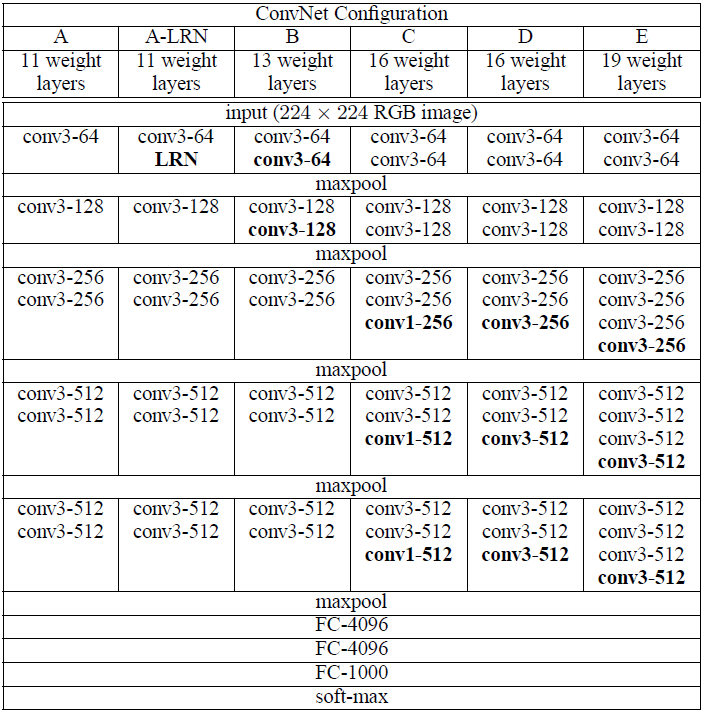

# VERY DEEP CONVOLUTIONAL NETWORKS FORLARGE-SCALEIMAGERECOGNITION

# 備考
## 著者
Karen Simonyan, Andrew Zisserman

## 掲載
"Very Deep Convolutional Networks For Large-ScaleImageRecognition，" arXiv:1409.1556[cs.CV]，2014．

# Abstract
本研究では、大規模画像認識における畳み込みネットワークの深さが精度に与える影響を調べる。私たちの主な貢献は、非常に小さな（3×3）畳み込みフィルタを備えたアーキテクチャを用いてネットワークのた深さを増した場合の徹底的な評価であり、深さを16～19の重み層に押し上げることで、従来の構成に比べて大幅な改善が達成できることを示しています。これらの調査結果は、ImageNet Challenge 2014に参加した際に得られたもので、我々のチームはローカリゼーションおよび分類のトラックでそれぞれ1位と2位を獲得しました。また、私たちの表現が他のデータセットでもうまく一般化され、最先端の結果が得られることも示しています。コンピュータビジョンにおける深層視覚表現の使用に関する研究を促進するために、最高の性能を持つ2つのConvNetモデルを公開しました。

# 1. Introduction
近年、コンボリューションネットワーク（ConvNets）は、ImageNetのような大規模な公開画像リポジトリ（Dengら、2009年）や、GPUや大規模な分散クラスタ（Deanら、2012年）のような高性能なコンピューティングシステムによって可能になった大規模な画像・映像認識（Krizhevskyら、2012年；Zeiler & Fergus、2013年；Sermanetら、2014年；Simonyan & Zisserman、2014年）において大きな成功を収めています。特に、深層視覚認識アーキテクチャの進歩において重要な役割を果たしてきたのは、ImageNetの大規模視覚認識チャレンジ（ILSVRC）（Russakovskyら、2014）です。このコンペティションでは，高次元の浅い特徴符号化（Perronninら、2010）（ILSVRC-2011の優勝者）からDeep ConvNet（Krizhevskyら。、2012）（ILSVRC-2012の優勝者）まで、数世代にわたる大規模画像分類システムのテストベッドとして機能してきた。

ConvNetsがコンピュータービジョンの分野でより一般的なものになるにつれて、より良い精度を達成するために Krizhevsky ら（2012）のオリジナルアーキテクチャを改良する試みが数多く行われてきました。例えば、ILSVRC-2013（Zeiler＆Fergus、2013， Sermanetら、2014）への最も優れた提出では、より小さい受容ウィンドウサイズ（＝フィルタサイズ）と最初の畳み込み層より小さいストライドを利用しました。もう一つの改善点は、画像全体と複数のスケールにわたってネットワークを密にトレーニングおよびテストしました（Sermanetら、2014，Howard、2014）。本論文では、ConvNetアーキテクチャ設計のもう一つの重要な側面である深さについて説明します。この目的のために、我々はアーキテクチャの他のパラメータを固定し、より多くの畳み込み層を追加することによってネットワークの深さを着実に増やします。これは、すべての層で非常に小さい（3×3）たたみ込みフィルターを使用することで実現可能です。

その結果、我々はより精度の高いConvNetアーキテクチャを開発しました。これは、ILSVRC分類およびローカリゼーションタスクで最先端の精度を実現しただけでなく、他の画像認識データセットにも適用可能であり、比較的単純なパイプラインの一部として使用した場合でも優れた性能を達成しました（例えば、微調整なしで線形SVMによって分類された深部特徴など）。私たちは、さらなる研究を促進するために、2つの最も優れた性能を持つモデル1を公開しました。

# 2. ConvNet Configurations
公平な環境で ConvNet の深さの増加による改善を測定するために、Ciresan ら（2011）、Krizhevsky ら（2012）に触発された同じ原理を用いて ConvNet 層の構成を設計しました。本節では、まず私たちのConvNetの一般的なレイアウト（2.1節）について説明し、次に評価で使用される特定の構成の詳細を（2.2節）で説明します。続いて、2.3 節では、我々の設計の選択について議論し、先行技術との比較を行う。

## 2.1. Architecture
トレーニング中、ConvNetへの入力は、固定サイズの224×224 RGB画像です。私たちが実行する唯一の前処理は、トレーニングセットで計算された平均RGB値を各ピクセルから減算することです。画像は、$3×3$（左右、上下、中央の概念を捉えるための最小サイズ）という非常に小さな畳み込みフィルターを使用した畳み込み（conv.）レイヤーを通過します。演算の1つには、$1×1$の畳み込みフィルターも使用します。これは、入力チャネルの線形変換（非線形性が後に続く）と見なすことができます。畳み込みストライドは１ピクセルに固定されており、畳み込み層の入力の空間パディングは、畳み込み演算後も空間分解能が維持されるようになっています。つまり、パディングは$3x3$畳み込み演算に対して1ピクセルです。空間プーリングは、5つのmaxプーリングレイヤーによって実行されます。これらは、いくつかの畳み込み層の後に続きます（すべての畳み込み層の後にmax-pooling層があるわけではない）。maxプーリングは、$2×2$ピクセルのウィンドウ上で、ストライド2で実行されます。

畳み込み層（アーキテクチャによって深さが異なる）の演算の後に、3つの完全接続（FC）レイヤが続きます：最初の2つのレイヤはそれぞれ4096チャネルを持ち、3番目のレイヤは1000クラスのILSVRC分類を実行するため、1000チャネル（各クラスに1つ）を含みます。最後の層はソフトマックス層です。完全接続レイヤの構成は、すべてのネットワークで同じです。

すべての隠れ層は、非線形性(ReLU(Krizhevskyら、2012))の補正機能が備わっています。私たちのネットワーク（1つを除く）にはローカル応答正規化（LRN）が含まれていないことに注意してください（Krizhevskyら、2012）。図4に示すように、このような正規化はILSVRCデータセットの性能を向上させず、メモリ消費と計算時間の増加につながります。該当する場合、LRN層のパラメーターは（Krizhevskyら、2012）のパラメーターです。

## 2.2. Configurations
本論文で評価したConvNetの構成を表1に列ごとに1つずつ示します。以下では、ネットの名称を(A-E)と呼ぶことにします。すべての構成は第2.1節で示した一般的な設計を踏襲しており、深さだけが違います．具体的には，ネットワークＡの11個の重み層（８つの畳み込み層と３つのFC層）からネットワークＥの19個の重み層（16個の畳み込み層と3つのFC層）まであります．畳み込み層の幅（チャネル数）はかなり小さく、最初の層の64から始まり、最大プーリングレイヤーの後は2倍ずつ512に達するまで増加します。

**表1：ConvNet構成（列に表示）**\
レイヤーが追加されると、構成の深さが左（A）から右（E）に増加します（追加されたレイヤーは太字で示されています）。畳み込み層パラメーターは、「(畳み込みフィルタのサイズ)-(チャネルの数)」として示されます。ReLU活性化関数は簡潔にするために表示されていません。

表2では、各構成のパラメーターの数を報告しています。深度が大きいにも関わらず、ネットのウェイトの数は、変換が大きく、浅いネットのウェイトの数よりも多くありません。層の幅と受容野((Sermanetら、2014)で144M個の重み)。

**表2：パラメータの数（百万単位）**\

## 2.3. Discussion
私たちのConvNetの構成は、ILSVRC-2012（Krizhevskyら、2012）やILSVRC-2013の大会の上位入賞作品で使用されたもの（Zeiler & Fergus、2013; Sermanetら、2014）とは大きく異なっています。
最初の畳み込み層で比較的大きな畳み込みフィルタを使用するのではなく、第2の畳み込み層で比較的大きな畳み込みフィルタサイズを持つ畳み込み演算を行う．層ではなく(例えば、(Krizhevskyら. 2012)でフィルタサイズ$11×11$、ストライド数4、または(Zeiler & Fergus, 2013, Sermanetら，2014)フィルタサイズ$7x7$ストライド数2)、ネット全体で非常に小さな$3×3$の畳み込みフィルタを使用し、すべてのピクセル（ストライド1で）で入力と畳み込み演算されます。
フィルタサイズ$3×3$の2つの畳み込み層（間に空間的なプーリングがない）は、$5×5$の畳み込みフィルタサイズを持つ畳み込み層と同じ効果があることが簡単にわかります．同様に、フィルタサイズ$7×7$の代わりに、例えば、フィルタサイズ$3×3$の畳み込み層3層の演算を使用することで何が得られるのでしょうか？第一に、単一の層の代わりに3つのReLUを組み込むことで、決定関数をより識別性の高いものにします。第二に、パラメータの数を減らします。3層の$3x3$畳み込み演算の入力と出力の両方にCチャンネルあると仮定すると、演算は3つの3$(3^2C^2) = 27C^2$の重みでパラメータ化されます．同時に、単一のフィルターサイズ$7 \times 7$の畳み込み層は$7^2C^2 = 49C^2$のパラメータを必要とし、すなわち$81\%$多くなります。これは、$7 \times 7$畳み込みフィルタに正則化を課し、$3 \times 3$ フィルタ（間に非線形性が注入されている）を使って強制的に分解させます。

$1×1$畳み込み層（構成 C、表 1）を組み込むことは、 畳み込み層のフィルタサイズに影響を与えることなく、決定関数の非線形性を増加させる方法です。私たちの場合、$1x1$畳み込みは、本質的に同じ次元の空間への線形投影であるが（入力チャンネルと出力チャンネルの数は同じ）、ReLUによって追加の非線形性が導入されます。1×1畳み込み層は、最近、Linら（2014）の「Network in Network」アーキテクチャで利用されていることにも注目すべきです。

小型の畳み込みフィルターは、Ciresanら(2011)によって既に使用されていますが、彼らのネットは私たちのものよりもかなり浅く、大規模なILSVRCデータセットでの評価を行っていません。Goodfellowら(2014)は、深いConvNet（11重みレイヤー）を番地認識のタスクに適用し、深度の増加がパフォーマンスの向上につながることを示しました。 ILSVRC-2014分類タスクのトップパフォーマンスであるGoogleNet（Szegedyら、2014）は、私たちの研究と独立して開発されましたが、非常に深いConvNet（22の重みレイヤー）と小さな畳み込みフィルタ（3×3は別として、1×1および5×5の畳み込みも使用します）に基づいているという点で類似しています。しかし、この2つのネットワークトポロジは私たちのものよりも複雑で、特徴マップの空間解像度は最初のレイヤーでより積極的に削減され、計算量が減少します。4.5 節で示すように、私たちのモデルは単一ネットワーク分類精度の点でSzegedyら(2014)のモデルを上回っています。

# 3. Classification framework
前節では、ネットワーク構成の詳細を紹介した。本節では、分類ConvNetの学習と評価の詳細について説明します。

## 3.1. Training
