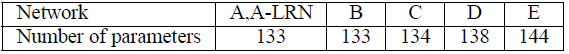

# VERY DEEP CONVOLUTIONAL NETWORKS FORLARGE-SCALEIMAGERECOGNITION

# 備考
## 著者
Karen Simonyan, Andrew Zisserman

## 掲載
"Very Deep Convolutional Networks For Large-ScaleImageRecognition，" arXiv:1409.1556[cs.CV]，2014．

# Abstract
本研究では、大規模画像認識における畳み込みネットワークの深さが精度に与える影響を調べる。私たちの主な貢献は、非常に小さな（3×3）畳み込みフィルタを備えたアーキテクチャを用いてネットワークのた深さを増した場合の徹底的な評価であり、深さを16～19の重み層に押し上げることで、従来の構成に比べて大幅な改善が達成できることを示しています。これらの調査結果は、ImageNet Challenge 2014に参加した際に得られたもので、我々のチームはローカリゼーションおよび分類のトラックでそれぞれ1位と2位を獲得しました。また、私たちの表現が他のデータセットでもうまく一般化され、最先端の結果が得られることも示しています。コンピュータビジョンにおける深層視覚表現の使用に関する研究を促進するために、最高の性能を持つ2つのConvNetモデルを公開しました。

# 1. Introduction
近年、コンボリューションネットワーク（ConvNets）は、ImageNetのような大規模な公開画像リポジトリ（Dengら、2009年）や、GPUや大規模な分散クラスタ（Deanら、2012年）のような高性能なコンピューティングシステムによって可能になった大規模な画像・映像認識（Krizhevskyら、2012年；Zeiler & Fergus、2013年；Sermanetら、2014年；Simonyan & Zisserman、2014年）において大きな成功を収めています。特に、深層視覚認識アーキテクチャの進歩において重要な役割を果たしてきたのは、ImageNetの大規模視覚認識チャレンジ（ILSVRC）（Russakovsky et al。、2014）です。このコンペティションでは，高次元の浅い特徴符号化（Perronnin et al。、2010）（ILSVRC-2011の優勝者）からDeep ConvNet（Krizhevsky et al。、2012）（ILSVRC-2012の優勝者）まで、数世代にわたる大規模画像分類システムのテストベッドとして機能してきた。

ConvNetsがコンピュータービジョンの分野でより一般的なものになるにつれて、より良い精度を達成するために Krizhevsky ら（2012）のオリジナルアーキテクチャを改良する試みが数多く行われてきました。例えば、ILSVRC-2013（Zeiler＆Fergus、2013， Sermanetら、2014）への最も優れた提出では、より小さい受容ウィンドウサイズと最初の畳み込み層のより小さいストライドを利用しました。もう一つの改善点は、画像全体と複数のスケールにわたってネットワークを密にトレーニングおよびテストしました（Sermanet et al。、2014; Howard、2014）。本論文では、ConvNettアーキテクチャ設計のもう一つの重要な側面である深さについて説明します。この目的のために、我々はアーキテクチャの他のパラメータを固定し、より多くの畳み込み層を追加することによってネットワークの深さを着実に増やします。これは、すべての層で非常に小さい（3×3）たたみ込みフィルターを使用することで実現可能です。

その結果、我々はより精度の高いConvNetアーキテクチャを開発しました。これは、ILSVRC分類およびローカリゼーションタスクで最先端の精度を実現しただけでなく、他の画像認識データセットにも適用可能であり、比較的単純なパイプラインの一部として使用した場合でも優れた性能を達成しました（例えば、微調整なしで線形SVMによって分類された深部特徴など）。私たちは、さらなる研究を促進するために、2つの最も優れた性能を持つモデル1を公開しました。

# 2. ConvNet Configurations
公平な環境で ConvNet の深さの増加による改善を測定するために、Ciresan ら（2011）、Krizhevsky ら（2012）に触発された同じ原理を用いて ConvNet 層の構成を設計した。本節では、まず私たちのConvNetの一般的なレイアウト（2.1節）について説明し、次に評価で使用される特定の構成（2.2節）の詳細を説明します。続いて、2.3 節では、我々の設計の選択について議論し、先行技術との比較を行う。

## 2.1. Architecture
トレーニング中、ConvNetへの入力は、固定サイズの224×224 RGB画像です。実行する唯一の前処理は、トレーニングセットで計算された平均RGB値を各ピクセルから減算することです。画像は、畳み込み（conv.）レイヤーの演算を通過します。ここでは、3×3（左右、上下、中央の概念を捉えるための最小サイズ）という非常に小さな受容野を持つフィルターを使用します。構成の1つでは、1×1のたたみ込みフィルターも使用します。これは、入力チャネルの線形変換（非線形性が後に続く）と見なすことができます。畳み込みストライドは１ピクセルに固定されており、畳み込み層の入力の空間パディングは、畳み込み後も空間分解能が維持されるようになっています。つまり、３×３畳み込み層のパディングは1ピクセルです。空間プーリングは、いくつかのコンバージョンの後に続く5つのmaxプーリングレイヤーによって実行されます。、これらは、いくつかのconv.層の後に続く（すべてのconv.層がmax-poolingによって後に続くわけではない）。最大プーリングは、2×2ピクセルのウィンドウ上で、ストライド2で実行されます。

畳み込みレイヤ（アーキテクチャによって深さが異なる）の演算の後に、3つの完全接続（FC）レイヤが続きます：最初の2つのレイヤはそれぞれ4096チャネルを持ち、3番目のレイヤは1000クラスのILSVRC分類を実行するため、1000チャネル（各クラスに1つ）を含みます。最後の層はソフトマックス層です。完全接続レイヤの構成は、すべてのネットワークで同じです。

すべての隠れ層は、非線形性(ReLU(Krizhevskyら、2012))の補正機能が備わっています。私たちのネットワーク（1つを除く）にはローカル応答正規化（LRN）が含まれていないことに注意してください（Krizhevskyら、2012）。図4に示すように、このような正規化はILSVRCデータセットの性能は向上させませんが、メモリ消費と計算時間の増加につながります。該当する場合、LRN層のパラメーターは（Krizhevskyら、2012）のパラメーターです。

## 2.2. Configurations
本論文で評価したConvNetの構成を表1に列ごとに1つずつ示します。以下では、ネットの名称を(A-E)と呼ぶことにします。すべての構成は第2.1節で示した一般的な設計を踏襲しており、深さの違いだけがあります：ネットワークＡの１１個の重み層（８凸と３ＦＣ層）からネットワークＥの１９個の重み層（１６凸と３ＦＣ層）まで。conv.の幅は、ネットワークAでは11層（8凸、3FC層）、ネットワークEでは19層（16凸、3FC層）となっています。レイヤー（チャネル数）はかなり小さく、最初のレイヤーの64から始まり、各最大プーリングレイヤーの後、512に達するまで2倍ずつ増加します。

表2では、各構成のパラメーターの数を報告しています。深度が大きいにも関わらず、ネットのウェイトの数は、変換が大きく、浅いネットのウェイトの数よりも多くありません。層の幅と受容野((Sermanetら、2014)で144M個の重み)。

## 2.3. Discussion
私たちのConvNetの構成は、ILSVRC-2012（Krizhevskyら、2012）やILSVRC-2013の大会の上位入賞作品で使用されたもの（Zeiler & Fergus、2013; Sermanetら、2014）とは大きく異なっています。
最初の畳み込み層において比較的大きな受容野を使用するのではなく（例えば、（Krizhevskyら. 2012）でフィルタサイズ$11×11$、ストライド数4、または（Zeiler & Fergus, 2013, Sermanetら，2014）フィルタサイズ$7x7$ストライド数2）ネット全体で非常に小さな$3×3$の受容野（畳み込みフィルタ）を使用し、それはすべてのピクセル（ストライド1で）で入力と畳み込み演算されます。
2つの3×3畳み込み層（間に空間的なプーリングがない）の演算は、5×5の有効な受容野を持ち、3つの層は7×7の有効な受容野を持つことが容易にわかります。では、単一の7×7層の代わりに、例えば、3つの3×3層の演算を使用することで何が得られるのでしょうか？第一に、単一の層の代わりに3つのReLUを組み込むことで、決定関数をより識別性の高いものにします。第二に、パラメータの数を減らします。3層の$3x3$畳み込み演算の入力と出力の両方がCチャンネルであると仮定すると、演算は3つの3$(3^2C^2) = 27C^2$の重みでパラメトリック化されます；同時に、単一の$7 \times 7$畳み込み層は$7^2C^2 = 49C^2$のパラメータを必要とし、すなわち$81\%$多くなります。これは、$7 \times 7$畳み込みフィルタに正則化を課し、$3 \times 3$ フィルタ（間に非線形性が注入されている）を介した分解を強制していると見ることができます。

**表1：ConvNet構成（列に表示）**\
レイヤーが追加されると、構成の深さが左（A）から右（E）に増加します（追加されたレイヤーは太字で示されています）。畳み込み層パラメーターは、「受胎野のサイズi-hチャネルの数i」として示されます。 ReLUアクティベーション機能は簡潔にするために表示されていません。

**表2：パラメータの数（百万単位）**\

