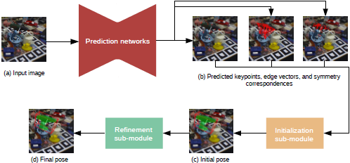

# HybridPose 6D Object Pose Estimation under Hybrid Representations

# 備考
## 要約
* ハイブリット中間表現を利用して入力画像の様々な幾何学的特徴を表現
* 深度情報を使用しない
* 姿勢推定エラーを低減するために、ロバストノルムを利用して予測された要素の外れ値を自動的にフィルタリング

## 著者
Chen Song, Jiaru Song, Qixing Huang

## 掲載
Hybridpose: 6d object pose estimation under hybridrepresentations, arXiv:2001.01869, 2020.

# Abstract
新しい6Dオブジェクトポーズ推定アプローチであるHybridPoseを紹介します。 HybridPoseは、ハイブリッド中間表現を利用して、キーポイント、エッジベクトル、対称性の対応など、入力画像のさまざまな幾何学的情報を表現します。ユニタリ表現と比較すると、ハイブリッド表現では、1つのタイプの予測表現が不正確な場合（たとえば、オクルージョンのため）、ポーズ回帰でより多様な機能を利用できます。 HybridPoseで使用されるさまざまな中間表現は、すべて同じ単純なニューラルネットワークで予測でき、予測された中間表現の外れ値は、堅牢な回帰モジュールによってフィルター処理されます。最先端のポーズ推定アプローチと比較して、HybridPoseは実行時間において同等であり、はるかに正確です。たとえば、Occlusion Linemod [3]データセットでは、このメソッドは30 fpsの予測速度を79.2％の平均ADD（-S）精度で達成します。これは、現在の最先端のアプローチから67.4％の改善を表します。 HybridPoseの実装は、https://github.com/chensong1995/HybridPose で入手できます。

# 1. Introducrtion
RGB画像からオブジェクトの6Dポーズを推定することは、3Dビジョンの基本的な問題であり、オブジェクト認識とロボットとオブジェクトの相互作用にさまざまなアプリケーションがあります。ディープラーニングの進歩により、この問題は大きく進歩しました。初期の研究では、一般的にエンドツーエンドのポーズ分類[39]やポーズ回帰[16, 42]としてポーズ推定を定式化しているが、最近のポーズ推定手法は通常、中間表現としてキーポイントを利用し[38, 34]、予測された2Dキーポイントを根拠のある3Dキーポイントに整列させています。これらの手法は、グランドトゥルースポーズラベルに加えて、中間監督としてキーポイントを組み込むことで、モデルの学習をスムーズに行うことができる。キーポイントベースの手法は、以下の2つの前提に基づいて構築されています。(1)機械学習モデルが2次元キーポイント位置を正確に予測できること、(2)これらの予測値が、基礎となる6次元ポーズを回帰させるのに十分な制約を提供することです。どちらの仮定も、多くの実世界の設定では簡単に破られてしまいます。オブジェクトのオクルージョンや予測ネットワークの表現上の制限のため、RGB画像だけでは2次元キーポイント座標を正確に予測できないことがよくあります。

この論文では、複数の中間表現を利用して入力画像の幾何学的情報を表現する新しい6Dポーズ推定アプローチであるHybridPoseを紹介します。キーポイントに加えて、HybridPoseでは、隣接するキーポイント間のエッジベクトルを出力する予測ネットワークを統合します。ほとんどのオブジェクトには（部分的な）反射対称性があるため、HybridPoseは、ピクセル間の根本的な対称関係を反映する予測された密なピクセル単位の対応も利用します。ユニタリー表現と比較して、このハイブリッド表現には多くの利点があります。まず、HybridPoseは入力画像により多くの信号を統合します。エッジベクトルはオブジェクトパーツ間の特別な関係をエンコードし、対称の対応は内部の詳細を組み込みます。次に、HybridPoseは、ポーズ回帰にキーポイントのみを使用するよりも多くの制約を提供し、予測された要素のかなりの部分が外れ値である場合でも（たとえば、オクルージョンのため）、正確なポーズ予測を可能にします。最後に、対称性の対応により、特に反射面の法線方向に沿って、姿勢予測の回転成分が安定することを示すことができます（詳細は付属の資料に記載されています）。

最初のモジュールによって予測された中間表現が与えられると、HybridPoseの2番目のモジュールは姿勢回帰を実行します。特に、HybridPoseはトレーニング可能な堅牢な基準を使用して、予測された中間表現の外れ値を削除します。結果のオブジェクトポーズの品質を最大化するために、ポーズの初期化とポーズの調整を組み合わせる方法を示します。また、ポーズ予測モジュールのトレーニングセットとポーズ回帰モジュールの検証セットを使用して、ハイブリッドポーズを効果的にトレーニングする方法も示します。

2つの一般的なベンチマークデータセット、Linemod [12]とOcclusion Linemod [3]でHybridPoseを評価します。精度（ADD（-S）メトリックの下）の観点から、Hybrid-Poseは、単にキーポイントを利用するすべての最新のメソッドから大幅な改善をもたらします。 Occlusion Linemod [3]では、HybridPoseは79.2％の精度を達成しています。これは、このベンチマークデータセットの現在の最先端のメソッドであるDPOD [44]から67.4％の改善を表します。

精度は向上しましたが、私たちのアプローチは効率的であり、一般的なワークステーションでは毎秒30フレームで実行されます。洗練されたネットワークアーキテクチャを使用して単一の中間表現（Pix2Pose [30]など）を予測するアプローチと比較して、HybridPoseは、比較的単純なネットワークを使用してハイブリッド表現を予測することにより、かなり優れたパフォーマンスを実現します。

# 2. Related Works
**ポーズの中間表現**。RGB画像で幾何学的情報を表現するために、普及している中間表現がキーポイントであり、最先端のパフォーマンスを実現します[34、32、36]。対応する姿勢推定パイプラインは、キーポイント予測とPnPアルゴリズムによって初期化された姿勢回帰を組み合わせます[18]。キーポイント予測は通常、ニューラルネットワークによって生成されます。以前の研究では、さまざまなタイプのテンソル記述子を使用して2Dキーポイント座標を表現しています。一般的なアプローチでは、キーポイントをヒートマップのピークとして表します[28、48]。これは、キーポイントがふさがれている場合に最適ではなくなります。これは、入力画像がその場所の明確な視覚的手がかりを提供しないためです。別のキーポイント表現には、ベクトルフィールド[34]とパッチ[14]が含まれます。これらの表現により、オクルージョン下でのキーポイント予測が向上し、最終的には姿勢推定の精度が向上します。ただし、キーポイントだけでは、オブジェクトのポーズのまばらな表現であり、推定精度を向上させる可能性は限られています。

キーポイントの他に、もう一つの一般的な中間表現は、3D物理世界のすべての画像ピクセルの座標です。これは、ポーズの位置合わせのための密な２Ｄ-３Ｄ対応関係を提供し、オクルージョン下で堅牢になります[3、4、30、20]。ただし、密なオブジェクト座標を回帰することは、キーポイント予測よりもはるかにコストがかかります。また、対応する視覚的な手がかりがないため、キーポイントよりも精度が低くなります。キーポイントとピクセル単位の2D-3D対応に加えて、深度は視覚オドメトリ設定のもう1つの代替中間表現であり、教師なしの方法でポーズと一緒に推定できます[47]。実際には、深度推定の精度は、ニューラルネットワークの表現力によって制限されます。

従来のアプローチとは異なり、HybridPoseは複数の中間表現を組み合わせ、ポーズ推定のための協調性を発揮します。

**マルチモーダル入力**。単一のRGB画像からの姿勢推定の課題に対処するために、いくつかの研究では、複数のセンサからの入力を利用することが検討されています。一般的なアプローチは、RGB画像と深度画像の両方からの情報を活用することです[47、40、42]。深度情報が存在する場合、ポーズ回帰は3D位置合わせ問題として再定式化でき、それはICPアルゴリズムによって解決されます[42]。 HybridPoseは複数の中間表現を利用しますが、すべての中間表現はRGB画像のみから予測されます。 HybridPoseは、深度情報が存在しない状況を処理します。

**エッジ特徴**。エッジは、オブジェクトの輪郭[2]、顕著なエッジ[23]、直線セグメント[45]などの重要な画像特徴を捉えることが知られています。これらの低レベルの画像機能とは異なり、HybridPoseは隣接するキーポイント間に定義されたセマンティックエッジベクトル（意味的なエッジベクトル）を利用します。この表現は、キーポイント間の相関関係を捉え、物体の基本的な構造を明らかにするもので、簡潔で予測が容易です。このようなエッジベクトルは、ポーズ回帰のためのキーポイント単独よりも多くの制約を提供し、オクルージョンの下で明確な利点があります。我々のアプローチは、隣接するキーポイント間の方向を予測し、キーポイントを人間の骨格にリンクさせる[5]に似ています。ただし、エッジベクトルの方向と大きさの両方を予測し、これらのベクトルを使用してオブジェクトのポーズを推定します。

**画像からの対称性検出**。対称性の検出は、コンピュータービジョンで大きな注目を集めています。一般的な調査については[22、27]を、最近の進歩については[1、41]を参照してください。対称性検出の従来のアプリケーションには、顔認識[31]、深度推定[21]、3D再構成[13、43]があります。物体の姿勢推定のコンテキストでは、姿勢推定にあいまいさを導入するという観点から対称性を研究してきました（c.f. [25、36、42]）。これは、対称オブジェクトはポーズが異なっていても画像内で同じように見えるためです。いくつかの研究[36、42、6、25、30]は、たとえば、対称変換の下で不変である損失関数を設計することによって、そのようなあいまいさを解決する方法を模索しました。

**堅牢な回帰**。中間表現による姿勢推定は、オクルージョンや雑然とした背景によって導入される予測の外れ値に敏感です[37、32、40]。そこでポーズエラーを軽減するために、2D-3D位置合わせステージで異なる予測要素に異なる重みを割り当てる作業がいくつかあります[34、32]。対照的に、我々のアプローチでは、ロバストノルムを利用して、予測された要素の外れ値を自動的にフィルタリングしています。

再重み付け戦略に加えて、いくつかの最近の研究は、ディープラーニングベースのリファイナーを使用して姿勢推定のパフォーマンスを向上させることを提案しています[19、26、44]。 [44、19]は、ポイントマッチング損失を使用して、高精度を実現しています。 [26]輪郭情報を使用して姿勢の更新を予測します。これらの研究とは異なり、私たちのアプローチは、ロバスト目的関数の臨界点と損失面を考慮しており、リカレントネットワークベースのアプローチで使用される固定の事前決定された反復回数を伴いません。

# 3.Approach
HybridPoseへの入力は、既知の固有パラメーターを持つピンホールカメラによって撮影された、既知のクラスのオブジェクトを含む画像$I$です。オブジェクトのクラスに標準座標系$\sum$（つまり3D点群）があると仮定すると、HybridPoseは$\sum$の下の画像オブジェクトの6Dカメラポーズ$(R_I \in SO, t_I \in \bm{R}^3)$を出力します。ここで、$R_I$は回転です。 $t_I$は翻訳コンポーネントです。

## 3.1. Approach Overview
図2に示すように、HybridPoseは予測モジュールとポーズ回帰モジュールで構成されています。

\
図2 アプローチの概要。\
HybridPoseは、中間表現予測ネットワークとポーズ回帰モジュールで構成されています。予測ネットワークは画像を入力として受け取り、予測されたキーポイント、エッジベクトル、対称性の対応を出力します。ポーズ回帰モジュールは、初期化サブモジュールと改良サブモジュールで構成されています。初期化サブモジュールは、予測された中間表現を使用して線形システムを解き、初期ポーズを取得します。リファインメントサブモジュールは、GMロバストノルムを利用して最適化し（9）、最終的なポーズ予測を取得します。

**予測モジュール（セクション3.2）**\
HybridPoseは、3つの予測ネットワーク$f^{K}_{\theta}、f^{\varepsilon}_{\phi}、$および$f^{S}_{\gamma}$を利用して、キーポイントの集合$K = \{p_k\}$、キーポイント間のエッジの集合$E = \{v_e\}$、および画像ピクセル間の対称性の対応関係の集合$S = \{(q_{s, 1}, q_{s, 2})\}$を推定します。$K、\varepsilon、S$はすべて2Dで表されます。 $\theta、\phi$およびは$\gamma$トレーニング可能なパラメータです。

キーポイントネットワーク$f^{K}_{\theta}$は、既製の予測ネットワーク[34]を採用しています。他の2つの予測ネットワーク$f^{\varepsilon}_{\phi}$と$f^{S}_{\gamma}$は、キーポイント予測が不正確な場合に姿勢回帰を安定させるために導入されています。具体的には、$f^{\varepsilon}_{\phi}$はあらかじめ定義されたキーポイントのグラフに沿ってエッジベクトルを予測し，入力画像中にキーポイントが乱雑に存在する場合にポーズ回帰を安定化させます。$f^{S}_{\gamma}$は、基になる（部分的な）反射対称を反映する対称対応を予測します。この対称表現の主な利点は、対称対応の数が多いことです。つまり、オブジェクト上のすべてのイメージピクセルに対称対応があります。その結果、外れ値の比率が大きくても、対称性の対応は、基礎となるポーズを正則化するために反射対称面を推定するための十分な制約を提供します。さらに、対称性の対応には、基になるオブジェクトの内部に、キーポイントやエッジベクトルよりも多くの機能が組み込まれています。

**ポーズ回帰モジュール（セクション3.3）**\
HybridPoseの2番目のモジュールは、3つの予測ネットワークの出力に適合するようにオブジェクトポーズ$(R_I, t_I)$を最適化します。このモジュールは、トレーニング可能な初期化サブモジュールとトレーニング可能な改良サブモジュールを組み合わせたものです。特に、初期化サブモジュールはSVDを実行して、グローバルアフィンポーズ空間の初期ポーズを解決します。リファインメントサブモジュールは、ロバストノルムを利用して、予測された要素の外れ値をフィルタリングし、正確なオブジェクトポーズを推定します。

**HybridPoseのトレーニング（セクション3.4）**\
データセットをトレーニングセットと検証セットに分割することで、HybridPoseをトレーニングします。トレーニングセットを使用して予測モジュールを学習し、検証セットを使用してポーズ回帰モジュールのハイパーパラメーターを学習します。 1つのトレーニングセットを使用して、HybridPoseをエンドツーエンドでトレーニングしてみました。ただし、トレーニングセットとテストセットの予測分布の違いは、最適化されていない汎化パフォーマンスにつながります。

## 3.2. Hybrid Representation
このセクションでは、HybridPoseで使用される3つの中間表現について説明します。

**キーポイント**\
最初の中間表現は、ポーズ推定に広く使用されているキーポイントで構成されています。入力画像$I$が与えられると、ニューラルネットワーク$f^{K}_{\theta} (I) \in R^{2 \times |K|}$をトレーニングして、事前に定義された$|K|$キーポイントの集合の2D座標を予測します。私たちの実験では、HybridPoseにPVNet [34]と呼ばれる既製のアーキテクチャが組み込まれています。これは、投票スキームを使用して可視と不可視の両方のキーポイントを予測する、最先端のキーポイントベースの姿勢推定器です。

予測されたキーポイントの外れ値の他に、キーポイントベースの技術のもう一つの限界は、隣接するキーポイント間の差（方向と距離）がオブジェクトポーズの重要な情報を特徴付ける場合、不正確なキーポイント予測が大きなポーズエラーを引き起こすことです。

**エッジ**\
第２の中間表現は、予め定義されたグラフに沿ったエッジベクトルで構成され、キーポイントの各ペア間の変位を明確にモデル化する。図2に示すように、HybridPoseは単純なネットワーク$f^{\varepsilon}_{\phi} (I) \in R^{2 \times |\varepsilon|}$を使用して、2D画像平面のエッジベクトルを予測します。ここで$|\varepsilon|$は、定義済みグラフのエッジの数を表します。私たちの実験では、$\varepsilon$は完全に接続されたグラフです。つまり、$|\varepsilon| = \frac{|K| \cdot (|K|-1)}{2}$です。

**対称性の対応**\
第３の中間表現は、基礎となる反射対称性を反映する予測されたピクセル単位の対称性の対応関係で構成されます。我々の実験では、HybridPoseはFlowNet 2.0 [15]のネットワークアーキテクチャを拡張したものであり、密なピクセル単位のフローとPVNetによって予測されたセマンティックマスクを組み合わせたものです。結果として生じる対称性の対応関係は、マスク領域内の予測されたピクセル単位のフローによって与えられます。最初の2つの表現と比較すると、対称対応点の数が大幅に多いため、オクルードされたオブジェクトに対しても豊富な制約を与えることができます。しかし、対称対応関係は、オブジェクトポーズの回転成分の2つの自由度のみを制約します（c.f. [24]）。よって、対称の対応を他の中間表現と組み合わせる必要があります。

3Dモデルは複数の反射対称面を持つことがあります。これらのモデルに対して、最も顕著な反射対称面、すなわち、元の3Dモデル上で最も多くの対称対応がある面を基準に、対称対応を予測するためにHybridPoseを訓練します。

**ネットワーク設計のまとめ**\
私たちの実験では$f^{K}_{\theta} (I)$、$f^{\varepsilon}_{\phi} (I)$、および$f^{S}_{\gamma}$はすべてResNet[11]に基づいており、実装の詳細はセクション4.1で説明します。トレーニング可能なパラメーターは、最後のたたみ込み層を除くすべてで共有されます。したがって、エッジ予測ネットワーク$f^{\varepsilon}_{\phi} (I)$および対称性予測ネットワーク$f^{S}_{\gamma}$を導入するオーバーヘッドは重要ではありません。

## 3.3. Pose Regression
HybridPoseの2番目のモジュールは、予測された中間表現$\{K; \varepsilon; S\}$を入力として取り、入力画像$I$の6次元物体ポーズ$(R_I \in SO(3), t_I \in \bm{R}3)$を出力する。回帰アプローチ[35]と同様に、HybridPoseは初期化サブモジュールと洗練サブモジュールを組み合わせています。両方のサブモジュールはすべての予測された要素を活用します。洗練サブモジュールはさらに、堅牢な関数を活用して、予測された要素の外れ値をモデル化します。

**初期化サブモジュール**\
このサブモジュールは、$(R_I, t_I)$と予測された要素間の制約を利用し、アフィン空間で$(R_I,t_I)$を解決します。これは、交互最適化方法でSE（3）に投影されます。このために、予測される要素のタイプごとに次の差分ベクトルを導入します。
$$
\bar{r}_{R,t}^\kappa (p_k) := \hat{p_k} \times \left(R\bar{p}_k + t \right) \\
\bar{r}_{R,t}^\epsilon (v_e, p_{e_s}) := \hat{v}_e \times \left(R\bar{p_{e_t}} + t \right) + \hat{p_{e_s}} \times \left(R\bar{v_e} \right) \\
\bar{r}_{R,t}^S (q_{s,1}, q_{s,2}) := \left(\hat{q_{s,1}} \times q_{s,2} \right)^T R\bar{n}r
$$

ここで、$e_s$と$e_t$はエッジ$e$の終了頂点であり、$\bar{v}_e =\bar{p}_{e_t} \in \bm{R}^3$、$\bar{n}_r \in \bm{R}^3$は正則系の反射対称平面の法線です。

HybridPoseはEPnP [18]のフレームワークを変更して、初期ポーズを生成します。予測された要素からのこれら3つの制約を組み合わせることにより、$Ax = 0$の線形システムを生成します。ここで、$A$は行列で、その次元は$(3|\kappa| + 3|\epsilon| + |S|) \times 12$です。$x = [r^T_1, r^T_2, r^T_3, t^T]^T_{12\times1}$は、回転および並進パラメータを含むベクトルです。キーポイント、dgeベクトル、および対称対応の間の相対的な重要性をモデル化するために、ハイパーパラメーター$\alpha_E$および$\alpha_S$によってそれぞれ(2)および(3)を再スケーリングし、$A$を生成しました。

EPnP[18]に従って、xを次のように計算します
$$
\bm{x} = \sum_{i=1}^N \gamma_i \bm{v}_i
$$

ここで、$v_i$は$A$の$i$番目に小さい右特異ベクトルです。理想的には、予測された要素にノイズがない場合、$\bm{x} = \bm{v}_1$を持つ$N = 1$が最適解です。ただし、この手法は、ノイズの多い予測値が与えられた場合には、十分に機能しません。EPnP[18]と同様に、$N = 4$を選択します。最適な$\bm{x}$を計算するために、次の目的関数を用いて、交互最適化手順で潜在変数$\gamma_{i}$と回転行列$R$を最適化します。

$$
\min_{R \in \bm{R}^{3 \times 3}, \gamma_i} ||\sum_{i=1}^4 \gamma_iR_i - R||_F^2
$$

ここで、$R_i \in R^{3\times3}$は$\bm{v}_i$の最初の9要素から再形成されます。最適な$\gamma_i$を取得した後、結果のアフィン変換$\sum_{i = 1}^4 \gamma_iR_i$を剛体変換に射影します。スペースの制約のため、詳細はサポートに委ねています。

**細分割サブモジュール**。
（5）はハイブリッド中間表現を組み合わせ、適切な初期化を可能ですが、予測された要素の外れ値を直接モデル化しているわけではありません。また、別の制限として（1）と（2）では、キーポイントベースのポーズ推定で有効であることが知られている（キーポイントとエッジに関する）射影誤差を最小化しません（c.f. [35]）．

初期オブジェクトポー$(R^{init}, t^{init})$を利用することで得られる refinementサブモジュールは、オブジェクトポーズをrefineするための局所最適化を行います。ここでは，射影誤差$\forall k$, $e, $s$を含む2つの差分ベクトルを導入する．

$$
\bar{r}_{R,t}^\kappa (p_k) := p_{R,t}\left(\bar{\bm{p}}_k\right) -\bm{p}_k \\
\bar{r}_{R,t}^\kappa (p_k) := p_{R,t}\left(\bar{\bm{p}}_{e_t}\right) - p_{R,t}\left(\bar{\bm{p}}_{e_s}\right) -\bm{v}_e
$$

ここで$P_{R,t}$:$\bm {R}^3 \rightarrow \bm{R}^2$は、現在のポーズ$(R, \bm{t})$から誘導された投影演算子です。

予測された要素の外れ値をプルーニングする(取り除く)ために、一般化されたGerman-Mcclure（またはGM）ロバスト関数を検討します。
$$
\rho(x, \beta) := \frac{\beta_1^2}{(\beta_2^2 + x^2)}
$$
この設定により、HybridPoseは、ポーズの微調整に関する次の非線形最適化問題を解決します。

$$
\min_{R, t} = \sum_{k=1}^{|\kappa|}\rho \left( ||\bm{r}_{R, t}^\kappa (\bm{p}_k)||, \beta_\kappa || \right) || \bm{r}_{R, t}^\kappa (\bm{p}_k) ||_{\sum_k}^2 \\ + \frac{|\kappa|}{|\epsilon|}\sum_{e=1}^{|\epsilon|}\rho \left( ||\bm{r}_{R, t}^\epsilon (\bm{v}_e)||, \beta_\epsilon || \right) || \bm{r}_{R, t}^\epsilon (\bm{p}_k) ||_{\sum_e}^2 \\ + \frac{|\kappa|}{|S|}\sum_{s=1}^{|S|}\rho \left(\bm{r}_{R, t}^S (\bm{q}_{s, 1}, \bm{q}_{s, 2}), \beta_S \right)
$$

ここで、$\beta_K$、$\beta_E$、および$\beta_S$は、キーポイント、エッジ、および対称対応の個別のハイパーパラメーターです。 $\sum_k$および$\sum_e$は、キーポイントおよびエッジ予測に付加された共分散情報を示します。 $||\bm{x}||_A = (\bm{x}^T A\bm{x})^{\frac{1}{2}}$。予測の共分散が利用できない場合は、$\sum_k = \sum_e = I_2$に設定します。上記の最適化問題は、$R^{init}$と$t^{init}$から始まるガウス・ニュートン法によって解きます。

補足資料では、(9)の安定性解析を行い、(9)の最適解が予測表現のノイズに対してどのように変化するかを示しています。また、3つの中間表現すべての中での協調性の強さも示す。キーポイントが$t$の精度に大きく寄与する一方で、エッジベクトルと対称性の対応関係は$R$の回帰を安定化させることができます。

## 3.4. HybridPose Training
このセクションでは、ラベル付きデータセット$T = {I, (\kappa_I^{gt}, \epsilon_I^{gt}, S_I^{gt}, (R_I^{gt}, t_I^{gt}))}$を使用して、HybridPoseの予測ネットワークとハイパーパラメーターをトレーニングする方法について説明します。ここで、$I$、$K_I^{gt}$、$E_I^{gt}$、$S_I^{gt}$、および$(R_I^{gt}, t_I^{gt})$を使用して、RGBイメージ、ラベル付きキーポイント、エッジ、対称対応、グラウンドトゥルースオブジェクトのポーズをそれぞれ示します。一般的な方法は、モデル全体をエンドツーエンドでトレーニングすることです。たとえば、リカレントネットワークを使用して最適化手順をモデル化し、オブジェクトポーズ出力と中間表現に損失項を導入します。しかし、この方法は最適ではないことがわかりました。学習セットの予測要素の分布は、テストセットの分布とは異なります。予測された要素の監視と最終的なオブジェクトポーズの間のトレードオフを慎重に調整しても、トレーニングデータに適合するポーズ回帰モデルは、テストデータでは一般化しません。

このアプローチでは、ラベル付きセット$T=T_{train} \cup T_{val}$をランダムにトレーニングセットと検証セットに分割します。 $T_{train}$は予測ネットワークをトレーニングするために使用され、$T_{val}$はポーズ回帰モデルのハイパーパラメーターをトレーニングします。予測ネットワークの実装とトレーニングの詳細は、セクション4.1に示されています。以下では、$T_{val}$を使用してハイパーパラメータをトレーニングすることに焦点を当てます。

