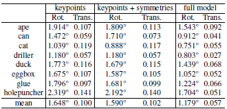

# HybridPose 6D Object Pose Estimation under Hybrid Representations

# 備考

## 要約

- ハイブリット中間表現を利用して入力画像の様々な幾何学的特徴を表現
- 深度情報を使用しない
- 姿勢推定エラーを低減するために，ロバストノルムを利用して予測された要素の外れ値を自動的にフィルタリング

## 著者

Chen Song, Jiaru Song, Qixing Huang

## 掲載

"Hybridpose: 6d object pose estimation under hybridrepresentations," arXiv:2001.01869, 2020.

# Abstract

新しい 6D オブジェクトポーズ推定アプローチである HybridPose を紹介します． HybridPose は，ハイブリッド中間表現を利用して，キーポイント，エッジベクトル，対称性の対応など，入力画像のさまざまな幾何学的情報を表現します．ユニタリ表現と比較すると，ハイブリッド表現では，1 つのタイプの予測表現が不正確な場合 (たとえば，オクルージョンのため) ，ポーズ回帰でより多様な機能を利用できます． HybridPose で使用されるさまざまな中間表現は，すべて同じ単純なニューラルネットワークで予測でき，予測された中間表現の外れ値は，堅牢な回帰モジュールによってフィルター処理されます．最先端のポーズ推定アプローチと比較して，HybridPose は実行時間において同等であり，はるかに正確です．たとえば，Occlusion Linemod [3]データセットでは，このメソッドは 30 fps の予測速度を 79.2％の平均 ADD (-S) 精度で達成します．これは，現在の最先端のアプローチから 67.4％の改善を表します． HybridPose の実装は，https://github.com/chensong1995/HybridPose で入手できます．

# 1. Introducrtion

RGB 画像からオブジェクトの 6D ポーズを推定することは，3D ビジョンの基本的な問題であり，オブジェクト認識とロボットとオブジェクトの相互作用にさまざまなアプリケーションがあります．ディープラーニングの進歩により，この問題は大きく進歩しました．初期の研究では，一般的にエンドツーエンドのポーズ分類[39]やポーズ回帰[16, 42]としてポーズ推定を定式化しているが，最近のポーズ推定手法は通常，中間表現としてキーポイントを利用し[38, 34]，予測された 2D キーポイントを根拠のある 3D キーポイントに整列させています．これらの手法は，グランドトゥルースポーズラベルに加えて，中間監督としてキーポイントを組み込むことで，モデルの学習をスムーズに行うことができる．キーポイントベースの手法は，以下の 2 つの前提に基づいて構築されています．
1. 機械学習モデルが 2 次元キーポイント位置を正確に予測できること．
2. これらの予測値が，基礎となる 6 次元ポーズを回帰させるのに十分な制約を提供すること．

どちらの仮定も，多くの実世界の設定では簡単に破られてしまいます．オブジェクトのオクルージョンや予測ネットワークの表現上の制限のため，RGB 画像だけでは 2 次元キーポイント座標を正確に予測できないことがよくあります．

この論文では，複数の中間表現を利用して入力画像の幾何学的情報を表現する新しい 6D ポーズ推定アプローチである HybridPose を紹介します．キーポイントに加えて，HybridPose では，隣接するキーポイント間のエッジベクトルを出力する予測ネットワークを統合します．ほとんどのオブジェクトには (部分的な) 反射対称性があるため，HybridPose は，ピクセル間の根本的な対称関係を反映する予測された密なピクセル単位の対応も利用します．ユニタリー表現と比較して，このハイブリッド表現には多くの利点があります．まず，HybridPose は入力画像により多くの信号を統合します．エッジベクトルはオブジェクトパーツ間の特別な関係をエンコードし，対称の対応は内部の詳細を組み込みます．次に，HybridPose は，ポーズ回帰にキーポイントのみを使用するよりも多くの制約を提供し，予測された要素のかなりの部分が外れ値である場合でも (たとえば，オクルージョンのため) ，正確なポーズ予測を可能にします．最後に，対称性の対応により，特に反射面の法線方向に沿って，姿勢予測の回転成分が安定することを示すことができます (詳細は付属の資料に記載されています) ．

最初のモジュールによって予測された中間表現が与えられると，HybridPose の 2 番目のモジュールは姿勢回帰を実行します．特に，HybridPose はトレーニング可能な堅牢な基準を使用して，予測された中間表現の外れ値を削除します．結果のオブジェクトポーズの品質を最大化するために，ポーズの初期化とポーズの調整を組み合わせる方法を示します．また，ポーズ予測モジュールのトレーニングセットとポーズ回帰モジュールの検証セットを使用して，ハイブリッドポーズを効果的にトレーニングする方法も示します．

2 つの一般的なベンチマークデータセット，Linemod [12]と Occlusion Linemod [3]で HybridPose を評価します．精度 (ADD (-S) メトリックの下) の観点から，Hybrid-Pose は，単にキーポイントを利用するすべての最新のメソッドから大幅な改善をもたらします． Occlusion Linemod [3]では，HybridPose は 79.2％の精度を達成しています．これは，このベンチマークデータセットの現在の最先端のメソッドである DPOD [44]から 67.4％の改善を表します．

精度は向上しましたが，私たちのアプローチは効率的であり，一般的なワークステーションでは毎秒 30 フレームで実行されます．洗練されたネットワークアーキテクチャを使用して単一の中間表現 (Pix2Pose [30]など) を予測するアプローチと比較して，HybridPose は，比較的単純なネットワークを使用してハイブリッド表現を予測することにより，かなり優れたパフォーマンスを実現します．

\
図 1 
HybridPose は，キーポイント，エッジベクトル，対称性の対応を予測します．(a)では，対象のオブジェクト(ドリラー)が部分的に隠れている入力 RGB 画像を示しています．(b)では，赤いマーカーは予測された 2D キーポイントを示します．(c)では，エッジベクトルはすべてのキーポイント間で完全に接続されたグラフによって定義されます．(d)では，対称の対応により，オブジェクトの各 2D ピクセルが対称の対応物に接続されます．説明のために，この例では 5755 個の検出されたオブジェクトピクセルから 50 個のランダムサンプルの対称対応のみを描画します．予測されたポーズ(f)は，すべての予測を 3D テンプレートと共同で調整することによって取得されます．これには，非線形最適化問題の解決が含まれます．

# 2. Related Works

### **ポーズの中間表現**

RGB 画像で幾何学的情報を表現するために，普及している中間表現がキーポイントであり，最先端のパフォーマンスを実現します[34，32，36]．対応する姿勢推定パイプラインは，キーポイント予測と PnP アルゴリズムによって初期化された姿勢回帰を組み合わせます[18]．キーポイント予測は通常，ニューラルネットワークによって生成されます．以前の研究では，さまざまなタイプのテンソル記述子を使用して 2D キーポイント座標を表現しています．一般的なアプローチでは，キーポイントをヒートマップのピークとして表します[28，48]．これは，キーポイントがふさがれている場合に最適ではなくなります．これは，入力画像がその場所の明確な視覚的手がかりを提供しないためです．別のキーポイント表現には，ベクトルフィールド[34]とパッチ[14]が含まれます．これらの表現により，オクルージョン下でのキーポイント予測が向上し，最終的には姿勢推定の精度が向上します．ただし，キーポイントだけでは，オブジェクトのポーズのまばらな表現であり，推定精度を向上させる可能性は限られています．

キーポイントの他に，もう一つの一般的な中間表現は，3D 物理世界のすべての画像ピクセルの座標です．これは，ポーズの位置合わせのための密な２Ｄ-３Ｄ対応関係を提供し，オクルージョン下で堅牢になります[3，4，30，20]．ただし，密なオブジェクト座標を回帰することは，キーポイント予測よりもはるかにコストがかかります．また，対応する視覚的な手がかりがないため，キーポイントよりも精度が低くなります．キーポイントとピクセル単位の 2D-3D 対応に加えて，深度は視覚オドメトリ設定のもう 1 つの代替中間表現であり，教師なしの方法でポーズと一緒に推定できます[47]．実際には，深度推定の精度は，ニューラルネットワークの表現力によって制限されます．

従来のアプローチとは異なり，HybridPose は複数の中間表現を組み合わせ，ポーズ推定のための協調性を発揮します．

### **マルチモーダル入力**

単一の RGB 画像からの姿勢推定の課題に対処するために，いくつかの研究では，複数のセンサからの入力を利用することが検討されています．一般的なアプローチは，RGB 画像と深度画像の両方からの情報を活用することです[47，40，42]．深度情報が存在する場合，ポーズ回帰は 3D 位置合わせ問題として再定式化でき，それは ICP アルゴリズムによって解決されます[42]． HybridPose は複数の中間表現を利用しますが，すべての中間表現は RGB 画像のみから予測されます． HybridPose は，深度情報が存在しない状況を処理します．

### **エッジ特徴**

エッジは，オブジェクトの輪郭[2]，顕著なエッジ[23]，直線セグメント[45]などの重要な画像特徴を捉えることが知られています．これらの低レベルの画像機能とは異なり，HybridPose は隣接するキーポイント間に定義されたセマンティックエッジベクトル (意味的なエッジベクトル) を利用します．この表現は，キーポイント間の相関関係を捉え，物体の基本的な構造を明らかにするもので，簡潔で予測が容易です．このようなエッジベクトルは，ポーズ回帰のためのキーポイント単独よりも多くの制約を提供し，オクルージョンの下で明確な利点があります．我々のアプローチは，隣接するキーポイント間の方向を予測し，キーポイントを人間の骨格にリンクさせる[5]に似ています．ただし，エッジベクトルの方向と大きさの両方を予測し，これらのベクトルを使用してオブジェクトのポーズを推定します．

### **画像からの対称性検出**

対称性の検出は，コンピュータービジョンで大きな注目を集めています．一般的な調査については[22，27]を，最近の進歩については[1，41]を参照してください．対称性検出の従来のアプリケーションには，顔認識[31]，深度推定[21]，3D 再構成[13，43]があります．物体の姿勢推定のコンテキストでは，姿勢推定にあいまいさを導入するという観点から対称性を研究してきました (c.f. [25，36，42]) ．これは，対称オブジェクトはポーズが異なっていても画像内で同じように見えるためです．いくつかの研究[36，42，6，25，30]は，たとえば，対称変換の下で不変である損失関数を設計することによって，そのようなあいまいさを解決する方法を模索しました．

### **堅牢な回帰**

中間表現による姿勢推定は，オクルージョンや雑然とした背景によって導入される予測の外れ値に敏感です[37，32，40]．そこでポーズエラーを軽減するために，2D-3D 位置合わせステージで異なる予測要素に異なる重みを割り当てる作業がいくつかあります[34，32]．対照的に，我々のアプローチでは，ロバストノルムを利用して，予測された要素の外れ値を自動的にフィルタリングしています．

再重み付け戦略に加えて，いくつかの最近の研究は，ディープラーニングベースのリファイナーを使用して姿勢推定のパフォーマンスを向上させることを提案しています[19，26，44]． [44，19]は，ポイントマッチング損失を使用して，高精度を実現しています． [26]輪郭情報を使用して姿勢の更新を予測します．これらの研究とは異なり，私たちのアプローチは，ロバスト目的関数の臨界点と損失面を考慮しており，リカレントネットワークベースのアプローチで使用される固定の事前決定された反復回数を伴いません．

# 3. Approach

HybridPose への入力は，既知の固有パラメーターを持つピンホールカメラによって撮影された，既知のクラスのオブジェクトを含む画像

です．オブジェクトのクラスに標準座標系

 (つまり 3D 点群) があると仮定すると，HybridPose は

の下の画像オブジェクトの 6D カメラポーズ

を出力します．ここで，

は回転です．

は翻訳コンポーネントです．

## 3.1. Approach Overview

図 2 に示すように，HybridPose は予測モジュールとポーズ回帰モジュールで構成されています．

\
図 2 アプローチの概要．\
HybridPose は，中間表現予測ネットワークとポーズ回帰モジュールで構成されています．予測ネットワークは画像を入力として受け取り，予測されたキーポイント，エッジベクトル，対称性の対応を出力します．ポーズ回帰モジュールは，初期化サブモジュールと改良サブモジュールで構成されています．初期化サブモジュールは，予測された中間表現を使用して線形システムを解き，初期ポーズを取得します．リファインメントサブモジュールは，GM ロバストノルムを利用して最適化し (9) ，最終的なポーズ予測を取得します．

### **予測モジュール(セクション 3.2)**
HybridPose は，3 つの予測ネットワーク

,

および

を利用して，キーポイントの集合

，キーポイント間のエッジの集合

，および画像ピクセル間の対称性の対応関係の集合

を推定します．

はすべて 2D で表されます．

はトレーニング可能なパラメータです．

キーポイントネットワーク

は，既製の予測ネットワーク[34]を採用しています．他の 2 つの予測ネットワーク

と

は，キーポイント予測が不正確な場合に姿勢回帰を安定させるために導入されています．具体的には，

はあらかじめ定義されたキーポイントのグラフに沿ってエッジベクトルを予測し，入力画像中にキーポイントが乱雑に存在する場合にポーズ回帰を安定化させます．

は，基になる (部分的な) 反射対称を反映する対称対応を予測します．この対称表現の主な利点は，対称対応の数が多いことです．つまり，オブジェクト上のすべてのイメージピクセルに対称対応があります．その結果，外れ値の比率が大きくても，対称性の対応は，基礎となるポーズを正則化するために反射対称面を推定するための十分な制約を提供します．さらに，対称性の対応には，基になるオブジェクトの内部に，キーポイントやエッジベクトルよりも多くの機能が組み込まれています．

### **ポーズ回帰モジュール(セクション 3.3)**
HybridPose の 2 番目のモジュールは，3 つの予測ネットワークの出力に適合するようにオブジェクトポーズ

を最適化します．このモジュールは，トレーニング可能な初期化サブモジュールとトレーニング可能な改良サブモジュールを組み合わせたものです．特に，初期化サブモジュールは SVD を実行して，グローバルアフィンポーズ空間の初期ポーズを解決します．リファインメントサブモジュールは，ロバストノルムを利用して，予測された要素の外れ値をフィルタリングし，正確なオブジェクトポーズを推定します．

### **HybridPose のトレーニング(セクション 3.4)**
データセットをトレーニングセットと検証セットに分割することで，HybridPose をトレーニングします．トレーニングセットを使用して予測モジュールを学習し，検証セットを使用してポーズ回帰モジュールのハイパーパラメーターを学習します． 1 つのトレーニングセットを使用して，HybridPose をエンドツーエンドでトレーニングしてみました．ただし，トレーニングセットとテストセットの予測分布の違いは，最適化されていない汎化パフォーマンスにつながります．

## 3.2. Hybrid Representation

このセクションでは，HybridPose で使用される 3 つの中間表現について説明します．

### **キーポイント**

最初の中間表現は，ポーズ推定に広く使用されているキーポイントで構成されています．入力画像

が与えられると，ニューラルネットワーク

をトレーニングして，事前に定義された

キーポイントの集合の 2D 座標を予測します．私たちの実験では，HybridPose に PVNet [34]と呼ばれる既製のアーキテクチャが組み込まれています．これは，投票スキームを使用して可視と不可視の両方のキーポイントを予測する，最先端のキーポイントベースの姿勢推定器です．

予測されたキーポイントの外れ値の他に，キーポイントベースの技術のもう一つの限界は，隣接するキーポイント間の差 (方向と距離) がオブジェクトポーズの重要な情報を特徴付ける場合，不正確なキーポイント予測が大きなポーズエラーを引き起こすことです．

### **エッジ**

第２の中間表現は，予め定義されたグラフに沿ったエッジベクトルで構成され，キーポイントの各ペア間の変位を明確にモデル化する．図 2 に示すように，HybridPose は単純なネットワーク

を使用して，2D 画像平面のエッジベクトルを予測します．ここで

は，定義済みグラフのエッジの数を表します．私たちの実験では，

は完全に接続されたグラフです．つまり，

です．

### **対称性の対応**

第３の中間表現は，基礎となる反射対称性を反映する予測されたピクセル単位の対称性の対応関係で構成されます．我々の実験では，HybridPose は FlowNet 2.0 [15]のネットワークアーキテクチャを拡張したものであり，密なピクセル単位のフローと PVNet によって予測されたセマンティックマスクを組み合わせたものです．結果として生じる対称性の対応関係は，マスク領域内の予測されたピクセル単位のフローによって与えられます．最初の 2 つの表現と比較すると，対称対応点の数が大幅に多いため，オクルードされたオブジェクトに対しても豊富な制約を与えることができます．しかし，対称対応関係は，オブジェクトポーズの回転成分の 2 つの自由度のみを制約します (c.f. [24]) ．よって，対称の対応を他の中間表現と組み合わせる必要があります．

3D モデルは複数の反射対称面を持つことがあります．これらのモデルに対して，最も顕著な反射対称面，すなわち，元の 3D モデル上で最も多くの対称対応がある面を基準に，対称対応を予測するために HybridPose を訓練します．

### **ネットワーク設計のまとめ**
私たちの実験では

,

，および

はすべて ResNet[11]に基づいており，実装の詳細はセクション 4.1 で説明します．トレーニング可能なパラメーターは，最後のたたみ込み層を除くすべてで共有されます．したがって，エッジ予測ネットワーク

および対称性予測ネットワーク

を導入するオーバーヘッドは重要ではありません．

## 3.3. Pose Regression

HybridPose の 2 番目のモジュールは，予測された中間表現

を入力として取り，入力画像

の 6 次元物体ポーズ

を出力する．回帰アプローチ[35]と同様に，HybridPose は初期化サブモジュールと洗練サブモジュールを組み合わせています．両方のサブモジュールはすべての予測された要素を活用します．洗練サブモジュールはさらに，堅牢な関数を活用して，予測された要素の外れ値をモデル化します．

### **初期化サブモジュール**
このサブモジュールは，

と予測された要素間の制約を利用し，アフィン空間で

を解決します．これは，交互最適化方法で SE(3)に投影されます．このために，予測される要素のタイプごとに次の差分ベクトルを導入します．

<a href="https://www.codecogs.com/eqnedit.php?latex=\inline&space;\dpi{100}&space;\bg_white&space;\fn_jvn&space;\bar{\mathbf{r}}_{R,t}^\kappa&space;(\textbf{p}_\kappa)&space;:=&space;\mathbf{\hat{p}}_\kappa&space;\times&space;\left(R\bar{\mathbf{p}}_\kappa&space;&plus;&space;\mathbf{t}&space;\right)&space;\\&space;\bar{\mathbf{r}}_{R,\mathbf{t}}^\epsilon&space;(v_e,&space;\mathbf{p}_{e_s})&space;:=&space;\hat{\mathbf{v}}_e&space;\times&space;\left(R\mathbf{\bar{p}}_{e_t}&space;&plus;&space;\mathbf{t}&space;\right)&space;&plus;&space;\mathbf{\hat{p}}_{e_s}&space;\times&space;\left(R\mathbf{\bar{v}}_e&space;\right)&space;\\&space;\bar{r}_{R,\mathbf{t}}^S&space;(\mathbf{q}_{s,1},&space;\mathbf{q}_{s,2})&space;:=&space;\left(\hat{q}_{s,1}&space;\times&space;\hat{q}_{s,2}&space;\right)^T&space;\mathbf{R}\bar{\mathbf{n}}_r" target="_blank"></a>

ここで，

と

はエッジ

の終了頂点であり，

,

は正則系の反射対称平面の法線です．

HybridPose は EPnP [18]のフレームワークを変更して，初期ポーズを生成します．予測された要素からのこれら 3 つの制約を組み合わせることにより，

の線形システムを生成します．ここで，

は行列で，その次元は

です．

は，回転および並進パラメータを含むベクトルです．キーポイント，dge ベクトル，および対称対応の間の相対的な重要性をモデル化するために，ハイパーパラメーター

および

によってそれぞれ(2)および(3)を再スケーリングし，

を生成しました．

EPnP[18]に従って，

を次のように計算します．

ここで，

は

の

番目に小さい右特異ベクトルです．理想的には，予測された要素にノイズがない場合，

を持つ

が最適解です．ただし，この手法は，ノイズの多い予測値が与えられた場合には，十分に機能しません．EPnP[18]と同様に，

を選択します．最適な

を計算するために，次の目的関数を用いて，交互最適化手順で潜在変数

と回転行列

を最適化します．

ここで，

は

の最初の 9 要素から再形成されます．最適な

を取得した後，結果のアフィン変換

を剛体変換に射影します．スペースの制約のため，詳細はサポートに委ねています．

### **細分割サブモジュール**
 (5) はハイブリッド中間表現を組み合わせ，適切な初期化を可能ですが，予測された要素の外れ値を直接モデル化しているわけではありません．また，別の制限として (1) と (2) では，キーポイントベースのポーズ推定で有効であることが知られている (キーポイントとエッジに関する) 射影誤差を最小化しません (c.f. [35]) ．

初期オブジェクトポーズ

を利用することで得られる refinement サブモジュールは，オブジェクトポーズを refine するための局所最適化を行います．ここでは，射影誤差

を含む 2 つの差分ベクトルを導入する．

ここで

は，現在のポーズ

から誘導された投影演算子です．

予測された要素の外れ値をプルーニングする(取り除く)ために，一般化された German-Mcclure (または GM) ロバスト関数を検討します．

この設定により，HybridPose は，ポーズの微調整に関する次の非線形最適化問題を解決します．

<a href="https://www.codecogs.com/eqnedit.php?latex=\inline&space;\dpi{100}&space;\bg_white&space;\fn_jvn&space;\min_{R,&space;t}&space;=&space;\sum_{k=1}^{|\kappa|}\rho&space;\left(&space;||\mathbf{r}_{R,&space;\textbf{t}}^\kappa&space;(\mathbf{p}_k)||,&space;\beta_\kappa&space;||&space;\right)&space;||&space;\mathbf{r}_{R,&space;\textbf{t}}^\kappa&space;(\mathbf{p}_k)&space;||_{\sum_k}^2&space;\\&space;&plus;&space;\frac{|\kappa|}{|\varepsilon|}\sum_{e=1}^{|\varepsilon|}\rho&space;\left(&space;||\mathbf{r}_{R,&space;\textbf{t}}^\varepsilon&space;(\mathbf{v}_e)||,&space;\beta_\varepsilon&space;||&space;\right)&space;||&space;\mathbf{r}_{R,&space;\textbf{t}}^\varepsilon&space;(\mathbf{v}_e)&space;||_{\sum_e}^2&space;\\&space;&plus;&space;\frac{|\kappa|}{|S|}\sum_{s=1}^{|S|}\rho&space;\left(\mathbf{r}_{R,&space;\textbf{t}}^S&space;(\mathbf{q}_{s,&space;1},&space;\mathbf{q}_{s,&space;2}),&space;\beta_S&space;\right)" target="_blank"></a>

ここで，

，

および

は，キーポイント，エッジ，および対称対応の個別のハイパーパラメーターです．

および

は，キーポイントおよびエッジ予測に付加された共分散情報を示します．

．予測の共分散が利用できない場合は，

に設定します．上記の最適化問題は，

と

から始まるガウス・ニュートン法によって解きます．

補足資料では，(9)の安定性解析を行い，(9)の最適解が予測表現のノイズに対してどのように変化するかを示しています．また，3 つの中間表現すべての中での協調性の強さも示す．キーポイントが$t$の精度に大きく寄与する一方で，エッジベクトルと対称性の対応関係は$R$の回帰を安定化させることができます．

## 3.4. HybridPose Training

このセクションでは，ラベル付きデータセット

を使用して，HybridPose の予測ネットワークとハイパーパラメーターをトレーニングする方法について説明します．ここで，

および

を使用して，RGB イメージ，ラベル付きキーポイント，エッジ，対称対応，グラウンドトゥルースオブジェクトのポーズをそれぞれ示します．一般的な方法は，モデル全体をエンドツーエンドでトレーニングすることです．たとえば，リカレントネットワークを使用して最適化手順をモデル化し，オブジェクトポーズ出力と中間表現に損失項を導入します．しかし，この方法は最適ではないことがわかりました．学習セットの予測要素の分布は，テストセットの分布とは異なります．予測された要素の監視と最終的なオブジェクトポーズの間のトレードオフを慎重に調整しても，トレーニングデータに適合するポーズ回帰モデルは，テストデータでは一般化しません．

このアプローチでは，ラベル付きセット

をランダムにトレーニングセットと検証セットに分割します．

は予測ネットワークをトレーニングするために使用され，

はポーズ回帰モデルのハイパーパラメーターをトレーニングします．予測ネットワークの実装とトレーニングの詳細は，セクション 4.1 に示されています．以下では，

を使用してハイパーパラメータをトレーニングすることに焦点を当てます．

### **初期化サブモジュール**

と

を初期化サブモジュールの出力とします．次の最適化問題を解くことにより，最適なハイパーパラメータ

および

を取得します．

ハイパーパラメータの数はかなり少なく，ポーズの初期化ステップでは明示的な表現ができないため，有限差分法を用いて数値勾配つまり，勾配を周囲のハイパーパラメータのサンプルに当てはめることによって現在のソリューションを計算する．次に，最適化のためにバックトラックライン検索を適用します．

### **細分割サブモジュール**

このサブモジュールのハイパーパラメタを

とする．各インスタンス

について，(9) の目的関数を

とする．ここで，

は

と

の局所的なパラメータ化であり，

を表す．

は SE(3)における現在の推定ポーズと基底真実ポーズの違いをコード化したものである．

改良モジュールは制約のない最適化問題を解いており，その最適解は臨界点と臨界点周辺の損失面によって決定されます．2 つの単純な目的を考えます．最初の目的は

を強制するもので，言い換えれば，基底点がほぼ臨界点であることを意味します．2 番目の目的は，条件数

を最小化します．この目的は，各最適解の周りの損失面を正規化し，

の大きな収束半径を促進します．この設定で，我々は

を最適化するために以下の目的関数を定式化します．

ここで

は

に設定されている．次に，(10)で使用したのと同じ方法を用いて(11)を最適化する．

# 4 Experimental Evaluation

本節では，提案手法の実験評価を行います．4.1 節では，実験のセットアップについて説明します．4.2 節では，HybridPose を他の 6D ポーズ推定方法と定量的および定性的に比較します．4.3 節では，対称性の対応，エッジベクトル，およびリファインメントサブモジュールの有効性を調査するためのアブレーション研究を紹介します．

## 4.1. Experimental Setup

### **データセット**

6 次元ポーズ推定問題で広く使われている 2 つのベンチマークデータセット，Linemod [12]と Occlusion Linemod [3]を用いて検討する． Linemod と比較して Occlusion Linemod の方が，オブジェクトがオクルージョン下にある例が多く含まれています．私たちのキーポイントアノテーション戦略は，[34]のものと同じです．つまり，最も遠いポイントサンプリングアルゴリズムを介して

キーポイントを選択します．エッジベクトルは，キーポイントの各ペアを接続するベクトルとして定義されます．合計すると，各オブジェクトには

のエッジがあります．さらに，[8]で提案されたアルゴリズムを使用して，Linemod および Occlusion Linemod に反射対称ラベルで注釈を付けます．各データセットでは，トレーニング用の例の 80％，検証用の 20 個のインスタンス，テスト用の残りをランダムに選択します．

### **実装の詳細**

ResNet[11]と ImageNet[7]の事前トレーニング済みの重みを使用して，予測ネットワーク

，

および

を構築します．予測ネットワークは，サイズ

の RGB 画像

を入力として受け取り，サイズ

のテンソルを出力します．ここで，

は画像解像度で，

は，出力テンソルのチャネル数です．

出力テンソルの最初のチャネルは 2 値セグメンテーションマスク

です．

の場合，

は入力画像

の対象オブジェクトのピクセルに対応します．セグメンテーションマスクは学習されていますクロスエントロピー損失を使用します．

出力テンソルの後の

チャネルは，すべての

キーポイントの x 成分と y 成分を与える．この

チャネルテンソルとセグメンテーションマスク

から 2D キーポイントの座標を抽出するために，投票ベースのキーポイントローカリゼーションスキーム[34]が適用されます．

出力テンソルの次の

チャネルは，すべての

エッジの x および y コンポーネントを提供します．これをエッジと呼びます．

をエッジのインデックスとすると

は，Edge の i 番目のエッジベクトルのピクセルごとの予測を含む 2 タプルの集合です．

の平均が予測エッジとして抽出されます．

出力テンソルの最後の 2 つのチャネルは，対称対応の x および y コンポーネントを定義します． この対称対応の 2 チャネル「マップ」を Sym と表記します．

を入力画像の対象オブジェクト上のピクセル，つまり

とします．

および

と仮定します．

と

は反射対称面に関して対称であると見なします．

[9]で説明されている滑らかな

損失を使用して，3 つの中間表現すべてをトレーニングします． ネットワークトレーニングでは，500 エポックの Adam [17]オプティマイザを採用しています． 学習率は 200 エポックの前に 0.02，200 エポックの後に 0.002 です． セグメンテーションマスク，キーポイント，エッジベクトル，および対称対応のトレーニングの重みは，それぞれ 1.0，10.0，0.1，および 0.1 です．

上記のアーキテクチャは，検出精度の点で優れたパフォーマンスを実現します． それにもかかわらず，HybridPose のフレームワークは，キーポイント，エッジベクトル，および対称対応検出技術に将来の改善を組み込むことができることを強調する必要があります． さらに，Hybridpose は，画像内の複数のオブジェクトを処理するように拡張できます． 1 つのアプローチは，Mask R-CNN [10]などの方法でセマンティックレベルのセグメンテーションマスクではなく，インスタンスレベルを予測することです． 次に，中間表現が各インスタンスから抽出され，3.3 のポーズ回帰モジュールに送られます．

### **評価プロトコル**

HybridPose の性能を評価するために 2 つの指標を使用しています．

1. ADD(-S) [12, 42]は，まず，予測ポーズと基底ポーズでそれぞれ変換された 2 つの点群間の距離を計算し，平均距離を抽出する．対象物が対称的なポーズの曖昧性を持つ場合，平均距離は変換された 2 つの点集合間の最も近い点から計算される．ADD(-S)精度は，計算された平均距離がモデル直径の 10%以下の例の割合として定義されます．
2. アブレーション研究では，角度回転誤差
   
   と，予測姿勢
   
   と基底姿勢
   
   との間の相対的な並進誤差
   
   を計算して報告する．ここで
   
   はオブジェクトの直径です．

## 4.2. Analysis of Results

表 1，表 2，および図 3 に示すように，HybridPose は正確な姿勢推定につながります． Linemod および Occlusion Linemod では，HybridPose の平均 ADD (-S) 精度はそれぞれ 94.5 および 79.2 です． Linemod の結果は，中間表現から回帰する 1 つの最先端のアプローチを除いて，すべてを上回っています． Occlusion-Linemod の結果は，すべての最先端のアプローチよりも優れています．

図 3.**ポーズ回帰の結果**．\
HybridPose は，RGB 画像から 6D ポーズを正確に予測できます． HybridPose は，オブジェクトにオクルージョンがない (a，d，f，h) ，ライトオクルージョン (b，c) ，および重度オクルージョン (e，g) がある状況を処理します． 説明のために，各例でランダムに選択された対称対応を 50 のみ描画します．

表 1.**定量的評価．Linemod 上の ADD(-S)精度．**\
ベースラインアプローチ．Tekin ら. [38]，BB8 [36]，Pix2Pose [30]，PVNet [34]，CDPN [20]，DPOD [44]．(y)でアノテーションされたオブジェクトは，対称的なポーズの曖昧さを持っています．\

表 2.**定量的評価：Occlusion Linemod の ADD (-S) 精度．**\
ベースラインアプローチ：PoseCNN [42]，Oberweger et al． [29]，胡ら． [14]，PVNet [34]，および DPOD [44]．  (y) で注釈されたオブジェクトは，対称的なポーズのあいまいさを持っています．\

### **Linemod のベースライン比較．**

HybridPose は，キーポイントの予測に使用するバックボーンモデルである PVNet [34]よりも優れています． 改善は 1 つのオブジェクトクラスを除いてすべてに一貫しています．これは，単一の中間表現ではなくハイブリッドを使用することの明らかな利点を示しています． HybridPose は DPOD [44]に対して競争力のある結果を示し，6 つのオブジェクトクラスで勝利しました． DPOD の利点は，データの増強と，入力画像と投影画像の間の密な対応の明示的なモデリングにあります．どちらも，オブジェクトの閉塞がない状況に対応しています． 詳細な分析により，HybridPose が最適以下のパフォーマンスを示すオブジェクトのクラスは，Linemod の最小のオブジェクトの 1 つであることが明らかになりました． これは，パイプラインで使用されるピクセルベースの記述子が画像の解像度によって制限されることを示唆しています．

### **Occlusion Linemod のベースライン比較．**

HybridPose は，すべてのベースラインを大幅に上回っています． ADD (-S) の観点から，私たちのアプローチは PVNet [34]を 40.8 から 79.2 に改善し，94.1％の強化を表しています．これは，見えないキーポイントの予測がノイズが多く，目に見えるキーポイントである閉塞オブジェクトに対する HybridPose の利点を明確に示しています． ポーズの回帰だけでは十分な制約が得られない場合があります． また，HybridPose は，このデータセットの最新モデルである DPOD より 67.4％優れています． 説明の 1 つは，DPOD のようなレンダリングベースのアプローチは，データの増大と対応の計算でオクルージョンをモデリングすることが難しいため，オクルードされたオブジェクトではうまく機能しないことです．

### **実行時間．**

16 コア Intel (R) Xeon (R) E5-2637 CPU および GeForce GTX 1080 GPU を搭載したデスクトップでは，HybridPose は中間表現を予測するために 0.6 秒，ポーズを後退させるために 0.4 秒かかります． バッチサイズを 30 とすると，平均処理速度は約 30 fps になり，リアルタイム分析が可能になります．

## 4.3. Ablation Study

表３は，Occlusion Linemod データセット上の異なる予測中間表現を用いた HybridPose の性能をまとめたものである．Linemod でのアブレーションの研究はサポート資料に延期されています．

表 3.**さまざまな中間表現による定量的評価．**\
2 つのメトリックを使用してエラーを報告します．回転における絶対角度エラーの中央値と，オブジェクトの直径に関する並進の相対エラーの中央値です．\

### **キーポイント付き．**

ベースラインアプローチとして，キーポイント情報のみを使用してオブジェクトのポーズを推定します． 表 3 に示すように，これにより，平均絶対回転誤差は 1.648°，平均相対並進誤差は 0.100 になります．

### **キーポイントと対称性．**

キーポイントに対称の対応を追加すると，ローテーションのパフォーマンスが著しく向上します． 相対的なパフォーマンスの向上は 3.52％であり，そのような改善はすべてのオブジェクトカテゴリにわたってほぼ一定であり，対称対応の有効性を示しています． 一方，キーポイントを使用した場合とキーポイント+対称性を使用した場合の変換エラーはほとんど同じです． 1 つの説明は，対称の対応は合計 3 つの回転パラメータの 2 つの自由度を制約するだけであり，並進パラメータの制約を提供しないことです ( (3) を参照) ．

### **フルモデル．**

キーポイントと対称対応にエッジベクトルを追加すると，回転推定と並進推定の両方で顕著なパフォーマンスが向上します． ローテーションとトランスレーションの相対的なパフォーマンス向上は，それぞれ 25.85％と 44.12％です． 説明の 1 つは，エッジベクトルは並進と回転の両方にさらに制約を与えることです ( (2) を参照) ． エッジベクトルは，隣接するキーポイントの変位を表し，回帰の勾配情報を提供するので，キーポイントよりも移動に対する制約が多くなります． 対称対応とは異なり，エッジベクトルは回転パラメータの 3 自由度を制約し，回転推定のパフォーマンスをさらに向上させます．

# 5. Conclusions and Future Work

この論文では，キーポイント，エッジベクトル，および対称対応を利用する 6D 姿勢推定アプローチである HybridPose を紹介します． 実験により，HybridPose はリアルタイムの予測を享受し，現在の最先端の姿勢推定アプローチを正確に上回っています． HybridPose は，オクルージョンや極端なポーズに対して堅牢です． 今後，HybridPose を拡張して，形状プリミティブ，法線，平面などの中間表現を含める予定です． 別の可能な方向は，ネットワークトレーニングでの自己監視損失として[46]と同様の方法で異なる表現に一貫性を強制することです．
