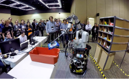

# Analysis and Observations from the First Amazon Picking Challenge

# 備考

## 著者

Nikolaus Correll, Kostas E. Bekris, Dmitry Berenson, Oliver Brock,  Albert Causo, Kris Hauser, Kei Okada, Alberto Rodriguez, Joseph M. Romano, Peter R. Wurman,

## 掲載

"Analysis and Observations from the First Amazon Picking Challenge," IEEE Transactions on Automation Science and Engineering, Vol. 15 Issue 1, pp. 172–188, 2018.

# Abstract

本稿では、第1回Amazonピッキングチャレンジの概要と、参加26チームへのアンケート調査の概要を紹介する。  挑戦の目的は、ウェアハウスの棚から商品をピッキングする自律型ロボットを設計することである。 現在、この作業は人間が行っていますが、いつかロボットがコストを下げながら効率を上げて商品を入れることができるのではないかと期待されています。 本研究では、各チームの背景、機構設計、知覚装置、計画性、制御方法などについて28項目のアンケート調査を実施し、その結果を報告する。 調査結果の傾向を明らかにし、各チームの大会での成功との関連付けを行い、調査結果と筆者の個人的な経験に基づいた観察と教訓を議論する。

知覚、動作計画、把持、ロボットシステム工学は、多品種少量のピッキングアプリケーションを含む半構造化された環境での単純なウェアハウス作業の自動化を探求することを可能にする成熟度に達している。 この調査では、第1回Amazonピッキングチャレンジから学んだこと、高照明メカニズムの設計、知覚、動作計画アルゴリズム、および単純化された注文処理タスクの解決に最も成功したソフトウェアエンジニアリングの実践についてまとめています。メカニズムの選択は実行速度にほとんど影響を与えますが、このコンテストはロボット工学のシステム課題を実証し、反応制御と計画的な計画を組み合わせることの重要性を示しました。

# Introduction

第1回Amazon Picking Challenge（APC）は、2015年にワシントン州シアトルのIEEE International Conference onRobotics and Automation（ICRA）で2日間にわたって開催されました。この大会の目的は、ウェアハウスオートメーションの長期的な目標[1], [2]である物体認識、動作計画、把持計画、タスク計画における最先端の技術の統合に関わる課題をロボット研究コミュニティに提供することであった。この大会は、人工知能のベンチマークとしての長い伝統を受け継ぐものである[3]。本論文では、チャレンジに参加した 26 チームの調査結果を紹介し、参加者と参加チームを率いたことのある、あるいはチャレンジの組織に関与したことのある著者（Romano と Wurman）が学んだ教訓をまとめたものである。

採用されたソリューションの多様性は、ハードウェア、ソフトウェア、アルゴリズムのレベルで印象的でした。 大型の単一ロボットアームから、棚の上の1つのビンに複数の小型ロボットがそれぞれ割り当てられているもの、単純な吸盤から擬人化されたロボットハンドまで、また、完全に反応するアプローチから、完全に意図的なセンス・プラン・アクションアプローチまで、様々な種類のロボットが採用されていました。各チームのアプローチの詳細を調査し、そこから何を学んだのかを問うことで、(1)最終的にどのように問題を解決するのかを理解し、(2)知覚・操作・計画といった一般的な問題を解決するために、今後のロボット工学研究の方向性を見出すことができればと考えています。

しかし、このような傾向を抽出するのは簡単ではない。異なるチームは、表IIIに示すように、ほぼ直交的なアプローチに従うことで同等の結果を得ており、時には1つの技術の限界を超えていることもありました。特定のアイテムをゴミ箱から取り出してトートに運ぶなどの成功した把持に関する利用可能なデータはまばらであった。 これは、複雑なロボットシステムのスキャンが、ラボ環境の外での単一の評価試験中に失敗するような、多くの特異な方法に起因する部分もありました。 それでも、メカアニズムとアルゴリズムの両方を含む個々のアプローチの長所と短所、そして解決策の一般性を向上させるためにそれらをどのように組み合わせるべきかについて、いくつかの観察を行うことができます。また、そのプロセスについてもいくつかの結論を導き出すことができます。例えば、

* チームの中には、ゼロから開発したコンポーネントが多すぎて、堅牢なものを作る時間がないという報告もありました。
* 他の人たちは、「ブラックボックス」として使用した既製のソフトウェアコンポーネントには、適切にカスタマイズできない重要な機能が隠されていたと報告しています。

この点で、複雑なロボットシステムの設計をいかにシンプルにして、より信頼性の高いものにするかという重要な教訓があります。

図1.  倉庫の棚から取り出したオレオクッキーをトートに入れるRBOチームのロボット。画像提供：RBOチーム

# Conclusion

APCコンテストは、先進的な研究を現実世界の問題に応用したエキサイティングな展示会でした。ロボティクス分野における現代の進歩は、過去の単調な産業用アプリケーションよりもはるかにニュアンスのあるダイナミックな作業を可能にしています。しかし、このような状況下で人間のようなスピードと信頼性を実現するためには、まだまだ改善とブレークスルーが必要であることは明らかです。人間は同じタスクのより複雑なバージョンを、エラーを最小限に抑えながら毎時400ソートで実行することができますが、APCの中で最高のロボットは毎時30ソートで16%の故障率を達成しました。この課題は、様々なコンポーネントの成熟度と産業用アプリケーションへの移行の準備ができていることを示す、興味深い計測棒でした。

APC システムの基盤となっているのは、ロボット工学界のオープンソース プロジェクトの多くであることは、ロボット工学コミュニティの功績と言えるでしょう。数ヶ月でこのような課題に対応できるシステムを開発することは、質の高いツールと応用可能な研究がなければ考えられないことです。 しかし、これらのツールを完全なソリューションに統合することが困難であったり、特定のタスクにロバストなソリューションを提供するための変更が困難であることが判明した場所で、貴重なフィードバックが得られたことは重要です。