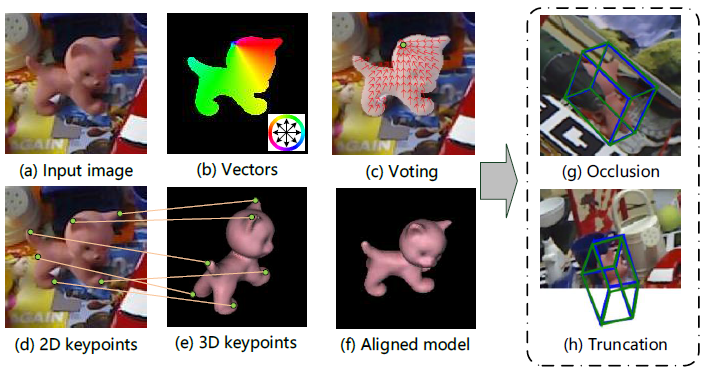
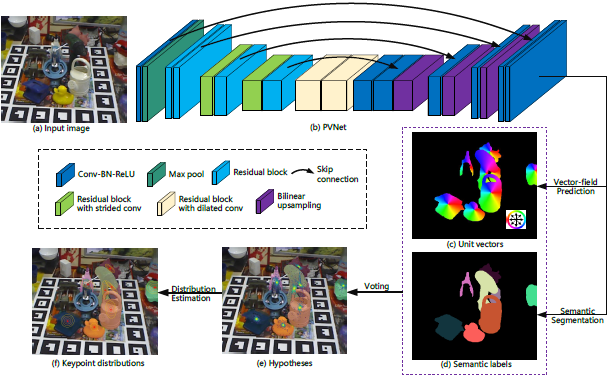

# PVNet: Pixel-wise Voting Network for 6DoF Pose Estimation

# 備考
## 著者
Sida Peng, Yuan Liu, Qixing Huang, Xiaowei Zhou, Hujun Bao

## 掲載
"Pvnet: Pixel-wise voting network for 6dof pose estimation", In Proceedings of the IEEE Conference on ComputerVision and Pattern Recognition, pages 4561–4570, 2019.

# Abstract
この論文では、深刻なオクルージョンまたはトランケーション(先端切断)の下での単一のRGB画像からの6DoFポーズ推定の課題について説明します。最近の多くの研究で、最初にキーポイントを検出し、次に姿勢推定のためにPerspective-n-Point（PnP）問題を解決する2段階のアプローチにより、驚くべきパフォーマンスが達成されることが示されています。ただし、これらの方法のほとんどは、画像座標またはヒートマップを回帰することにより、スパースキーポイントのセットをローカライズするだけで、オクルージョンとトランケーションに敏感です。代わりに、ピクセル単位の投票ネットワーク（PVNet）を導入して、キーポイントを指すピクセル単位のベクトルを回帰し、これらのベクトルを使用してキーポイントの場所に投票します。これにより、隠れたキーポイントまたは切り捨てられたキーポイントをローカライズするための柔軟な表現が作成されます。この表現のもう1つの重要な機能は、PnPソルバーでさらに活用できるキーポイントの位置の不確実性を提供することです。実験は、提案されたアプローチがLINEMOD、Occlusion LINEMODおよびYCB-Videoデータセットの最新技術を大幅に上回っており、リアルタイムの姿勢推定には効率的であることを示しています。さらに、トランケーションLINEMODデータセットを作成して、トランケーションに対するアプローチの堅牢性を検証します。コードは
https://zju3dv.github.io/pvnet/
で入手できます。

# 1. Introduction
オブジェクトポーズ推定は、オブジェクトを検出し、標準フレームに対するオブジェクトの向きと平行移動を推定することを目的としています[39]。 正確な姿勢推定は、拡張現実、自動運転、ロボット操作などのさまざまなアプリケーションに不可欠です。 たとえば、ロボットが倉庫の棚からオブジェクトを選ぶ必要があるAmazon Picking Challenge [6]では、高速で堅牢な姿勢推定が重要です。 このホワイトペーパーでは、オブジェクトの6自由度のポーズを回復する特定の設定、つまり、オブジェクトの単一のRGBイメージから3Dでの回転と平行移動に焦点を当てています。 この問題は、厳しいオクルージョンの下でのオブジェクトの検出、照明と外観の変化、乱雑な背景オブジェクトなど、多くの観点から非常に困難です。

従来の方法[24、20、15]は、ポーズ推定がオブジェクトイメージとオブジェクトモデル間の対応を確立することによって達成できることを示しています。 画像のバリエーションや背景の乱雑さに対して堅牢ではない手作りの機能に依存しています。 深層学習に基づく方法[33、17、40、4]は、画像を入力として受け取り、対応する姿勢を出力するエンドツーエンドのニューラルネットワークをトレーニングします。 ただし、そのようなエンドツーエンドのメソッドが姿勢推定のための十分な特徴表現を学習するかどうかは不明であるため、一般化は依然として問題として残っています。

最近のいくつかの方法[29、30、36]では、CNNを使用して最初に2Dキーポイントを回帰し、次にPerspective-n-Point（PnP）アルゴリズムを使用して6Dポーズパラメーターを計算しています。 言い換えると、検出されたキーポイントは、姿勢推定の中間表現として機能します。 このような2段階のアプローチでは、キーポイントを確実に検出できるため、最先端のパフォーマンスを実現できます。 ただし、これらのメソッドでは、キーポイントの一部が表示されないため、隠れたオブジェクトや切り捨てられたオブジェクトに取り組むのが困難です。 CNNは同様のパターンを記憶することによってこれらの目に見えないキーポイントを予測する可能性がありますが、一般化は依然として困難です。

オクルージョンとトランケーションに対処するには、密な予測、つまり最終出力または中間表現のピクセル単位またはパッチ単位の推定が必要であると私たちは主張します。 このために、ピクセルワイズ投票ネットワーク（PVNet）を使用した6D姿勢推定の新しいフレームワークを提案します。 基本的な考え方を図1に示します。キーポイントの画像座標を直接回帰するのではなく、PVNetはオブジェクトの各ピクセルからキーポイントへの方向を表すベクトルを予測します。 これらの指示は、RANSAC [9]に基づいてキーポイント位置に投票します。 この投票方式は、一部のローカルパーツを確認すると、他のパーツへの相対方向を推測できる剛体オブジェクトのプロパティに基づいています。

\
**図1.**\
6Dポーズ推定問題は、このペーパーではPerspective-n-Point（PnP）問題として定式化され、（d）および（e）に示すように、2Dおよび3Dキーポイント間の対応が必要です。 （b）に示すように、各ピクセルのキーポイントを指すベクトルを予測し、（c）に示すように、RANSACベースの投票スキームで2Dキーポイントをローカライズします。 提案された方法は、オクルージョン（g）およびトランケーション（h）に対してロバストであり、緑のバウンディングボックスはグラウンドトゥルースポーズを表し、青のバウンディングボックスは予測を表します。

オクルージョンとトランケーションに対処するには、密な予測、つまり最終出力または中間表現のピクセル単位またはパッチ単位の推定が必要であると私たちは主張します。 このために、ピクセルワイズ投票ネットワーク（PVNet）を使用した6D姿勢推定の新しいフレームワークを提案します。 基本的な考え方を図1に示します。キーポイントの画像座標を直接回帰するのではなく、PVNetはオブジェクトの各ピクセルからキーポイントへの方向を表すベクトルを予測します。 これらの指示は、RANSAC [9]に基づいてキーポイント位置に投票します。 この投票方式は、一部のローカルパーツを確認すると、他のパーツへの相対方向を推測できる剛体オブジェクトのプロパティに基づいています。

私たちのアプローチは基本的に、キーポイントのローカライズのためのベクトルフィールド表現を作成します。 座標またはヒートマップベースの表現とは対照的に、そのような表現を学習すると、ネットワークはオブジェクトのローカル機能とオブジェクトパーツ間の空間関係に焦点を合わせるように強制されます。 その結果、不可視部分の位置は可視部分から推測できます。 さらに、このベクトルフィールド表現は、入力画像の外側にあるオブジェクトのキーポイントを表すことができます。 これらのすべての利点により、オクルードまたはトランケートされたオブジェクトの理想的な表現になります。 Xiang et al。 [40]は、オブジェクトを検出するための同様のアイデアを提案しました。ここでは、キーポイントを特定するためにそれを使用しています。

提案されたアプローチの別の利点は、密な出力がPnPソルバーが不正確なキーポイント予測を処理するための豊富な情報を提供することです。 具体的には、RANSACベースの投票は外れ値予測を排除し、各キーポイントの空間確率分布も提供します。 キーポイントの位置のこのような不確実性により、PnPソルバーは、最終的な姿勢を予測するための一貫した対応を特定するための自由度が高くなります。 実験により、不確実性主導のPnPアルゴリズムが姿勢推定の精度を向上させることが示されています。

LINEMOD [15]、オクルージョンLINEMOD [2]およびYCB-Video [40]データセットでのアプローチを評価します。これらは、6Dポーズ推定に広く使用されているベンチマークデータセットです。 すべてのデータセットにおいて、PVNetは最先端のパフォーマンスを発揮します。 また、LINEMODの画像をランダムにクロッピングして作成されるTruncation LINEMODと呼ばれる新しいデータセットで切り捨てられたオブジェクトを処理するアプローチの機能も示します。 さらに、私たちのアプローチは効率的で、GTX 1080ti GPUで25 fpsを実行し、リアルタイムの姿勢推定に使用されます。

要約すると、この作品には以下の貢献があります。
* 堅牢な2Dキーポイントローカリゼーションのベクトルフィールド表現を学習し、自然にオクルージョンとトランケーションを処理するピクセル単位の投票ネットワーク（PVNet）を使用した6Dポーズ推定の新しいフレームワークを提案します。
* PVNetからの密な予測に基づいて、不確実性駆動型PnPアルゴリズムを使用して、2Dキーポイント位置の不確実性を説明することを提案します。
* ベンチマークデータセットの最新技術と比較して、アプローチのパフォーマンスが大幅に向上していることを示しています（ADD：86.3％対79％、40.8％対30.4％、それぞれLINEMODとOCCLUSION）。 また、切り捨てられたオブジェクトを評価するための新しいデータセットを作成します。

# 2. Related work

### **全体的な方法。**

画像が与えられた場合、いくつかの方法は、1回のショットでオブジェクトの3D位置と方向を推定することを目的としています。従来の方法は、乱雑な環境や外観の変化に敏感なテンプレートマッチング技術[16、12、14、42]に主に依存しています。最近、CNNは環境の変化に対してかなりの堅牢性を示しています。 PoseNet [19]は、パイオニアとして、単一のRGB画像から6Dカメラポーズを直接後退させるCNNアーキテクチャを導入しています。これは、オブジェクトポーズ推定に似たタスクです。ただし、奥行き情報が不足し、検索スペースが大きいため、3Dでオブジェクトを直接ローカライズすることは困難です。この問題を克服するために、PoseCNN [40]は2D画像内のオブジェクトの位置を特定し、それらの深度を予測して3D位置を取得します。ただし、回転空間の非線形性によりCNNが一般化されなくなるため、3D回転を直接推定することも困難です。この問題を回避するために、[38、33、23、35]は回転空間を離散化し、3D回転推定を分類タスクにキャストします。このような離散化は粗い結果を生成し、正確な6DoFポーズを得るには事後精錬が不可欠です。

### **キーポイントベースのメソッド。**

画像からポーズを直接取得する代わりに、キーポイントベースのメソッドは2段階のパイプラインを採用します。最初にオブジェクトの2Dキーポイントを予測し、次にPnPアルゴリズムを使用して2D-3D対応を通じてポーズを計算します。 2Dのキーポイント検出は、3Dの位置特定と回転の推定よりも比較的簡単です。リッチテクスチャのオブジェクトの場合、従来の方法[24、32、1]はローカルキーポイントをロバストに検出するため、雑然としたシーンや厳しいオクルージョンの下でも、オブジェクトのポーズが効率的かつ正確に推定されます。ただし、従来の方法では、テクスチャのないオブジェクトの処理や低解像度の画像の処理が困難です[20]。この問題を解決するために、最近の研究ではセマンティックキーポイントのセットを定義し、キーポイント検出器としてCNNを使用しています。 [30]は、セグメンテーションを使用して、オブジェクトを含む画像領域を識別し、検出された画像領域からキーポイントを回帰します。 [36]はオブジェクトのキーポイントを推定するためにYOLOアーキテクチャ[31]を採用しています。彼らのネットワークは、低解像度の機能マップに基づいて予測を行います。オクルージョンなどの全体的な注意散漫が発生すると、フィーチャマップが妨害され[27]、姿勢推定の精度が低下します。 2Dの人間の姿勢推定の成功[26]を動機として、別のカテゴリの方法[29、27]は、キーポイントのピクセル単位のヒートマップを出力して、オクルージョンの問題に対処します。ただし、ヒートマップは固定サイズであるため、これらのメソッドでは、キーポイントが入力画像の外側にある可能性がある切り詰められたオブジェクトを処理することが困難です。対照的に、この方法では、より柔軟な表現、つまりベクトル場を使用して2Dキーポイントのピクセル単位の予測を行います。キーポイントの位置は、方向からの投票によって決定されます。これは、切り捨てられたオブジェクトに適用できます。

### **密な方法。**

これらの方法では、すべてのピクセルまたはパッチが目的の出力の予測を生成し、一般化されたハフ投票方式で最終結果に投票します[22、34、11]。 [2、25]ランダムフォレストを使用して各ピクセルの3Dオブジェクト座標を予測し、幾何学的制約を使用して2D-3D対応仮説を作成します。強力なCNNを利用するには、[18、7]画像パッチを密にサンプリングし、ネットワークを使用して後者の投票の特徴を抽出します。ただし、これらの方法ではRGB-Dデータが必要です。 RGBデータのみが存在する場合、[3]は自動コンテキスト回帰フレームワーク[37]を使用して、3Dオブジェクト座標のピクセル単位の分布を生成します。疎なキーポイントと比較して、オブジェクト座標は、ポーズ推定に対して密な2D-3D対応を提供します。これは、オクルージョンに対してより堅牢です。ただし、出力スペースが大きいため、オブジェクト座標の回帰はキーポイント検出よりも困難です。私たちのアプローチは、キーポイントのローカライズのための密な予測を行います。これは、キーポイントベースの方法と密な方法のハイブリッドと見なすことができ、両方の方法の利点が組み合わされています。

# 3. Proposed approach

この論文では、6DoFオブジェクト姿勢推定のための新しいフレームワークを提案します。 画像が与えられた場合、ポーズ推定のタスクは、オブジェクトを検出し、その方向と3D空間での並進を推定することです。 具体的には、6Dポーズは、オブジェクト座標系からカメラ座標系への厳密な変換

によって表されます。ここで、

は3D回転を表し、

は3D変換を表します。

最近の方法[29、30、36]に着想を得て、2ステージのパイプラインを使用してオブジェクトのポーズを推定します。最初にCNNを使用して2Dオブジェクトのキーポイントを検出し、次にPnPアルゴリズムを使用して6Dポーズパラメータを計算します。 私たちの革新は、2Dオブジェクトのキーポイントの新しい表現と、姿勢推定のための修正されたPnPアルゴリズムです。 具体的には、この方法ではPVNetを使用して、RANDSACのような方法で2Dキーポイントを検出します。これにより、隠れたオブジェクトや切り捨てられたオブジェクトが確実に処理されます。 RANSACベースの投票では、各キーポイントの空間確率分布も提供されるため、不確実性に基づくPnPで6Dポーズを推定できます。

## 3.1. Votaing-based keypoint localization

\
**図2.キーポイントローカリゼーションの概要**\
（a）オクルージョンLINEMODデータセットの画像。 （b）PVNetのアーキテクチャ。 （c）オブジェクトのキーポイントを指すピクセル単位のベクトル。 （d）セマンティックラベル。 （e）投票によって生成されたキーポイントの場所の仮説。 投票スコアが高い仮説は明るくなります。 （f）仮説から推定されたキーポイント位置の確率分布。 分布の平均は赤い星で表され、共分散行列は楕円で示されます。

図2は、キーポイントのローカリゼーションのために提案されているパイプラインの概要を示しています。 RGB画像が与えられると、PVNetはすべてのピクセルからすべてのキーポイントへの方向を表すピクセル単位のオブジェクトラベルとベクトルを予測します。 そのオブジェクトに属するすべてのピクセルから特定のオブジェクトキーポイントへの方向を指定すると、そのキーポイントの2D位置の仮説と、RANSACベースの投票による信頼スコアが生成されます。 これらの仮説に基づいて、各キーポイントの空間確率分布の平均と共分散を推定します。

画像ウィンドウから直接キーポイント位置を回帰することとは対照的に[30、36]、ピクセル単位の方向を予測するタスクは、オブジェクトのローカル機能にさらに焦点を合わせ、雑然とした背景の影響を軽減するようにネットワークを強化します。 このアプローチのもう1つの利点は、画像の外側または外側に隠れているキーポイントを表現できることです。 キーポイントが見えなくても、オブジェクトの他の目に見える部分から推定された方向に従って正しくキーポイントを見つけることができます。

具体的には、PVNetは、セマンティックセグメンテーションとベクトルフィールド予測の2つのタスクを実行します。 ピクセル

の場合、PVNetはそれを特定のオブジェクトに関連付けるセマンティックラベルと、ピクセル

からオブジェクトの2Dキーポイント

への方向を表すベクトル

を出力します。 ベクトル

は、ピクセル

とキーポイント

の間のオフセット、つまり

です。 セマンティックラベルとオフセットを使用して、ターゲットオブジェクトのピクセルを取得し、オフセットを追加して一連のキーポイント仮説を生成します。

ただし、これらのオフセットはオブジェクトのスケール変更の影響を受けやすく、PVNetの一般化機能が制限されます。 したがって、スケール不変ベクトルをさらに提案します。

オブジェクトパーツ間の相対方向のみを考慮します。 セクション5.3で、2種類のベクトルのパフォーマンスを比較します。

ターゲットオブジェクトのピクセルと単位ベクトルが与えられると、RANSACベースの投票スキームでキーポイント仮説が生成されます。 最初に、2つのピクセルをランダムに選択し、それらのベクトルの交点をキーポイント

の仮説

とします。 このステップを

回繰り返し、可能なキーポイントの位置を表す一連の仮説

を生成します。 次に、オブジェクトのすべてのピクセルがこれらの仮説に投票します。 具体的には、仮説

の投票スコア

は次のように定義されます。

ここで、

は指標関数、

はしきい値（すべての実験で0.99）、

はピクセル

がオブジェクト

に属することを意味します。直感的には、投票スコアが高ければ高いほど、より多くの予測された方向性と一致しているため、仮説がより確信に満ちていることを意味します。

結果の仮説は、画像内のキーポイントの空間確率分布を特徴付けます。 図2（e）に例を示します。 最後に、キーポイント

の平均

と共分散

は、次のように推定されます。

これらは、セクション3.2で説明されている不確実性主導のPnPに使用されます。

### **キーポイントの選択。**

\
図3.（a）3Dオブジェクトモデルとその3Dバウンディングボックス。 （b）境界ボックスのコーナーについてPVNetによって生成された仮説。 （c）オブジェクト表面で選択されたキーポイントに対してPVNetによって生成された仮説。 サーフェスキーポイントの分散が小さいことは、このアプローチでは、境界ボックスのコーナーよりもサーフェスキーポイントをローカライズする方が簡単であることを示しています。

キーポイントは、3Dオブジェクトモデルに基づいて定義する必要があります。 最近の多くの方法[30、36、27]は、オブジェクトの3Dバウンディングボックスの8つのコーナーをキーポイントとして使用しています。 図3（a）に例を示します。 これらの境界ボックスの角は、画像内のオブジェクトピクセルから離れている場合があります。 キーポイント仮説はオブジェクトピクセルから始まるベクトルを使用して生成されるため、オブジェクトピクセルまでの距離が長いほど、ローカリゼーションエラーが大きくなります。 図3（b）および（c）は、PVNetによって生成された、バウンディングボックスのコーナーとオブジェクトサーフェス上で選択されたキーポイントの仮説をそれぞれ示しています。 オブジェクトサーフェス上のキーポイントは、通常、ローカリゼーションの分散がはるかに小さくなります。

したがって、私たちのアプローチでは、キーポイントをオブジェクトサーフェス上で選択する必要があります。 その間、これらのキーポイントはオブジェクト上に広がり、PnPアルゴリズムをより安定させる必要があります。 2つの要件を考慮して、最遠点サンプリング（FPS）アルゴリズムを使用して

個のキーポイントを選択します。 まず、オブジェクトの中心を追加してキーポイントセットを初期化します。 次に、現在のキーポイントセットに最も遠いオブジェクトサーフェス上のポイントを繰り返し見つけ、セットのサイズが

に達するまでセットに追加します。セクション5.3の経験的結果は、この戦略がより良い結果をもたらすことを示しています。 境界ボックスのコーナーを使用します。 また、異なる数のキーポイントを使用して結果を比較します。 精度と効率の両方を考慮して、実験結果に従って

を提案します。 図4は、いくつかのオブジェクトの選択されたキーポイントを視覚化しています。

\
図4. LINEMODデータセット内の4つのオブジェクトのキーポイント。

### **複数のインスタンス。**

私たちの方法は、[40、28]で提案された戦略に基づいて複数のインスタンスを処理できます。 オブジェクトクラスごとに、提案された投票スキームを使用して、オブジェクトセンターとその投票スコアの仮説を生成します。 次に、仮説の中からモードを見つけ、これらのモードを異なるインスタンスの中心としてマークします。 最後に、インスタンスマスクは、投票する最も近いインスタンスの中心にピクセルを割り当てることによって取得されます。