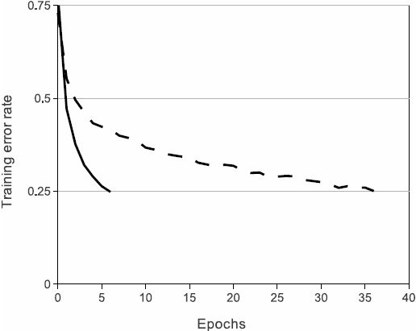
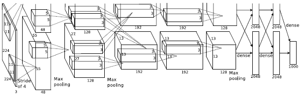
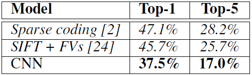
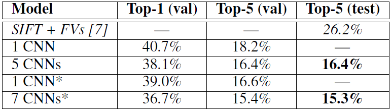
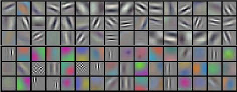
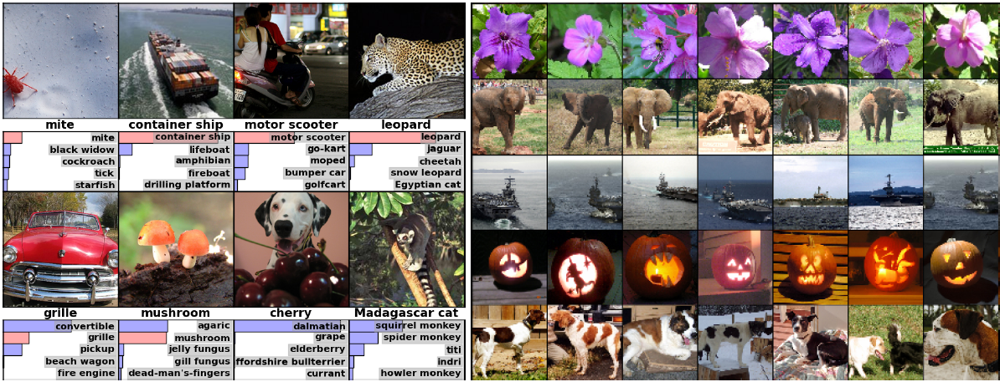

# ImageNet Classification with Deep Convolutional Neural Networks

# 備考

## 著者

Alex Krizhevsky, Ilya Sutskever, Geoffrey E. Hinton

## 掲載

"ImageNet Classification with Deep Convolutional Neural Networks." In NIPS, 2012.

# Abstract

ImageNet LSVRC-2010 コンテストの 120 万の高解像度画像を 1000 の異なるクラスに分類するために、大規模で深い畳み込みニューラルネットワークをトレーニングしました。テストデータでは、トップ 1 とトップ 5 のエラー率が 37.5％と 17.0％を達成しました。これは、従来の最新技術よりもかなり優れています。6,000 万のパラメーターと 650,000 のニューロンを持つニューラルネットワークは、5 つの畳み込み層で構成され、そのうちのいくつかは最大プール層、最後に 1000 カテゴリのソフトマックスを持つ 3 つの完全に接続された層が続きます。トレーニングを高速化するために、非飽和ニューロンと畳み込み演算の非常に効率的な GPU 実装を使用しました。完全に接続された層の過剰適合を減らすために、非常に効果的であることが証明された「ドロップアウト」と呼ばれる最近開発された正則化方法を採用しました。また、ILSVRC-2012 コンペティションでこのモデルのバリアントを入力し、2 位のエントリで達成された 26.2％と比較して、15.3％高いテストエラー率でトップ 5 に勝利しました。

# 1 Introduction

オブジェクト認識への現在のアプローチは、機械学習法を本質的に使用しています。パフォーマンスを向上させるために、より大きなデータセットを収集し、より強力なモデルを学習し、オーバーフィットを防ぐためのより良いテクニックを使用できます。最近まで、ラベル付き画像のデータセットは比較的小さく、数万枚の画像でした（たとえば、NORB [16]、Caltech-101 / 256 [8、9]、および CIFAR-10 / 100 [12]）。単純な認識タスクは、このサイズのデータセットを使用して、特にラベル保存変換で強化されている場合、非常によく解決できます．例えば、MNIST 数字認識タスクの現在の最高エラー率（<0.3％）は、人間のパフォーマンスに近づいています[4]。しかし、現実的な設定のオブジェクトにはかなりのばらつきがあるため、それらを認識することを学ぶには、はるかに大きなトレーニングセットを使用する必要があります。実際、小さな画像データセットの欠点は広く認識されていますが（たとえば、Pinto et al。[21]）、数百万の画像を含むラベル付きデータセットを収集できるようになったのはごく最近です。新しい大規模なデータセットには、数十万の完全にセグメント化された画像で構成される LabelMe [23]、および 22,000 以上のカテゴリの 1500 万を超えるラベル付き高解像度画像で構成される ImageNet [6]が含まれます。

数百万の画像から数千のオブジェクトについて学習するには、大きな学習能力を持つモデルが必要です。ただし、オブジェクト認識タスクは非常に複雑であるため、ImageNet と同じ大きさのデータセットでもこの問題を特定することはできません。したがって、モデルには、私たちが持たないすべてのデータを補うための多くの事前知識が必要です。畳み込みニューラルネットワーク（CNN）は、そのようなモデルのクラスの 1 つを構成します[16、11、13、18、15、22、26]。それらの容量は、深さと幅を変えることによって制御でき、また、画像の性質（つまり、統計の定常性とピクセル依存の局所性）について強力でほとんど正しい仮定を行います。したがって、同様のサイズのレイヤーを持つ標準のフィードフォワードニューラルネットワークと比較して、CNN は接続とパラメーターがはるかに少ないため、トレーニングが容易であり、理論的に最高のパフォーマンスはわずかに劣るだけです。CNN の魅力的な品質にもかかわらず、ローカルアーキテクチャの相対的な効率にもかかわらず、高解像度の画像に大規模に適用することは依然として非常に高価でした。幸いにも、2D 畳み込みの高度に最適化された実装と組み合わせた現在の GPU は、興味深い大きな CNN のトレーニングを促進するのに十分強力であり、ImageNet などの最近のデータセットには、過度の適合なしにそのようなモデルをトレーニングするのに十分なラベル付きの例が含まれています。

このペーパーの具体的な貢献は次のとおりです。ILSVRC-2010 および ILSVRC-2012 コンテストで使用される ImageNet のサブセット[2]でこれまでに最大の畳み込みニューラルネットワークの 1 つをトレーニングし、これまでに報告された中で最高の結果を達成しました。これらのデータセット。 2D 畳み込みの高度に最適化された GPU 実装と、畳み込みニューラルネットワークのトレーニングに固有のその他すべての操作を作成しました。ネットワークには、パフォーマンスを向上させ、トレーニング時間を短縮する新しい珍しい機能が多数含まれています。詳細については、セクション 3 で説明します。120 万のラベル付きトレーニング例を使用しても、ネットワークのサイズが重要な問題を過度に適合させるため、いくつかの効果的なセクション 4 で説明するオーバーフィッティングを防止する手法。最終的なネットワークには、5 つの畳み込み層と 3 つの完全に接続された層が含まれており、この深さは重要であると思われます。畳み込み層を削除すると、各層が 1％以下になることがわかりました。モデルのパラメータ）のパフォーマンスが低下しました。

結局のところ、ネットワークのサイズは、主に現在の GPU で使用可能なメモリの量と、許容できるトレーニング時間の量によって制限されます。私たちのネットワークは、2 つの GTX 580 3GB GPU でトレーニングするのに 5〜6 日かかります。すべての実験は、より高速な GPU とより大きなデータセットが利用可能になるのを待つだけで、結果を改善できることを示唆しています。

# 2. The Dataset

ImageNet は、約 22,000 のカテゴリに属する 1500 万を超えるラベル付き高解像度画像のデータセットです。画像はウェブから収集され、Amazon の Mechanical Turk クラウドソーシングツールを使用して人間のラベラーによってラベル付けされました。2010 年から、Pascal Visual Object Challenge の一環として、ImageNet Large-Scale Visual Recognition Challenge（ILSVRC）と呼ばれる年次大会が開催されました。ILSVRC は、1000 個のカテゴリごとに約 1000 個の画像を持つ ImageNet のサブセットを使用します。全体で、およそ 120 万のトレーニング画像、50,000 の検証画像、および 150,000 のテスト画像があります。

ILSVRC-2010 は、テストセットラベルが利用できる ILSVRC の唯一のバージョンです。したがって、これは、ほとんどの実験を実行したバージョンです。ILSVRC-2012 コンペティションでもモデルに参加したため、セクション 6 では、テストセットラベルが使用できないこのバージョンのデータセットに関する結果も報告します。ImageNet では、トップ 1 とトップ 5 の 2 つのエラー率を報告するのが一般的です。トップ 5 エラー率は、正しいラベルがモデルによって最も可能性が高いと考えられる 5 つのラベルの中にないテスト画像の割合です。

ImageNet は可変解像度の画像で構成されていますが、システムには一定の入力次元が必要です。したがって、画像を 256 x 256 の固定解像度にダウンサンプリングしました。長方形の画像が与えられた場合、まず短辺の長さが 256 になるように画像を再スケーリングし、次に結果の画像から中央の 256 x 256 パッチを切り取りました。各ピクセルからトレーニングセットの平均アクティビティを減算することを除いて、他の方法で画像を前処理しませんでした。そのため、ピクセルの（中心にある）生の RGB 値でネットワークをトレーニングしました。

# 3. The Architecture

私たちのネットワークのアーキテクチャを図 2 に示します。これには、5 つの畳み込み層と 3 つの完全に接続された 8 つの学習層が含まれています。以下では、ネットワークアーキテクチャの斬新な機能や珍しい特徴について説明します。セクション 3.1〜3.4 は、重要性の評価に従ってソートされています。

## 3.1. ReLU Nonlinearity

ニューロンの出力 f を入力 x の関数としてモデル化する標準的な方法は、

または

です。 勾配降下を用いた学習時間の観点からは、これらの飽和非線形性は非飽和非線形性

よりもはるかに遅い。 Nair と Hinton[20]に従い、この非線形性を持つニューロンを Rectified Linear Units (ReLUs)と呼ぶ。ReLU を用いた深層畳み込みニューラルネットワークは、tanh ユニットを用いた同等ものよりも数倍高速に学習することができる。 これは図 1 に示されており、特定の 4 層の畳み込みネットワークについて、CIFAR-10 データセットで 25%の学習誤差に到達するために必要な反復回数を示しています。 このプロットは、従来の飽和ニューロンモデルを使用していたら、このような大規模なニューラルネットワークを使った実験はできなかったことを示しています。

\
図 1：ReLU を使用した 4 層の畳み込みニューラルネットワーク（実線）は、tanh ニューロンを使用した同等のネットワーク（破線）の 6 倍の速さで CIFAR-10 の 25％トレーニングエラー率に到達します。 各ネットワークの学習率は、トレーニングをできるだけ速くするために個別に選択されました。 いかなる種類の正則化も採用されていません。 ここで示される効果の大きさはネットワークアーキテクチャによって異なりますが、ReLU を備えたネットワークは、飽和ニューロンを備えたネットワークよりも一貫して数倍速く学習します。

## 3.5. Overall Architecture

これで CNN の全体的なアーキテクチャを説明する準備ができた。図 2 に示すように，ネットは重みを持つ 8 つの層から構成されており，最初の 5 つは畳み込みで，残りの 3 つは全結合である．最後の全結合層の出力は 1000 出力のソフトマックスに送られ，1000 個のクラス・ラベルの分布を生成する．我々のネットワークは、多項ロジスティック回帰の目的関数を最大化する。これは、予測分布の下での正しいラベルの対数確率の学習ケース全体の平均を最大化することに相当する。

\
図 2：CNN のアーキテクチャの図。2 つの GPU 間の責任の概要を明示しています。 1 つの GPU は図の上部でレイヤーパーツを実行し、もう 1 つの GPU は下部でレイヤーパーツを実行します。 GPU は特定のレイヤーでのみ通信します。 ネットワークの入力は 150,528 次元であり、ネットワークの残りのレイヤーのニューロンの数は 253,440–186,624–64,896–64,896–43,264–4096–4096–1000 で与えられます。

2 番目、4 番目、5 番目の畳み込み層のカーネルは、同じ GPU に存在する前の層のカーネルマップにのみ接続されます（図 2 を参照）。 3 番目の畳み込み層のカーネルは、2 番目の層のすべてのカーネルマップに接続されます。 全結合層のニューロンは、前の層のすべてのニューロンに接続されます。 Response-normalization 層は、最初と 2 番目の畳み込み層から接続されています。セクション 3.4 で説明した種類の MaxPooling レイヤーは、Response-normalization 層と 5 番目の畳み込み層の両方にから接続されています。ReLU の非直線性は、すべての畳み込みおよび全結合層の出力に適用されます。

最初の畳み込み層は、4 ピクセルのストライドでサイズ 11x11x3 の 96 カーネルの 224x224x3 入力画像をフィルタリングします（これはカーネルマップ内の隣接するニューロンの受容野中心間の距離です）。 2 番目のたたみ込み層は、最初のたたみ込み層の（応答正規化およびプールされた）出力を入力として受け取り、サイズ 5x5x48 の 256 カーネルでフィルター処理します。 3 番目、4 番目、および 5 番目のたたみ込み層は、プーリング層または正規化層を介さずに互いに接続されています。 3 番目のたたみ込み層には、2 番目のたたみ込み層の（正規化され、プールされた）出力に接続されたサイズ 3x3x256 の 384 カーネルがあります。 4 番目の畳み込み層には、サイズが 3x3x192 の 384 個のカーネルがあり、5 番目の畳み込み層には、サイズが 3x3x192 の 256 個のカーネルがあります。 完全に接続された層には、それぞれ 4096 個のニューロンがあります。

# 4. Reducing Overfitting

我々のニューラルネットワークのアーキテクチャは 6000 万個のパラメータを持っています。 ILSVRC の 1000 クラスは、各トレーニング例で画像からラベルへのマッピングに 10 ビットの制約を課しますが、これはかなりのオーバーフィッティングなしに非常に多くのパラメーターを学習するには不十分であることがわかります。 以下では、オーバーフィッティングに対処するための主な 2 つの方法について説明します。

## 4.1. Data Augumentation

画像データのオーバーフィッティングを低減する最も簡単で一般的な方法は、ラベルを保存したまま画像変換を用いてデータセットを人為的に拡張することです（[25, 4, 5]など）。我々は 2 つの異なる形式のデータ拡張を採用していますが、どちらも元の画像から変換された画像を非常に少ない計算量で作成できるので、変換された画像をディスクに保存する必要がありません。我々の実装では、変換画像は CPU 上の Python コードで生成され、GPU は前のバッチの画像でトレーニングを行っています。このように、これらのデータ増強スキームは、実質的に計算不要です。

データ拡張方法の 1 つ目の形式は、水平反転した画像を生成することである。これを行うには、256x256 の画像からランダムな 224x224 のパッチ（および水平反転）を抽出し、これらの抽出されたパッチに基づいてネットワークを学習させます。これにより、学習セットのサイズは 2048 倍になりますが、結果として得られる学習例はもちろん相互依存性が高いものとなります。この方式がなければ、我々のネットワークはオーバーフィッティングにかなり悩まされ、より小さなネットワークを使わざるを得なかったでしょう。テスト時には、ネットワークは 5 つの 224x224 パッチ（4 つのコーナーパッチとセンターパッチ）とそれらの水平反転（つまり、全部で 10 パッチ）を抽出して予測を行い、その 10 パッチ上でネットワークのソフトマックス層が行った予測を平均化します。

データ拡張方法の２つ目の形式は、学習画像のＲＧＢチャンネルの強度を変化させることです。具体的には，ImageNet のトレーニングセット全体の RGB ピクセル値の集合に対して PCA を実行します．各トレーニング画像には，平均値 0，標準偏差 0.1 のガウス分布から抽出されたランダム変数に，対応する固有値に比例する大きさの主成分の倍数を加えます．したがって、各 RGB 画像ピクセル

に次の量を加えます。

ここで、

と

は、それぞれ RGB ピクセル値の 3x3 共分散行列の

th 固有ベクトルと固有値であり、

は前述の確率変数です。 それぞれの

は、特定のトレーニング画像のすべてのピクセルに対して 1 回だけ描画され、その画像が再度トレーニングに使用される時点で再描画されます。このスキームは、自然画像の重要な特性、すなわち、オブジェクトの同一性が、照明の強度と色の変化に対して不変であることをほぼ捕捉します。 このスキームにより、トップ 1 のエラー率が 1％以上減少します。

## 4.2. Dropout

多くの異なるモデルの予測を組み合わせることは、テストエラーを減らすための非常に成功した方法です[1、3]。しかし、トレーニングに数日を要している大きなニューラルネットワークにとっては、コストがかかりすぎるようです。ただし、トレーニング中に約 2 倍のコストしかかからない、非常に効率的なバージョンのモデルの組み合わせがあります。 「ドロップアウト」[10]と呼ばれる最近導入された手法は、0.5 の確率で各隠れニューロンの出力をゼロに設定することで構成されています。この方法で「ドロップアウト」されたニューロンは、順方向パスに寄与せず、逆伝播に関与しません。したがって、入力が提示されるたびに、ニューラルネットワークは異なるアーキテクチャをサンプリングしますが、これらのアーキテクチャはすべて重みを共有します。ニューロンは特定の他のニューロンの存在に依存できないため、この手法はニューロンの複雑な共同適応を削減します。したがって、他のニューロンの多くの異なるランダムサブセットと組み合わせて役立つ、より堅牢な特徴を学習することを余儀なくされる。テスト時には、すべてのニューロンを使用しますが、出力を 0.5 で乗算します。これは、指数関数的に多くのドロップアウトネットワークによって生成される予測分布の幾何平均を取るための妥当な近似です。

図 2 の最初の 2 つの完全に接続されたレイヤーでドロップアウトを使用します。ドロップアウトがないと、ネットワークはかなりのオーバーフィッティングを示します。 ドロップアウトにより、収束に必要な反復回数がおよそ 2 倍になります。

# 5. Details of learning

我々は、バッチサイズ：128、モーメンタム：0.9、重み減衰：0.0005 の確率的勾配降下を用いてモデルを学習した。この小さな量の重み減衰がモデルの学習に重要であることがわかりました。言い換えれば、ここでの重み減衰は単なる正則化ではなく、モデルの学習誤差を減少させます。重み w の更新規則は

<a href="https://www.codecogs.com/eqnedit.php?latex=\dpi{100}&space;\fn_cm&space;\\&space;v_{i&plus;1}&space;:=&space;0.9&space;\cdot&space;v_i&space;-0.0005&space;\cdot&space;\epsilon&space;\cdot&space;w_i&space;-\epsilon&space;\cdot&space;\left<\frac{\partial&space;L}{\partial&space;w}&space;|_{w_i}&space;\right>_{D_i}\\&space;w_{i&plus;1}&space;:=&space;w_i&space;&plus;&space;v_{i&plus;1}" target="_blank">_{D_i}\\&space;w_{i&plus;1}&space;:=&space;w_i&space;&plus;&space;v_{i&plus;1}" title="\\ v_{i+1} := 0.9 \cdot v_i -0.0005 \cdot \epsilon \cdot w_i -\epsilon \cdot \left<\frac{\partial L}{\partial w} |_{w_i} \right>_{D_i}\\ w_{i+1} := w_i + v_{i+1}" /></a>

ここで、

は反復インデックス、

は運動量変数、

は学習率、
<a href="https://www.codecogs.com/eqnedit.php?latex=\dpi{100}&space;\fn_cm&space;\left<\frac{\partial&space;L}&space;{\partial&space;w}&space;|&space;_{w_i}&space;\right>&space;_{D_i&space;}" target="_blank">&space;_{D_i&space;}" title="\left<\frac{\partial L} {\partial w} | _{w_i} \right> _{D_i }" /></a>
は、

に関する目的関数の導関数の

番目のバッチ

の平均で、

で評価されます。

各レイヤーの重みは、標準偏差 0.01 のゼロ平均ガウス分布から初期化しました。 2 番目、4 番目、5 番目の畳み込み層、および完全に接続された非表示層のニューロンバイアスを定数 1 で初期化しました。この初期化は、ReLU に正の入力を提供することで、学習の初期段階を加速します。 残りの層のニューロンバイアスを定数 0 で初期化しました。

すべての層 d で同じ学習率を使用し、これを訓練中に手動で調整した。続いて行った経験的な手法は、現在の学習率で検証エラー率の改善が止まったときに、学習率を 10 で割ることであった。学習率は 0.01 で初期化し、終了前までに 3 回減少させた。120 万枚の画像を用いて約 90 回のトレーニングを行い、2 台の NVIDIA GTX 580 3GB GPU 上で 5 ～ 6 日かけて学習しました。

# 6 Results

ILSVRC-2010 の結果を表 1 にまとめます。我々のネットワークは、トップ 1 とトップ 5 のテストセットエラー率 37.5%と 17.0%を達成しています。ILSVRC2010 の大会で達成された最高のパフォーマンスは、異なる特徴で訓練された 6 つのスパースコーディングモデルから生成された予測値を平均化するアプローチで 47.1%と 28.2%であり[2]、それ以降、2 つのタイプの密にサンプリングされた特徴から計算されたフィッシャーベクトル（FV）でトレーニングされた 2 つの分類器の予測値を平均化するアプローチで 45.7%と 25.7%である[24]。

\
表 1：ILSVRC2010 テストセットの結果の比較。 イタリック体は、他の人が達成した最良の結果です。

また、ILSVRC-2012 コンペティションにも我々のモデルをエントリーし、その結果を表 2 に報告します。ILSVRC-2012 のテストセットラベルは公開されていないため、我々が試したすべてのモデルのテストエラー率を報告することはできません。この段落の残りの部分では、検証エラー率とテストエラー率を入れ替えて使用しているが、それは、我々の経験上、0.1%以上の差がないからである（表 2 参照）。この論文で説明した CNN は、トップ 5 のエラー率 18.2%を達成しています。類似した５つの CNN の予測を平均すると，誤差率は 16.4%となる．1 つの CNN を，最後のプーリング層の上に 6 番目の畳み込み層を追加して，ImageNet 2011 年秋リリース（15M 画像，22K カテゴリ）全体を分類するために訓練し，ILSVRC-2012 上で「微調整」すると，16.6%の誤差率が得られる．2011 年秋リリース全体で事前に学習した 2 つの CNN の予測を，前述の 5 つの CNN で平均すると，誤差率は 15.3%となります．2 番目に優れたコンテストのエントリーは，異なるタイプの密標本特徴から計算された FV で訓練された複数の分類器の予測値を平均化するアプローチで 26.2%の誤差率を達成した [7]．

\
表 2：ILSVRC-2012 検証とテストセットのエラー率の比較。 イタリック体は、他の人が達成した最良の結果です。 アスタリスク\*の付いたモデルは、ImageNet 2011 Fall リリース全体を分類するために「事前トレーニング」されています。 詳細については、セクション 6 を参照してください。

最後に、2009 年秋バージョンの 10,184 のカテゴリと 890 万の画像を含む ImageNet のエラー率も報告します。 このデータセットでは、画像の半分をトレーニングに、残りの半分をテストに使用するという慣例に従います。 確立されたテストセットがないため、分割は以前の作成者が使用した分割とは必然的に異なりますが、これは結果にそれほど影響を与えません。 このデータセットのトップ 1 とトップ 5 のエラー率は 67.4％と 40.9％で、上記のネットによって達成されていますが、最後のプーリングレイヤーの上に追加の 6 番目の畳み込みレイヤーがあります。 このデータセットで公開された最良の結果は 78.1％と 60.9％です[19]。

## 6.1. Qualitative Evaluations

\
図 3：224x224x3 入力画像の最初のたたみ込み層によって学習されたサイズ 11x11x3 の 96 個のたたみ込みカーネル。 上位 48 カーネルは GPU 1 で学習され、下位 48 カーネルは GPU 2 で学習されました。詳細については、セクション 6.1 を参照してください。

図 3 は、ネットワークの 2 つのデータ接続層によって学習された畳み込みカーネルを示しています。このネットワークでは、さまざまな周波数と方向を選択するカーネルと、さまざまな色のブロブが学習されています。これはセクション 3.5 で説明した接続性の制限の結果である。GPU 1 のカーネルは大部分が色によらないのに対し、GPU 2 のカーネルは大部分が色に特化しています。この種の特殊化はすべての実行中に発生し，特定のランダムウェイトの初期化（GPU のナンバリングを変更した場合）とは無関係である．図 4 の左側のパネルでは，8 つのテスト画像についてトップ 5 の予測を計算することで，ネットワークが学習したことを定性的に評価しています．左上のダニのような中心から外れた物体でも、ネットが認識できることに注目してください。トップ 5 のラベルはほとんどが妥当なものです。例えば、ヒョウのラベルは、他の猫の種類のみが妥当と考えられます。いくつかのケース（グリル、チェリー）では、写真の意図された焦点について真の曖昧さがあります。

\
図 4: (左) 8 枚の ILSVRC-2010 テスト画像と、我々のモデルで最も確率が高いと考えられる 5 つのラベル。各画像の下には正しいラベルが書かれており、正しいラベルに割り当てられた確率も赤いバーで表示されています（上位 5 位以内に入っている場合）。右）最初の列の 5 つの ILSVRC-2010 テスト画像。残りの列は、テスト画像の特徴ベクトルからのユークリッド距離が最も小さい最後の隠れ層で特徴ベクトルを生成する 6 つのトレーニング画像を示しています。

ネットワークの視覚的知識を調べるもう一つの方法は、最後の 4096 次元の隠れ層で画像によって誘発される特徴活性化を考慮することです。2 つの画像が小さなユークリッド分離を持つ特徴活性化ベクトルを生成する場合、ニューラルネットワークの高次のレベルはそれらを類似していると考えていると言えます。図 4 は、テストセットからの 5 つの画像と、トレーニングセットからの 6 つの画像のうち、この指標に従ってそれぞれに最も類似している画像を示しています。ピクセルレベルでは、検索されたトレーニング画像は、一般的に、最初の列のクエリ画像に対して L2 では近くないことに注意してください。例えば，検索された犬や象は，様々なポーズをしています．補足資料では、より多くのテスト画像についての結果を示しています。

4096 次元の 2 つの実数ベクトル間のユークリッド距離を用いて類似度を計算するのは非効率的ですが、自動エンコーダーを訓練してこれらのベクトルを短いバイナリコードに圧縮することで効率的な計算が可能になります。これは、画像ラベルを利用しないため、意味的に類似しているかどうかに関わらず、類似したパターンのエッジを持つ画像を検索する傾向がある生のピクセルに自動エンコーダーを適用するよりも、はるかに優れた画像検索方法を生み出すはずである[14]。

# 7. Discussion

我々の結果は、大規模で深い畳み込みニューラルネットワークが、純粋な教師付き学習を用いて、非常に困難なデータセットにおいて記録的な結果を達成できることを示している。注目すべきは、我々のネットワークの性能は、1 つの畳み込み層が削除された場合に低下することです。例えば、中間層のいずれかを削除すると、ネットワークのトップ 1 の性能は約 2%低下します。つまり、我々の結果を達成するためには、深さが本当に重要なのです。

実験を簡単にするために、我々は教師なしの事前訓練を一切使用していません。これまでのところ、ネットワークを大型化し、訓練時間を長くすることで結果は改善していますが、人間の視覚システムの時間的・空間的な経路と一致させるためには、まだまだ何桁もの努力が必要とされています。最終的には、時間構造が静止画像では不足していたり、あまり目立たない情報を提供してくれるビデオシーケンスに、非常に大規模で深い畳み込みネットを使用したいと考えています。
