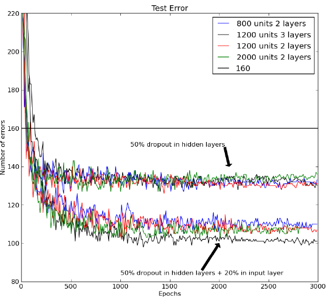

# Improving neural networks by preventing co-adaptation of feature detectors

# 備考

## 著者

G. E. Hinton, N. Srivastava, A. Krizhevsky, I. Sutskever and R. R. Salakhutdinov

## 掲載

"Improving neural networks by preventing co-adaptation of feature detectors", arXiv:1207.0580, 2012.

# Abstract

大規模なフィードフォワード・ニューラルネットワークが小さな訓練セットで訓練されると、一般的に、ホールドアウトされたテストデータではパフォーマンスが悪くなります。この「オーバーフィット」は、各訓練ケースの特徴検出器の半分をランダムに省略することで大幅に削減されます。これにより、ある特徴検出器が他のいくつかの特定の特徴検出器の文脈でしか役に立たないような複雑な共適応を防ぐことができます。その代わりに、各ニューロンは、そのニューロンが動作しなければならない様々な内部コンテクストを組み合わせて考えると、正しい答えを出すために一般的に役立つ特徴を検出することを学習します。ランダムな「ドロップアウト」は、多くのベンチマークタスクを大幅に改善し、音声認識と物体認識の新記録を樹立します。

# Introduction

フィードフォワード型の人工ニューラルネットワークは、入力と出力の間に非線形な「隠れた」ユニットの層を使用します。これらの隠れユニットの入力接続の重みを適応させることで、入力ベクトル(1)が与えられたときに正しい出力を予測することを可能にする特徴検出器を学習します。入力と正しい出力の関係が複雑で、ネットワークがそれを正確にモデル化するのに十分な数の隠れユニットを持っている場合、特にラベル付けされた訓練データが限られた量しかない場合、訓練セットをほぼ完全にモデル化することができる重みの多くの異なる設定が一般的に存在します。これらの重みベクトルのそれぞれは、ホールドアウトされたテストデータ上で異なる予測を行い、ほとんどすべての重みベクトルは、特徴検出器がトレーニングデータ上ではうまく機能するように調整されているが、テストデータ上では機能しないため、トレーニングデータ上よりもテストデータ上の予測が悪くなります。

オーバーフィットは、訓練データ上での複雑な共適応を防ぐために「ドロップアウト」を使用することによって低減することができる。各訓練ケースの各プレゼンテーションでは、各隠れユニットは 0.5 の確率でネットワークからランダムに省略されるので、隠れユニットは他の隠れユニットが存在することに頼ることができません。ドロップアウト手順の別の見方として、ニューラルネットワークでモデル平均化を行う非常に効率的な方法があります。テストセットの誤差を減らす良い方法は、非常に多くの異なるネットワークによって生成された予測値を平均化することです。これを行う標準的な方法は、多くの別々のネットワークを訓練してから、これらのネットワークのそれぞれをテストデータに適用することですが、これは訓練とテストの両方で計算コストがかかります。ランダム・ドロップアウトを用いると、膨大な数の異なるネットワークを合理的な時間で訓練することが可能になります。各トレーニングケースのプレゼンテーションごとに、ほぼ確実に異なるネットワークが存在しますが、これらのネットワークはすべて、存在する隠れユニットのための同じ重みを共有しています。

我々は、学習ケースのミニバッチでドロップアウト・ニューラル・ネットワークを学習するために、標準的な確率的勾配降下法を使用するが、重みが大きくなりすぎないようにするために通常使用されるペナルティ項を修正している。重みベクトル全体の 2 乗長(L2 ノルム)にペナルティを与える代わりに、個々の隠れユニットごとに入力される重みベクトルの L2 ノルムに上限を設定する。重みの更新がこの制約に違反した場合、隠れユニットの重みを除算で繰り込みます。ペナルティではなく制約を用いることで、提案された重みの更新がどれだけ大きくても、重みが非常に大きくなることを防ぎます。これにより、学習中に減衰する非常に大きな学習率で開始することが可能となり、小さな重みから開始して小さな学習率を使用する方法と比較して、はるかに徹底的な重み空間を探索することができる。

テスト時には、すべての隠れユニットを含む「平均ネットワーク」を使用しますが、2 倍の数の隠れユニットがアクティブであるという事実を補うために、出力する重みを半分にしています。実際には、これは多数のドロップアウト・ネットワークの平均化と非常に似た性能を提供します。N 単位の単一の隠れ層とクラス・ラベルの確率を計算するための「softmax」出力層を持つネットワークでは、平均ネットワークを使用することは、2N 個の可能なすべてのネットワークで予測されたラベル上の確率分布の幾何学的平均を取ることと全く同じです。ドロップアウト・ネットワークがすべて同じ予測をしないと仮定すると、平均ネットワークの予測は、個々のドロップアウト・ネットワークによって割り当てられた対数確率の平均よりも高い対数確率を正解に割り当てることが保証されます(2)。同様に、線形出力単位の回帰では、平均ネットワークの二乗誤差は、ドロップアウト・ネットワークの二乗誤差の平均よりも常に優れている。

# 2. Experiment

我々はまず、機械学習アルゴリズムのベンチマークとして広く使用されている MNIST を用いて、ドロップアウトの有効性を探りました。MNIST には、個々の手書き数字の 28x28 のトレーニング画像 60,000 枚とテスト画像 10,000 枚が含まれています。テストセットの性能は、変換された画像でトレーニングデータを拡張する(3)か、空間変換に関する知識を畳み込みニューラルネットワークに配線する(4)か、ラベルを使用せずにトレーニング画像から有用な特徴を抽出するために生成的事前訓練を使用する(5)ことによって、大幅に向上させることができます。これらのトリックを使用せずに、標準的なフィードフォワード・ニューラルネットワークで公表されている最良の結果は、テストセットで 160 エラーです。これは、各隠れユニットの入力重みに個別の L2 制約を持つ 50%のドロップアウトを使用することで約 130 エラーに削減することができ、さらに、ピクセルの 20%をランダムにドロップアウトすることで約 110 エラーに削減することができます（図 1 参照）。

\
図 1: バックプロパゲーションを用いて学習した様々なニューラルネットワークアーキテクチャの MNIST テストセットのエラー率。下の線のセットも入力層に 20%のドロップアウトを使用しています。事前学習やウェイトシェアリング、学習セットの強化を行わずにバックプロパゲーションを用いたこのタスクの過去に発表された最良の結果を横線で示します。

ドロップアウトは、生成的事前訓練と組み合わせることもできるが、この場合は、事前訓練で発見された特徴検出器を失うことを避けるために、学習率を小さくし、重み制約を与えないようにしている。(5)で述べた公開されている事前学習されたディープビリーフネットは、標準的なバックプロパゲーションを用いて微調整した場合は 118 個の誤差、隠れユニットの 50%ドロップアウトを用いて微調整した場合は 92 個の誤差が得られた。URL で公開されているコードを用いてディープボルツマンマシンの事前学習を 5 回行ったところ、標準バックプロパゲーションを用いて微調整した場合は 103、97、94、93、88 エラー、隠れユニットの 50%ドロップアウトを用いて微調整した場合は 83、79、78、78、77 エラーとなりました。79 エラーの平均値は、事前知識や強化された訓練セットを使用しない方法の記録である（詳細は付録 A を参照）。
