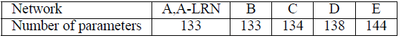

# VERY DEEP CONVOLUTIONAL NETWORKS FORLARGE-SCALEIMAGERECOGNITION

# 備考

## 著者

Karen Simonyan, Andrew Zisserman

## 掲載

"Very Deep Convolutional Networks For Large-ScaleImageRecognition," arXiv:1409.1556[cs.CV]，2014．

# Abstract

本研究では、大規模画像認識における畳み込みネットワークの深さが精度に与える影響を調べる。私たちの主な貢献は、非常に小さな (3×3) 畳み込みフィルタを備えたアーキテクチャを用いてネットワークのた深さを増した場合の徹底的な評価であり、深さを 16 ～ 19 の重み層に押し上げることで、従来の構成に比べて大幅な改善が達成できることを示しています。これらの調査結果は、ImageNet Challenge 2014 に参加した際に得られたもので、我々のチームはローカリゼーションおよび分類のトラックでそれぞれ 1 位と 2 位を獲得しました。また、私たちの表現が他のデータセットでもうまく一般化され、最先端の結果が得られることも示しています。コンピュータビジョンにおける深層視覚表現の使用に関する研究を促進するために、最高の性能を持つ 2 つの ConvNet モデルを公開しました。

# 1. Introduction

近年、コンボリューションネットワーク (ConvNets) は、ImageNet のような大規模な公開画像リポジトリ (Deng ら、2009 年) や、GPU や大規模な分散クラスタ (Dean ら、2012 年) のような高性能なコンピューティングシステムによって可能になった大規模な画像・映像認識 (Krizhevsky ら、2012 年, Zeiler & Fergus、2013 年, Sermanet ら、2014 年, Simonyan & Zisserman、2014 年) において大きな成功を収めています。特に、深層視覚認識アーキテクチャの進歩において重要な役割を果たしてきたのは、ImageNet の大規模視覚認識チャレンジ (ILSVRC) (Russakovsky ら、2014) です。このコンペティションでは，高次元の浅い特徴符号化 (Perronnin ら、2010) (ILSVRC-2011 の優勝者) から Deep ConvNet (Krizhevsky ら。、2012) (ILSVRC-2012 の優勝者) まで、数世代にわたる大規模画像分類システムのテストベッドとして機能してきた。

ConvNets がコンピュータービジョンの分野でより一般的なものになるにつれて、より良い精度を達成するために Krizhevsky ら (2012) のオリジナルアーキテクチャを改良する試みが数多く行われてきました。例えば、ILSVRC-2013 (Zeiler＆Fergus、2013, Sermanet ら、2014) への最も優れた提出では、より小さい受容ウィンドウサイズ (＝フィルタサイズ) と最初の畳み込み層より小さいストライドを利用しました。もう一つの改善点は、画像全体と複数のスケールにわたってネットワークを密にトレーニングおよびテストしました (Sermanet ら、2014, Howard、2014) 。本論文では、ConvNet アーキテクチャ設計のもう一つの重要な側面である深さについて説明します。この目的のために、我々はアーキテクチャの他のパラメータを固定し、より多くの畳み込み層を追加することによってネットワークの深さを着実に増やします。これは、すべての層で非常に小さい (3×3) たたみ込みフィルターを使用することで実現可能です。

その結果、我々はより精度の高い ConvNet アーキテクチャを開発しました。これは、ILSVRC 分類およびローカリゼーションタスクで最先端の精度を実現しただけでなく、他の画像認識データセットにも適用可能であり、比較的単純なパイプラインの一部として使用した場合でも優れた性能を達成しました (例えば、微調整なしで線形 SVM によって分類された深部特徴など) 。私たちは、さらなる研究を促進するために、2 つの最も優れた性能を持つモデル 1 を公開しました。

# 2. ConvNet Configurations

公平な環境で ConvNet の深さの増加による改善を測定するために、Ciresan ら (2011) 、Krizhevsky ら (2012) に触発された同じ原理を用いて ConvNet 層の構成を設計しました。本節では、まず私たちの ConvNet の一般的なレイアウト (2.1 節) について説明し、次に評価で使用される特定の構成の詳細を (2.2 節) で説明します。続いて、2.3 節では、我々の設計の選択について議論し、先行技術との比較を行う。

## 2.1. Architecture

トレーニング中、ConvNet への入力は、固定サイズの

RGB 画像です。私たちが実行する唯一の前処理は、トレーニングセットで計算された平均 RGB 値を各ピクセルから減算することです。画像は、

(左右、上下、中央の概念を捉えるための最小サイズ) という非常に小さな畳み込みフィルターを使用した畳み込み (conv.) レイヤーを通過します。演算の 1 つには、

の畳み込みフィルターも使用します。これは、入力チャネルの線形変換 (非線形性が後に続く) と見なすことができます。畳み込みストライドは１ピクセルに固定されており、畳み込み層の入力の空間パディングは、畳み込み演算後も空間分解能が維持されるようになっています。つまり、パディングは

畳み込み演算に対して 1 ピクセルです。空間プーリングは、5 つの max プーリングレイヤーによって実行されます。これらは、いくつかの畳み込み層の後に続きます (すべての畳み込み層の後に max-pooling 層があるわけではない) 。max プーリングは、

ピクセルのウィンドウ上で、ストライド 2 で実行されます。

畳み込み層 (アーキテクチャによって深さが異なる) の演算の後に、3 つの全結合 (FC) 層が続きます。最初の 2 つのレイヤはそれぞれ 4096 チャネルを持ち、3 番目のレイヤは 1000 クラスの 画像分類を実行するため、1000 チャネル (各クラスに 1 つ) を含みます。最後の層はソフトマックス層です。全結合層の構成は、すべてのネットワークで同じです。

すべての隠れ層は、非線形性(ReLU(Krizhevsky ら、2012))の補正機能が備わっています。私たちのネットワーク (1 つを除く) にはローカル応答正規化 (LRN) が含まれていないことに注意してください (Krizhevsky ら、2012) 。図 4 に示すように、このような正規化は ILSVRC データセットの性能を向上させず、メモリ消費と計算時間の増加につながります。該当する場合、LRN 層のパラメーターは (Krizhevsky ら、2012) のパラメーターです。

## 2.2. Configurations

本論文で評価した ConvNet の構成を表 1 に列ごとに 1 つずつ示します。以下では、ネットの名称を(A-E)と呼ぶことにします。すべての構成は第 2.1 節で示した一般的な設計を踏襲しており、深さだけが違います．具体的には，ネットワークＡの 11 個の重み層 (８つの畳み込み層と３つの FC 層) からネットワークＥの 19 個の重み層 (16 個の畳み込み層と 3 つの FC 層) まであります．畳み込み層の幅 (チャネル数) はかなり小さく、最初の層の 64 から始まり、最大プーリングレイヤーの後は 2 倍ずつ 512 に達するまで増加します。

**表 1：ConvNet 構成 (列に表示)**\
レイヤーが追加されると、構成の深さが左 (A) から右 (E) に増加します (追加されたレイヤーは太字で示されています) 。畳み込み層パラメーターは、「(畳み込みフィルタのサイズ)-(チャネルの数)」として示されます。ReLU 活性化関数は簡潔にするために表示されていません。

表 2 では、各構成のパラメーターの数を報告しています。深度が大きいにも関わらず、ネットのウェイトの数は、変換が大きく、浅いネットのウェイトの数よりも多くありません。層の幅と受容野((Sermanet ら、2014)で 144M 個の重み)。

**表 2：パラメータの数 (百万単位)**\

## 2.3. Discussion

私たちの ConvNet の構成は、ILSVRC-2012 (Krizhevsky ら、2012) や ILSVRC-2013 の大会の上位入賞作品で使用されたもの (Zeiler & Fergus、2013, Sermanet ら、2014) とは大きく異なっています。
最初の畳み込み層で比較的大きな畳み込みフィルタを使用するのではなく、2 つ目の畳み込み層で比較的大きな畳み込みフィルタサイズを持つ畳み込み演算を行う．層ではなく (例えば、(Krizhevsky ら. 2012)でフィルタサイズ

、ストライド数 4、または(Zeiler & Fergus, 2013, Sermanet ら，2014)フィルタサイズ

ストライド数 2)、ネット全体で非常に小さな$3×3$の畳み込みフィルタを使用し、すべてのピクセル (ストライド 1 で) で入力と畳み込み演算されます。
フィルタサイズ

の 2 つの畳み込み層 (間に空間的なプーリングがない) は、

の畳み込みフィルタサイズを持つ畳み込み層と同じ効果があることが簡単にわかります．同様に、フィルタサイズ

の代わりに、例えば、フィルタサイズ

の畳み込み層 3 つを使用することで何が得られるのでしょうか？第一に、単一の層の代わりに 3 つの ReLU を組み込むことで、決定関数をより識別性の高いものにします。第二に、パラメータの数を減らします。3 層の

畳み込み演算の入力と出力の両方に C チャンネルあると仮定すると、演算は 3 つの

の重みでパラメータ化されます．同時に、単一のフィルターサイズ

の畳み込み層は

のパラメータを必要とし、畳み込み層を 3 層重ねる場合と比較してパラメータ数が

多くなります。これは、

畳み込みフィルタに正則化を課し、

フィルタ (間に非線形性が挿入されている) を使って強制的に分解させます。

フィルタサイズ

畳み込み層 (構成 C、表 1) を組み込むことは、畳み込み層のフィルタサイズに影響を与えることなく、決定関数の非線形性を増加させる方法です。私たちの場合、

畳み込みは、本質的に同じ次元の空間への線形投影であるが (入力チャンネルと出力チャンネルの数は同じ)、ReLU によって追加の非線形性が導入されます。

畳み込み層は、最近、Lin ら (2014) の「Network in Network」アーキテクチャで利用されていることにも注目すべきです。

小型の畳み込みフィルターは、Ciresan ら (2011) によって既に使用されていますが、彼らのネットは私たちのものよりもかなり浅く、大規模な ILSVRC データセットでの評価を行っていません。Goodfellow ら (2014) は、深い ConvNet (11 重み層) を番地認識のタスクに適用し、深度の増加がパフォーマンスの向上につながることを示しました。 ILSVRC-2014 分類タスクのトップパフォーマンスである GoogleNet (Szegedy ら、2014) は、私たちの研究と独立して開発されましたが、非常に深い ConvNet (22 の重みレイヤー) と小さな畳み込みフィルタ (3×3 は別として、1×1 および 5×5 の畳み込みも使用します) に基づいているという点で類似しています。しかし、この 2 つのネットワークトポロジは私たちのものよりも複雑で、特徴マップの空間解像度は最初のレイヤーでより積極的に削減され、計算量が減少します。4.5 節で示すように、私たちのモデルは単一ネットワーク分類精度の点で Szegedy ら (2014)のモデルを上回っています。

# 3. Classification framework

前節では、ネットワーク構成の詳細を紹介した。本節では、分類 ConvNet の学習と評価の詳細について説明します。

## 3.1. Training

ConvNet の学習手順は，一般的に Krizhevsky et al. (2012) に従います (後述するように，マルチスケールの学習画像から入力画像をサンプリングすることを除けば) ．すなわち、訓練は、モーメンタムミニバッチ勾配降下法 (バックプロパゲーション (LeCun ら、1989) に基づく) を用いた多項ロジスティック回帰目的関数を最適化することによって行われます。バッチサイズは 256、モーメンタムは 0.9 に設定された。学習は、重み減衰 (L2 のペナルティ乗数を

に設定) と、最初の 2 つの全結合層のドロップアウト正則化 (ドロップアウト率を 0.5 に設定) によって正則化された。学習率は、最初

に設定され、検証セットの精度が向上しなくなると、10 倍で小さくしました．合計 3 回の学習率の低下を行い、370K 回 (74 エポック) の繰り返しで学習を停止した。我々は、(Krizhevsky et al., 2012)と比較して、より多くのパラメータ数と我々のネットの深さにもかかわらず、(a)より大きな深さとより小さい conv.フィルタサイズによって課される暗黙の正則化、(b)特定の層の事前初期化のために、ネットが収束するのに必要なエポック数がより少ないと推測している。

ネットワーク重みの初期化は重要であり、初期化が悪いとディープネットのグラジエントの不安定性のために学習が停滞する可能性があるからである。この問題を回避するために、我々は、ランダムな初期化で訓練するのに十分な浅い構成 A (表 1) を訓練することから始めた。次に、より深いアーキテクチャを訓練する際には、最初の 4 つの畳み込み層と最後の 3 つの完全連結層をネット A の層で初期化した (中間層はランダムに初期化した) 。事前に初期化された層の学習率を低下させず、学習中に変更できるようにした。ランダムな初期化のために (該当する場合)、平均がゼロで分散が 10-2 の正規分布から重みをサンプリングした。バイアスはゼロで初期化した。論文投稿後、Glorot & Bengio (2010) のランダム初期化手順を使用することで、事前学習なしで重みを初期化できることがわかりました。

ConvNet 入力画像は、トレーニング画像を固定サイズ

に再スケーリングした後、ランダムにトリミングしました (SGD の反復ごとに 1 画像につき 1 回トリミング) 。 またトレーニングセットをさらに強化するために、画像にランダム水平フリッピングとランダム RGB カラーシフトを施しました (Krizhevsky ら、2012)。 トレーニングイメージの再スケーリングについては、以下で説明します。

**トレーニング画像のサイズ**. S を等方的に再スケーリングされた学習画像の最小辺とし，そこから ConvNet の入力分だけ切り取ります (S を学習スケールと呼ぶこともあります)．

の場合は，訓練画像の最小辺を完全に覆う全画像の統計量をキャプチャし，

の場合は，小さな物体や物体の一部を含む画像の小さな部分に対応します．

トレーニングスケール S を設定するための 2 つのアプローチを検討します。1 つ目は、S を固定することです。これは、単一スケールトレーニングに対応します (サンプリングされた画像内の画像コンテンツは、依然としてマルチスケールの画像統計を表すことができることに注意してください) 。私たちの実験では、

(先行技術で広く使用されている (Krizhevsky ら (2012), Zeiler＆Fergus、2013, Sermanet ら、(2014))) と

の 2 つの固定スケールでトレーニングされたモデルを評価しました。ConvNet の構成が与えられると、最初に

を使用してネットワークをトレーニングしました。

ネットワークのトレーニングを高速化するために、まず

で事前トレーニングされた重みで初期化し、

と比べて学習率の初期値をより小さな

を使用しました。

S を設定する 2 番目のアプローチはマルチスケールトレーニングです。各トレーニングイメージは、特定の範囲

からランダムに S をサンプリングすることによって個別に再スケーリングされます(

および

を使用しました) 。 画像内のオブジェクトはサイズが異なる可能性があるため、トレーニング中にこれを考慮すると効果的です。 これは、スケールのジッタリングによるトレーニングセットの拡張と見なすこともできます。この場合、単一のモデルが広範囲のスケールでオブジェクトを認識するようにトレーニングされます。 速度上の理由から、シングルスケールモデルのすべてのレイヤーを同じ構成で微調整することにより、マルチスケールモデルをトレーニングしました。固定

で事前トレーニングしました。

## 3.2. TESTING
