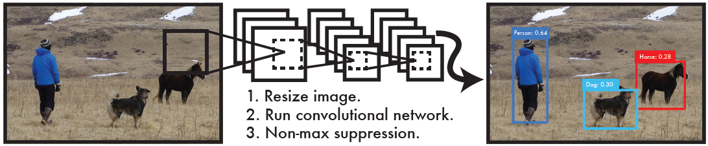
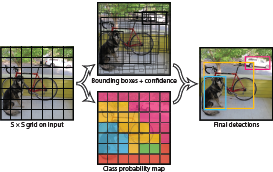
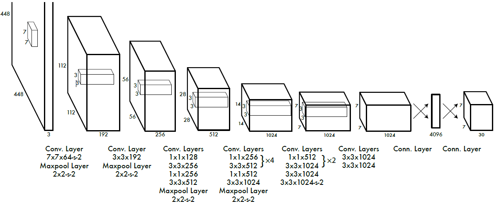

# You Only Look Once: Unified, Real-Time Object Detection

# 備考
## 著者
Joseph Redmon, Santosh Divvala, Ross Girshick, Ali Farhadi

## 掲載

# Abstract
オブジェクト検出の新しいアプローチであるYOLOを紹介します。オブジェクト検出に関する以前の作業では、分類器を再利用して検出を実行しました。代わりに、空間的に分離された境界ボックスと関連するクラス確率への回帰問題としてオブジェクト検出をフレーム化します。単一のニューラルネットワークは、1回の評価で完全な画像から直接境界ボックスとクラス確率を予測します。検出パイプライン全体が単一のネットワークであるため、検出パフォーマンスを直接エンドツーエンドで最適化できます。

当社の統合アーキテクチャは非常に高速です。私たちの基本YOLOモデルは、毎秒45フレームでリアルタイムに画像を処理します。ネットワークの小型バージョンであるFast YOLOは、他のリアルタイム検出器のmAPの2倍を達成しながら、驚異的な1秒あたり155フレームを処理します。最先端の検出システムと比較して、YOLOはローカリゼーションエラーを増やしますが、バックグラウンドでの誤検知を予測する可能性は低くなります。最後に、YOLOはオブジェクトの非常に一般的な表現を学習します。自然画像からアートワークのような他のドメインに一般化すると、DPMやR-CNNを含む他の検出方法よりも優れています。

# Introduction
人間は画像をちらっと見て、画像内にあるオブジェクト、それらの場所、それらがどのように相互作用するかを即座に把握します。人間の視覚システムは高速で正確であるため、ほとんど意識せずに運転するなどの複雑なタスクを実行できます。オブジェクト検出のための高速で正確なアルゴリズムにより、コンピューターは特殊なセンサーなしで車を運転し、支援デバイスがリアルタイムのシーン情報を人間のユーザーに伝え、汎用の応答性の高いロボットシステムの可能性を解き放つことができます。

現在の検出システムは、分類器を再利用して検出を実行します。オブジェクトを検出するために、これらのシステムはそのオブジェクトの分類子を取り、テストイメージのさまざまな場所とスケールで評価します。変形可能部品モデル（DPM）のようなシステムは、スライディングウィンドウアプローチを使用し、分類子は画像全体にわたって等間隔に配置されます[10]。

R-CNNのような最近のアプローチでは、領域提案手法を使用して、最初に画像内に潜在的な境界ボックスを生成し、次にこれらの提案されたボックスに対して分類子を実行します。分類後、バウンディングボックスを調整し、重複した検出を排除し、シーン内の他のオブジェクトに基づいてボックスを再スコアリングするために後処理が使用されます[13]。これらの複雑なパイプラインは、個々のコンポーネントを個別にトレーニングする必要があるため、低速で最適化が困難です。

画像のピクセルから境界ボックスの座標とクラスの確率まで、オブジェクトの検出を単一の回帰問題としてリフレームします。私たちのシステムを使用すると、画像を1回（YOLO）見ただけで、存在するオブジェクトとその場所を予測できます。

\
図1：YOLO検出システム。 YOLOを使用した画像の処理はシンプルで簡単です。私たちのシステムは、（1）入力画像のサイズを448 x 448に変更し、（2）画像に対して単一のたたみ込みネットワークを実行し、（3）モデルの信頼性によって結果として生じる検出をしきい値処理します。

YOLOは非常にシンプルです。図1を参照してください。単一のたたみ込みネットワークは、複数の境界ボックスとそれらのボックスのクラス確率を同時に予測します。 YOLOはフル画像をトレーニングし、検出パフォーマンスを直接最適化します。この統合モデルには、従来のオブジェクト検出方法に比べていくつかの利点があります。

まず、YOLOは非常に高速です。検出を回帰問題としてフレーム化するため、複雑なパイプラインは必要ありません。テスト時に新しい画像でニューラルネットワークを実行するだけで、検出を予測できます。私たちの基本ネットワークは、Titan X GPUでのバッチ処理なしで毎秒45フレームで実行され、高速バージョンは150 fpsを超えて実行されます。これは、25ミリ秒未満のレイテンシでストリーミングビデオをリアルタイムで処理できることを意味します。さらに、YOLOは他のリアルタイムシステムの平均精度の2倍以上を達成しています。ウェブカメラでリアルタイムに実行しているシステムのデモについては、プロジェクトのウェブページをご覧ください：http://pjreddie.com/yolo/。

第2に、YOLOは予測を行う際に画像についてグローバルに理由を説明しています。スライディングウィンドウや領域の提案に基づく手法とは異なり、YOLOはトレーニングおよびテスト時に画像全体を表示するため、クラスの外観やクラスに関するコンテキスト情報を暗黙的にエンコードします。上位の検出方法[14]であるFast R-CNNは、より大きなコンテキストを認識できないため、画像の背景パッチをオブジェクトと間違えます。 YOLOは、Fast R-CNNと比較して、バックグラウンドエラーの数を半分未満にします。

第3に、YOLOはオブジェクトの一般化可能な表現を学習します。自然画像でトレーニングし、アートワークでテストすると、YOLOは、DPMやR-CNNなどの上位の検出方法を大幅に上回ります。 YOLOは非常に一般化可能であるため、新しいドメインや予期しない入力に適用されたときに故障する可能性は低くなります。

YOLOは、最新の検出システムの精度にまだ遅れをとっています。画像内のオブジェクトをすばやく識別できますが、一部のオブジェクト、特に小さなオブジェクトを正確に特定するのは困難です。これらのトレードオフについては、実験でさらに検討します。

トレーニングとテストのコードはすべてオープンソースです。さまざまな事前トレーニング済みモデルもダウンロードできます。

# 2. Unified Detection
オブジェクト検出の個別のコンポーネントを単一のニューラルネットワークに統合します。私たちのネットワークは、画像全体の特徴を使用して、各境界ボックスを予測します。また、画像のすべてのクラスのすべての境界ボックスを同時に予測します。これは、私たちのネットワークが全体の画像と画像内のすべてのオブジェクトについてグローバルに推論することを意味します。 YOLOモデルは、高い平均精度を維持しながら、エンドツーエンドのトレーニングとリアルタイムの速度を実現します。

私たちのシステムは、入力画像をS x Sグリッドに分割します。オブジェクトの中心がグリッドセルに該当する場合、そのグリッドセルがそのオブジェクトを検出します。

各グリッドセルは、B境界ボックスとそれらのボックスの信頼スコアを予測します。これらの信頼スコアは、ボックスにオブジェクトが含まれているというモデルの信頼度と、ボックスが予測しているとボックスがどの程度正確であるかを反映しています。正式には、信頼度を$Pr(Object) \ast IOU^{truth}_{pred}$と定義します。そのセルにオブジェクトが存在しない場合、信頼スコアはゼロになります。それ以外の場合は、信頼スコアを予測ボックスとグラウンドトゥルース間の和集合（IOU）の交差に等しくする必要があります。

各境界ボックスは、$x, y, w, h,$および信頼度の5つの予測で構成されています。$(x, y)$座標は、グリッドセルの境界を基準にしたボックスの中心を表します。幅と高さは、画像全体に対して相対的に予測されます。最後に、信頼度予測は、予測されたボックスとグラウンドトゥルースボックスの間のIOUを表します。

各グリッドセルは、Cの条件付きクラス確率$Pr(Classi|Object)$も予測します。これらの確率は、オブジェクトを含むグリッドセルで条件付けられます。ボックスの数$B$に関係なく、グリッドセルごとにクラス確率のセットを1つだけ予測します.テスト時に、条件付きクラス確率と個々のボックス信頼度予測を乗算します。

$$
Pr(Class_i|Object) \ast Pr(Object) \ast IOU_{pred}^{truth} = Pr(Class_i) \ast IOU_{pred}^{truth}
$$

これにより、各ボックスのクラス固有の信頼スコアが得られます。これらのスコアは、そのクラスがボックスに表示される確率と、予測されるボックスがオブジェクトにどの程度適合するかをエンコードします。

\
私たちのシステムは、検出を回帰問題としてモデル化します。画像をS _Sグリッドに分割し、グリッドセルごとにB境界ボックス、それらのボックスの信頼度、およびCクラス確率を予測します。これらの予測は、$S \times S \times(B \ast 5 + C)$テンソルとしてエンコードされます。

PASCAL VOCでYOLOを評価するには、$S = 7，B = 2$を使用します。PASCALVOCには20のラベル付きクラスがあるため，$C = 20$です。最終予測は$7 \times 7 \times 30$テンソルです。

## 2.1. Network Design
このモデルを畳み込みニューラルネットワークとして実装し、PASCAL VOC検出データセット[9]で評価します。ネットワークの最初の畳み込み層は画像から特徴を抽出し、完全に接続された層は出力の確率と座標を予測します。

私たちのネットワークアーキテクチャは、画像分類のためのGoogLeNetモデルに触発されています[34]。私たちのネットワークには24の畳み込み層があり、その後に2つの完全に接続された層が続きます。 GoogLeNetで使用される開始モジュールの代わりに、Lin らは[22]と同様に、$1 \times 1$リダクションレイヤーとそれに続く$3 \times 3$たたみ込みレイヤーを使用します。完全なネットワークを図3に示します。

また、高速オブジェクト検出の境界を広げるように設計された高速バージョンのYOLOもトレーニングします。 Fast YOLOは、畳み込み層が少なく（24ではなく9）、それらの層のフィルターが少ないニューラルネットワークを使用します。ネットワークのサイズを除いて、すべてのトレーニングとテストのパラメーターはYOLOとFast YOLOで同じです。

私たちのネットワークの最終的な出力は、予測の$7 \times 7 \times 30$テンソルです。

## 2.2. Training
\
図3：アーキテクチャ。私たちの検出ネットワークには、24の畳み込み層と、それに続く2つの完全に接続された層があります。 $1 \times 1$のたたみ込み層を交互に配置すると、フィーチャスペースが前の層から減少します。 ImageNet分類タスクの畳み込み層を半分の解像度（$224 \times 224$入力画像）で事前トレーニングし、次に検出の解像度を2倍にします。

ImageNet 1000クラスの競合データセット[30]で畳み込み層を事前トレーニングします。事前トレーニングでは、図3の最初の20の畳み込みレイヤーを使用し、その後に平均プーリングレイヤーと完全に接続されたレイヤーを続けます。このネットワークを約1週間トレーニングし、ImageNet 2012検証セットで88％の単一作物の上位5の精度を達成しました。これは、Caffe’s Model ZooのGoogLeNetモデルに匹敵します[24]。私たちはすべてのトレーニングと推論にDarknetフレームワークを使用しています[26]。

次に、モデルを変換して検出を実行します。レン他事前学習済みネットワークに畳み込み層と接続層の両方を追加すると、パフォーマンスが向上することを示しています[29]。それらの例に従って、4つの畳み込み層とランダムに初期化された重みを持つ2つの完全に接続された層を追加します。多くの場合、検出にはきめ細かな視覚情報が必要になるため、ネットワークの入力解像度を$224 \times 224$から$448 \times 448$に増やします。

最後のレイヤーは、クラスの確率と境界ボックスの座標の両方を予測します。境界ボックスの幅と高さを画像の幅と高さで正規化し、0と1の間になるようにします。境界ボックスのx座標とy座標を特定のグリッドセル位置のオフセットになるようにパラメーター化して、0と1の間にも境界を設定します。

最終層には線形活性化関数を使用し、他のすべての層は次の漏出修正線形活性化を使用します。

$$
\phi(x) =  \left\{
    \begin{array}{l}
      x, if x >0  \\
      0.1x, otherwise
    \end{array}
  \right.
$$

モデルの出力の二乗和誤差を最適化します。最適化が容易なため、二乗誤差を使用しますが、平均精度を最大化するという目標と完全には一致しません。それは理想的ではないかもしれない分類エラーと等しくローカリゼーションエラーを重み付けします。また、すべての画像で、多くのグリッドセルにはオブジェクトが含まれていません。これにより、これらのセルの「信頼度」スコアがゼロに近づき、多くの場合、オブジェクトを含むセルからのグラデーションが圧倒されます。これにより、モデルが不安定になり、トレーニングが早い段階で分岐する可能性があります。

これを修正するために、バウンディングボックスの座標予測による損失を増やし、オブジェクトを含まないボックスの信頼性予測による損失を減らします。これを行うには、$\lambda_{coord}$と$\lambda_{noobj}$の2つのパラメーターを使用します。$\lambda_{coord} = 5$および$\lambda_{noobj} =.5$を設定します。

二乗和誤差は、大きな箱と小さな箱の誤差にも同じように重みを付けます。私たちのエラーメトリックは、大きなボックスの小さな偏差が小さなボックスの場合よりも重要ではないことを反映する必要があります。これに部分的に対処するために、幅と高さを直接ではなく、境界ボックスの幅と高さの平方根を予測します。

YOLOは、グリッドセルごとに複数の境界ボックスを予測します。トレーニング時には、各オブジェクトに対して1つのバウンディングボックスプレディクターのみが関与するようにします。 1つの予測子を、グラウンドトゥルースで現在のIOUが最も高い予測に基づいてオブジェクトを予測する「責任」に割り当てます。これにより、境界ボックス予測子間の特殊化が行われます。各予測子は、特定のサイズ、アスペクト比、またはオブジェクトのクラスの予測が向上し、全体的な再現率が向上します。

トレーニング中に、次のマルチパート損失関数を最適化します。