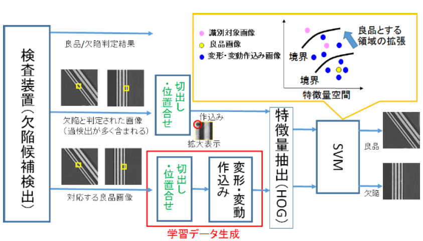

<!--
theme: default
size: 4:3
page_number: true
paginate: true
header: "2020年○月○日"
style: |

  section { font-size: 20px;}

  header {
    width: 100%;
    font-size: 20px;
    color: black;
    padding: 1px;
    top: 50px;
  }

  footer {
    width: 100%;
    font-size: 20px;
    color: black;
    text-align: right;
    padding: 15px;
  }

  h1 {
    font-size: 40;
    color: navy;
  }

  h2 {
    font-size: 35;
    color: navy;
  }

  h3 {
    font-size: 30;
    color: navy;
  }

  pre, code{
    font-size: 18px;
  }
-->

# HOG特徴量を電子部品検査に適用した場合の課題検討

検査対象：電子部品等に使われるプリント基板

検出方法：検査装置による不良品の過検出を、対応する良品画像と比較することで減らし、最終的にOCSVMで欠陥を識別。SVMが判別する特徴量には、HOG特徴量を用いる。

検査対象とする画像の切り出し位置の決定および比較する画像缶での位置合わせを、HOG特徴量の類似度二より行う。