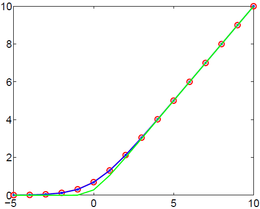

# Rectified Linear Units Improve Restricted Boltzmann Machines

# 備考
## 著者
Vinod Nair, Geoffrey E. Hinton

## 掲載
Proceedings of the 27th International Conference on International Conference on Machine Learning(ICML), pp. 807--814, 2010.

# Abstract

制限されたボルツマン機械は、二値確率的な隠れユニットを用いて開発されました。これらは，各バイナリユニットを，同じ重みを持つが負のバイアスが徐々に大きくなる無限のコピーで置き換えることで一般化できる．これらの "段階的シグモイドユニット"の学習と推論のルールは変更されません。それらは、ノイズの多い整流された線形ユニットによって効率的に近似できます。バイナリユニットと比較して、これらのユニットは、NORBデータセットでの物体認識や、野生の顔のラベル付けデータセットでの顔検証に適した特徴を学習します。バイナリユニットとは異なり、整流された線形単位は、情報が特徴検出器の複数の層を通過する際に、相対的な強度に関する情報を保持します。

# 2. Rectified linear units

各ユニットがより多くの情報を表現できるようにするために、(Teh & Hinton, 2001)は、すべてが同じバイアスと重みを共有する2値ユニットのN個の別々のコピーとして見ることができる2値ユニットを導入しました。2値ユニットから新しいタイプのユニットを合成するために重みの共有を使用することの良い副作用は、2値-2値RBMの学習の基礎となる数学が変化しないことです。すべてのN個のコピーが同じ総入力を受け取るので、すべてのコピーがオンになる確率は同じ $p$ であり、これは一度だけ計算する必要があります。オンになると予想される数は $Np$ であり，この数の分散は $Np(1-p)$ です．小さな $p$ では、これはポアソン単位のように動作しますが、$p$ が1に近づくにつれて分散は再び小さくなり、これは望ましくないかもしれません。また、$p$ の値が小さい場合、$p$ の成長は総入力の中で指数関数的になります。このため、学習の安定性は、次に説明する段階的シグモイド単位(SSU)に比べて格段に劣ります。

2値ユニットを少し修正することで、実際のニューロンのモデルとしてはるかに興味深いものになり、実用的な応用にも有用です。学習された重みベクトル $\bm{w}$ と学習されたバイアス $b$ が同じであるコピーを無限に作りますが、各コピーはバイアスに対して異なる固定のオフセットを持っています。オフセットが-0.5,-1.5,-2.5, ...の場合，コピーの確率の和は閉形に非常に近いものになります（図1）．

---

図1: 

---