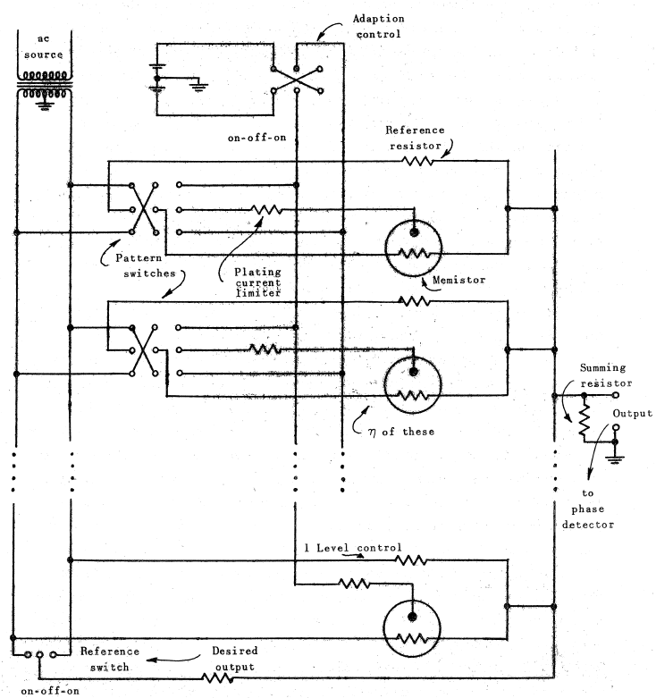
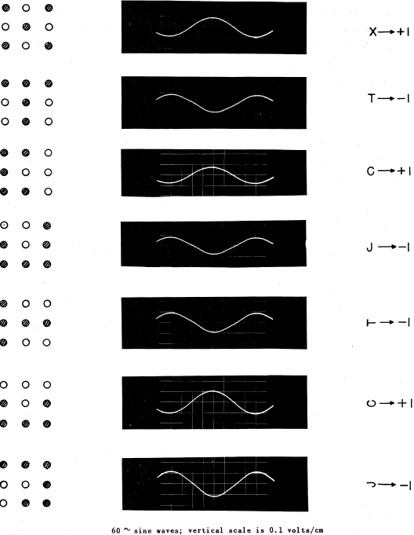

# An Adaptive 'Adaline' Neuron Using Chemical 'Memistors'

# 備考

# Summary

適応回路で一般的に使用される「メモリ」（メモリ付き抵抗器）と呼ばれる新しい回路要素が考案されました。このような要素を使用すると、システムの経験やトレーニングを保存するために必要なメモリとともに、電子的に可変のゲインコントロールを取得できます。エクスペリエンスは最もコンパクトな形式で保存され、システム機能の観点から直接使用できる形式で保存されます。この要素は、めっき浴に浸された抵抗性グラファイト基板で構成されています。抵抗は電気めっきによって可逆的に制御されます。

メミスタ素子は、適応ニューロンの実現に応用されています。 「アダリン」ニューロン用のミスター回路は、その単純な適応手順を組み込んで開発されました。 これらのニューロンをトレーニングして、このトレーニングを数週間有効に保つことができました。 メミスタ素子の小型化に向けた取り組みが進んでいます。 memistor は、安価で信頼性が高く、大量生産可能な適応型システム要素であることが約束されています。

# 1. Introduction

適応または「学習」システムは、過去の経験に基づいてパフォーマンスを最適化するために、独自の構造を自動的に変更できます。 ここでは、システム設計者はより経営幹部です。 システム設計のすべての詳細に目を向けるのではなく、入力信号またはパターンのシステム例を表示することで「教える」と同時に、出力を各入力にどのようにしたいかを示します。 このシステムは、designex の希望にできるだけ準拠するように組織化する役割を担っています。

ティーチングによって設計できるシンプルな論理システムとスイッチングシステムを構築および分析する方法は、この著者と M. E. Hoff によって、レポートと論文（「適応スイッチング回路」というタイトル）で説明されています。 そこに記載されているスキームのコアは、「アダリン」ニューロン（Adaline と呼ばれ、適応線形）と呼ばれる適応論理要素で構成されています。 システム設計手順は順応性があり、反復検索プロセスに基づいています。 パフォーマンスフィードバックは、統合自動システム、つまり、制限されているが有用な可能性のあるクラスから「最良の」論理関数を選択するために使用されます。

# 2. The Adaline neuron element

図 1 に、考慮すべき適応スイッチング回路の典型的な要素である組み合わせ論理回路を示します。 この要素は、フォンノイマンによって導入されたニューロンモデルに似ています。

\
図1

個々のラインのバイナリ入力信号の値は、通常の1または0ではなく+1または-1です。ニューロン内では、入力信号の線形結合が形成されます。 重みはゲイン

で、正と負の両方の値を持つことができます。 この加重和が特定のしきい値より大きい場合、出力信号は+1になり、それ以外の場合は-1になります。 しきい値レベルは、

の設定によって決定され、その入力は+1ソースに永続的に接続されます。 変化する

は、入力信号の線形結合に追加される

定数を変化させます。

固定ゲイン設定の場合、可能な

の各入力の組み合わせにより、

または

の出力が発生します。 したがって、すべての可能な入力は2つのカテゴリに分類されます。 入出力の関係は、ゲイン

の選択によって決定されます。 適応ニューロンでは、これらのゲインは「トレーニング」手順中に設定されます。

一般的に、5 つの入力変数を 1 つの出力変数にマッピングするためには、

つの異なる入出力関係または真理関数があります。これらのうち、線形に分離された真理関数のサブセットだけが、図 1 のニューロンの利得のすべての可能な選択によって実現されます。このサブセットはすべてを網羅するものではありませんが、有用なサブセットであり、「検索可能」、すなわち、多くの実用的なケースでは、サブセット内のすべての 関数を試すことなく、反復的に「最良」の関数を見つけることができます。

このニューロンを適応的パターン分類器に応用したのは、マットソンが最初である。彼は、これらのニューロンを組み合わせることで、スイッチング関数の選択に完全な汎用性が得られることを示した。彼は、ノイズの多い幾何学的パターンの分類のために、最適なアスのセットを見つけるための反復的なデジタル・コンピュータ・ルーチンを考案しました。同様の目的を持つ反復的な手順がWidrowとHoffによって考案され、以下に記述されている。後者の手順は実装が非常に簡単で、適応的サンプリングデータシステムの解析のために既に開発されている統計的手法を用いて解析することができます。

適応パターン分類マシン（「Adaline」と呼ばれます）は、適応行動と人工学習を説明する目的で構築されています。 このマシンの写真は、お弁当箱ほどの大きさで、図2に示されています。

学習段階では，

入力スイッチアレイのトグルスイッチを設定することで，粗い幾何学的パターンが機械に与えられます．別のトグルスイッチ（参照スイッチ）を設定することで、特定の入力パターンの出力が+1か-1かを判断します。システムは各パターンから少しずつ学習し、それに応じて設計変更を経験します。マシンの総合的な経験は，重み

の値に保存されます．マシンは、反復探索プロセスが収束するまで何度も繰り返すことで、歪んでいないノイズのないパターンで学習することができ、反復探索プロセスが統計的に収束するように、ワンパスベースでノイズのあるパターンのシーケンスで学習することができます。これらの方法の組み合わせが同時に可能です。学習後，機械は元のパターンと，ノイズの多いパターンや歪んだパターンを分類するために使用することができる．

Adalineのブロック図を図３に示す．実際の機械では、量子化器は装置として組み込まれているのではなく、オペレータが出力メータを見ることで実現されます。異なる量子化器（2レベル、3レベル、4レベル）は、適切なメータースケールを使用して実現されます（図2参照）。Adalineは、マルチレベルの量子化器を使用して、全く同じ適応手順を踏むことで、パターンをいくつかのカテゴリに分類するために使用することができます。

\
図3

以下、反復検索ルーチンについて説明する。パターンがマシンに送られ、参照スイッチが所望の出力に対応するように設定されます。次に、エラー（図 3 を参照）が読み込まれます（基準スイッチを切り替えることで、エラー電圧がニューロン出力電圧ではなく、メーターに表示されます）。誤差がゼロになるように、レベルを含むすべてのゲインを同じ絶対的な大きさだけ変更します。これは、誤差の大きさを 1/17 減らす量だけ減少させる方向に各ゲイン（正または負のどちらでも可）を変更することで達成されます。17 のゲインは任意の順序で変更することができ、すべての変更が行われた後、現在の入力パターンの誤差はゼロになります。リファレンスを元に戻すと，メーターは希望の出力を正確に読み取る。次のパターンとその希望の出力が表示され、エラーが読み取られます。同じ調整ルーチンに従うと誤差はゼロになります。最初のパターンがこの時点で再適用された場合、誤差は小さくなりますが、必ずしもゼロではありません。同様の方法でさらに多くのパターンが挿入されます。

収束は、（適応前の）小さな誤差によって示され、安定した二乗平均平方根の値に関する小さな変動があります。利得値は自動的に最適な値に安定します。反復ルーチンは純粋に機械的なものであり、オペレータが何も考える必要はありません。この手順の電子的自動化は本論文の主題です。

Adaline・ニューロンの構造とその適応手順は十分に単純であるため、全電子的な完全自動Adalineである物理的なデバイスを開発する努力が行われています。目的は、図 4 にスケッチしたような、信号入力線、「所望の出力」入力線｛訓練中のみ作動｝、出力線、および電源を備えた、自己完結型のデバイスです。装置自体は量産に適しており、部品点数が少なく、信頼性が高いものでなければなりません。

\
図4

このような適応ニューロンを持つためには、正でも負でもよい利得値を電子的に変更できるように記憶しておく必要があります。

# 3. The Menistor

可変ゲイン効果は、可変抵抗、静電容量、インダクタンス、またはこれらの組み合わせを使用することにより、物理的に実現できます。 この論文では、可変抵抗デバイスの使用とそのようなデバイスの特性について説明します。

抵抗基板上に金属を堆積させることにより抵抗を制御するために電気めっきの現象を使用する、メミスタ（メモリ付き抵抗）と呼ばれる可変抵抗が考案されました。 メミスターを作成する最初の成功した試みは、通常の鉛筆の芯に硫酸銅-硫酸浴から銅を電気めっきすることでした。

\
図5

図5は、メミスターの最も簡単な構成の回路図記号を示している。基板の抵抗は交流電流で感知し、めっきの厚さは電流で制御されます。このデバイスは、3つの端子の2つの端子間の抵抗が3番目の瞬時制御電流ではなく、この電流の時間積分によって制御されることを除いて、3端子トランジスタに似ています。

理想的なメミスタには、次の電気的特性があります。コンダクタンスは、総めっき電荷量に比例して変化します。 この特性を実現するには、めっきプロセスが可逆的であり、めっき電流がゼロのときにメミスタ抵抗が無期限に留まり、めっき電流によってコンダクタンスが滑らかに変化し、めっき方向の変化に伴うヒステリシスがないことが必要です。 最初の鉛筆芯のミスタは、5オームから1/2オームまでのダイナミック抵抗範囲にわたって、このような特性の近似を実現するために作成されました。 通常の硫酸銅-硫酸めっき浴によるめっき電荷とコンダクタンスの関係を図6（a）に示します。 ヒステリシス効果は、大きな銅結晶によって引き起こされると考えられています。 析出物をより小さな銅結晶で構成するようにする「ブライトナー」をバスに追加すると、ヒステリシスがなくなり、この特性が図6（b）のようになります。

\
図6

理想的なメミスタには、次の電気的特性があります。コンダクタンスは、総めっき電荷量に比例して変化します。 この特性を実現するには、めっきプロセスが可逆的であり、めっき電流がゼロのときにメミスタ抵抗が無期限に留まり、めっき電流によってコンダクタンスが滑らかに変化し、めっき方向の変化に伴うヒステリシスがないことが必要です。 最初の鉛筆芯のミスタは、5オームから1/2オームまでのダイナミック抵抗範囲にわたって、このような特性の近似を実現するために作成されました。 通常の硫酸銅-硫酸めっき浴によるめっき電荷とコンダクタンスの関係を図6（a）に示します。 ヒステリシス効果は、大きな銅結晶によって引き起こされると考えられています。 浴に「光沢剤」を加えると、析出物がより小さな銅の結晶で構成され、ヒステリシスがなくなり、この特性が図6（b）のようになります。

鉛筆の芯のメモリと試験管の写真を図7に示します。使用した「芯」は2 3/4インチのFinelineタイプH、中程度の硬さです。 接続をはんだ付けできるように、最初に端がメッキされます。 末端の接続は、塗装によって絶縁されています。 支持銅棒は、銅の供給源およびめっき電流電極として機能します。 めっきの前にグラファイトをスチールウールで研磨することは非常に有益であることがわかった。 これにより、めっき電流の有効性が3倍に増加し、めっき電荷によってコンダクタンスが滑らかに変化します。

\
図7

鉛筆の芯のメモリと試験管の写真を図7に示します。使用した「芯」は2 3/4インチのFinelineタイプH、中程度の硬さです。 接続をはんだ付けできるように、最初に端をメッキします。 末端の接続は、塗装によって絶縁されています。 支持銅棒は、銅の供給源およびめっき電流電極として機能します。 めっきの前にグラファイトをスチールウールで研磨することは非常に有益であることがわかった。 これにより、めっき電流の有効性が3倍に増加し、めっき電荷によってコンダクタンスが滑らかに変化します。

このような方法または同様の方法で作られたメミスターは、金属伝導経路を流れる情報が非常に速く処理されるという利点を持っています。相対的に遅いめっきプロセスは、システム構造の変化率を決定するが、これは、常に、情報を処理またはフィルタリングする率よりもはるかに遅いことを望むであろう。メミスタのために本明細書で主張されているものと同様の機能を実行するために使用されるかもしれない他の化学デバイスまたはアイデアは、情報の流れのために、金属伝導ではなく、電解質中のイオン伝導に依存しています。これらのデバイスおよび機構は、本質的に遅く、より温度に敏感であり、一般に信頼性が低い。

# 4. Memistor neuron circuits
本セクションで説明するニューロン回路は、ニューロン入力信号がスイッチによって印加され、適応の全体的な方向と範囲が手動で制御されることを前提としています。メミスターの個々の適応方向（メッキオンまたはメッキオフ）は、誤差信号と個々の入力信号の算術積の符号によって決定される。個別入力信号に関する情報は、最終的なめっき方向をゲージ付き入力スイッチの一部の区間で制御させることにより、入力スイッチの位置から得られる。これら全てのスイッチへのソースは、手動で操作される反転スイッチである適応制御から得られる。

\
図8

図8は、単純なメモスター・ニューロンの回路を示しており、ブリッジ配置で固定値に対してメミスターの抵抗をバランスさせることで、正負の利得値の効果を得ることができます。ゲインの検出は、固定された基準抵抗に交流電圧を印加し、180度の位相差を持つ別の交流電圧を印加することで行われます。 電流はコンダクタンスに比例し、合計されます。コンダクタンスが等しい場合、ゲインはゼロになります。利得の制御が最もスムーズになるのは、メミスターのコンダクタンス値のダイナミックレンジをフルに利用したときです。この基準では、基準抵抗器のコンダクタンスの最適値は、メミスターのコンダクタンスの両極端の平均値となります。

トレーニング段階では、パターンスイッチを設定することで入力パターンが適用されます。基準スイッチを設定することにより、所望の出力が適用されます。適応制御は、出力信号をゼロにするために必要な限り、適切な方向に作動します。その後、基準スイッチは「オフ」に戻され、出力信号はニューロンの和の尺度となります（図 1 を参照）。この和の位相は、交流電源の位相と同じか、これとは180度異なるかのいずれかです。位相は、ニューロンの出力が+1か-1かを決定する和の符号を示します。

\
図9

別のニューロン回路を図９に示すが、これは図８の回路のデュアルである。メミスターと基準抵抗は、等しく反対の交流電流源によって駆動されます。これらの電圧はここで合計されます。ゲインがゼロの場合は、抵抗値が等しいことになります。基準抵抗は、メミスター抵抗の両極端の平均値とすることで、メミスター抵抗のダイナミックレンジをフルに活用することができます。電気めっきは当然のことながら、抵抗値よりもコンダクタンスの方がめっき電荷の線形関数となる傾向があります。抵抗値がわずかに変化するだけで、抵抗値はめっき電荷とほぼ直線的に変化します。図8のシステムのトレーニング手順は、図8のシステムと同じです。

\
図10

図10の回路では、少し変わった種類の素子を使用しています。最初は、2つのメミスターを同じ浴中に同量のめっきを施した状態で浸漬します。銅源電極はありません。ブリッジ・バランシングの変更は、通常の交流検出電圧と一緒に等しく反対の直流電圧成分を印加することによって、一方の基板から他方の基板へのめっきによって達成されます。この回路の利点は、そのシンプルさです。主な欠点は、比較のために固定の基準抵抗がないために、メモリ抵抗値を安定化させるのが難しいことです。しかし、与えられたダブル・メミスターに関連する等価利得は、適応手順の性質の結果として安定した値になることに注意する必要があります。利得値はコンダクタンスの差に比例します。

# 5. A3X3 Memistor Adaline
メミスタの動作原理を説明するために、3 x 3 のニューロンを構築しました。装置の写真を図11に示します。

\
図11

この装置は、図8の回路の実装です。メミスタは、セクションIIで説明した鉛筆の芯のタイプです。 ニューロンへの60サイクルAC電源には、センタータップから0.5ボルトの片側への電圧があります。 基準抵抗の値は2.7オームです。 DCメッキ電源には、センタータップから各端子まで6ボルトがあり、メッキ電流制限抵抗器の値は49オームです。 これらは約100ミリアンペアのメッキ電流を与えます。 加算抵抗は不要であることが判明し、削除されました。

\
図12

出力波形を図１２に示します。7 つの異なるパターンとそれに関連した所望の出力は、線形に分離可能な集合を構成しており、単一のニューロンによって解決されていることが明らかになっています。しかし、これは、所望の出力が-１である「Ｊ」と、所望の出力が＋１である水平の「Ｃ」を比較することでわかるように、ニューロンにとっては厳しいテストとなります。

適応処理の収束速度（データの繰り返し回数で測定）は、図2の手動のAdalineに比べて、メミスターAdalineの方がやや大きいように見えました。この理由は、メミスター回路のゲイン変化が離散的ではなく滑らかであることにあります。調整過渡現象の量子化ノイズが、これらの過渡現象を長持ちさせているように見せています。

3 x 3ニューロンで使用されるミミスターは個別にテストされていません。 めっき電流制限抵抗器と基準抵抗器には5％の許容差がありました。 パフォーマンスフィードバックプロセスにより、ニューロンの動作を個々のゲイン要素の特性の変化に鈍感にすることができました。

トレーニング後、ニューロンの構造は数日間はほとんど変化がありませんでした。新たな訓練を行った1日後には、出力波形にわずかな変化が見られますが、その後はほとんど変化がありません。あるテストでは、図１２に示したパターンを "固定 "し、４日後に、それ以上の訓練を行わずに、元の入力パターンを再適用したときに、出力波形がほとんど変化しないことが観察された。めっきの保存の永続性は、硫酸銅が豊富なめっき浴に依存します。酸はこのような薄いめっきを溶解する傾向があります。光沢剤は、めっきの永続性を確保するのに非常に役立ちます。

# 6. Future Directions
以下は、再編成されたときにメミスタニューロン回路をはるかに柔軟で有用な開発状態にする目的のリストです。

1. 適応プロセスは完全に自動化されている必要があり、これには非常にシンプルな回路とコンポーネントが含まれている必要があります。
2. 入力信号は、スイッチ設定ではなく、直接供給されます。適応方向の制御は、入力信号の位相情報から行う必要があります。
3. ニューロンは、ニューラルネットワークで使用するために相互接続可能である必要があります。 入力と出力のインピーダンスレベルと信号は互換性がある必要があります。
4. ニューロンは小さく、メッキが速く、メッキ電流を少なくする必要があります。
5. 電極の形状、電解質の性質、および関連する回路の構成は、すべてのメミスターに共通の電解槽または単一セルを使用できるようにする必要があります。
6. ドライペースト電解液を使用するか、メッキまたは固体のその他の現象を使用して、メミスターアクションを取得する必要があります。
7. 構造と材料は、薄膜またはその他のマイクロエレクトロニクス構築技術によって、メミスターとニューロンが大量生産されるようなものでなければなりません。

\
図13

図13に示す回路は、目的（a）、（b）、および（c）の実現に向けた非常に投機的なステップを表しています。 ここでの意図は、適応が自動的であり、各ゲイン変更の方向がエラー信号の位相と個々の入力信号の位相によって決定されることです。 入力信号は、わかりやすくするために、入力スイッチから発生するものとして示されています。 それらは、他のニューロンまたは他の信号源からも発生する可能性があります。

図13の回路で使用されているミミスタデバイスは珍しいもので、大面積のグラファイトまたはプラチナ電極によってバス自体に電気的に接続された単一のバス内のダブルエレメントで構成されています。この電極は、セルのケーシングまたはシェルである可能性があります。回路内のエラー信号は整流され、結果の正のパルスがすべてのケーシング電極に印加されます。エラーパルスによって、1つの要素から別の要素への代替のメッキとストリッピングの通常の平衡交換が妨げられます。正のエラーパルス中に負の電圧を持つ要素へのメッキは、エラー信号がゼロに修正される次の半サイクルで他の要素の堆積を超える量のめっき堆積を受け取ります。ケーシング電極にめっきが付着してはいけません。傾向はこれとは逆です。したがって、この電極は、白金やグラファイトなど、溶液にならない材料で作成する必要があります。メミスタ要素に堆積した金属の総量は一定でなければなりません。適応は、この金属を1つの元素からエーテルにシフトするだけです。

目的(d)の実現に向けて、一定のステップを踏んできた。トランジスタ回路に使用されている1/10ワットの極小のカーボン抵抗器を用いて、次世代型のメモリ素子を作製しました。研削・研磨することで、抵抗器の円筒軸と平行な平板状の滑らかな基板を作ることができます。抵抗器のリード線の一部を研磨することで、これらのリード線と表面めっきとの間に金属接触が行われます。このようにして、100Ωの抵抗値から始まる（めっきなし）素子を作ることに成功しました。3 ミリアンペアの電流で約1分間のめっきを行うと、抵抗値は1Ω程度まで下げることができます。めっき電荷とコンダクタンスの関係は滑らかであり、瞬時に可逆的である。

この新しい要素は、次の点で鉛筆の芯の要素と比較されます。10倍の抵抗比を持ち、メッキ電流の1/30を必要とし、抵抗範囲を数倍速くカバーし、約10倍小さい 線形寸法では、より好ましい抵抗範囲があります（鉛筆の芯の約10倍のインピーダンスレベル）。

\
図14

図14では、これらの要素が描かれており、次の実験的ニューロンモデルで使用されるセルのハニカムの製造のさまざまな段階を示しています。 プラスチック封止材料はプレキシガラスです。 示されている単一のセルは数日間稼働しており、カプセル化の結果として特性に検出可能な変化はありません。 これらの新しい要素を使用したニューロンの動作については、後で報告します。