# Rethinking the Inception Architecture for Computer Vision

# 備考
## 著者
Christian Szegedy, Vincent Vanhoucke, Sergey Ioffe, Jon Shlens

## 掲載
“Rethinking the Inception Architecture for Computer Vision,” Procs. of the IEEE Conference on Computer Vision and Pattern Recognition, pp.2818–2826, 2016.

# Abstract
畳み込みネットワークは、さまざまなタスクに対応する最先端のコンピュータビジョンソリューションの中核をなしています。2014年以降、非常に深い畳み込みネットワークが主流となり、様々なベンチマークで大幅な改善が見られます。モデルサイズの増大と計算コストの増加は、ほとんどのタスクで品質の向上に直結する傾向にあるが（学習に十分なラベル付けデータが提供されている限り）、計算効率と低パラメータ数は、モバイルビジョンやビッグデータのシナリオなど、さまざまなユースケースで有効な要素であることに変わりはない。ここでは、適切に因子化された畳み込みと積極的な正則化により、追加された計算量を可能な限り効率的に利用することを目的としたネットワークのスケールアップ方法を模索している。ILSVRC 2012の分類チャレンジの検証セットにおいて、我々の手法をベンチマークしたところ、1回の推論あたりの乗算コストが50億のネットワークを使用し、2,500万以下のパラメータを使用した場合、シングルフレーム評価において、トップ1エラーが21.2％、トップ5エラーが5.6％と、現状のものよりも大幅に向上したことがわかりました。4モデルのアンサンブルとマルチクロップ評価では、検証セットでは3.5%top-5エラー、17.3%top-1エラー、公式テストセットでは3.6%top-5エラーを報告した。

# Intro
Krizhevskyら[9]が2012年のImageNetコンペティション[16]で優勝して以来，彼らのネットワーク「AlexNet」は，物体検出[5]，セグメンテーション[12]，人物のポーズ推定[22]，映像分類[8]，物体追跡[23]，超解像[3]など，より多様な計算機ビジョンタスクへの応用に成功してきた．

これらの成功は、より高性能な畳み込みニューラルネットワークを見つけることを目的とした新しい研究に拍車をかけました。2014年からは、より深く、より広い範囲を利用することで、ネットワークアーキテクチャの品質が大幅に向上しました。

これらの成功は、より高性能な畳み込みニューラルネットワークを見つけることを目的とした新しい研究に拍車をかけました。2014年から、より深く、より広いネットワークを利用することで、ネットワークアーキテクチャの品質が大幅に向上しました。VGGNet [18]とGoogLeNet [20]は、2014年のILSVRC [16]の分類チャレンジで、非常に高い性能を発揮した。このことは、ディープコンボリューションアーキテクチャのアーキテクチャ改善が、高品質で学習された視覚的特徴に大きく依存する他のほとんどのコンピュータビジョンタスクのパフォーマンス改善に利用できることを意味しています。また、ネットワーク品質の向上により、AlexNet の特徴が手作業で設計されたソリューションでは太刀打ちできないような場合にも、畳み込みネットワークの新しい応用領域が生まれた[4]。

VGGNet [18]はアーキテクチャがシンプルであるという魅力的な特徴を持っていますが、その反面、ネットワークの評価には多くの計算量を必要とするという高いコストがかかります。 一方、GoogLeNet [20]のInceptionアーキテクチャもまた、メモリと計算コストに厳しい制約がある場合でも十分な性能を発揮するように設計されています。 例えば、GoogleNetは約700万個のパラメータを使用しており、前身のAlexNetが6,000万個のパラメータを使用していたのに対し、9倍の削減を実現しています。さらに，VGGNetはAlexNetの約3倍のパラメータを使用しています．

Inceptionの計算コストは、VGGNetやその後継機に比べてはるかに低い[6]。これにより、膨大な量のデータを合理的なコストで処理する必要があるビッグデータシナリオ[17], [13]や、メモリや計算能力が本質的に制限されているシナリオ、例えばモバイルビジョンなどでInceptionネットワークを利用することが可能になりました。これらの問題の一部は、メモリ使用量に特化したソリューションを適用したり [2], [15]、または計算トリック[10]を使用して特定の演算の実行を最適化することで軽減することが可能です。しかし、これらの方法は余計に複雑さを増します。 さらに、これらの方法をInceptionアーキテクチャの最適化にも適用することで、効率性のギャップを再び広げることができる。

しかし、インセプション・アーキテクチャの複雑さは、ネットワークの変更をより困難にしている。アーキテクチャを安易にスケールアップすると、計算上の利益の大部分がすぐに失われてしまう可能性がある。また、[20]では、GoogLeNetアーキテクチャの様々な設計決定につながる要因について明確な記述がなされていない。このため、効率性を維持したまま新しいユースケースに適応させることがはるかに困難になっています。 例えば、Inceptionスタイルのモデルの容量を増やす必要があると判断された場合、すべてのフィルタバンクのサイズを2倍にするだけの単純な変換では、計算コストとパラメータ数の両方が4倍に増加します。これは、多くの実用的なシナリオにおいて、特に関連する利益がわずかである場合には、法外であったり、不合理であることが証明されるかもしれません。この論文では、まず、畳み込みネットワークを効率的にスケールアップするために有用であることが判明したいくつかの一般的な原理と最適化のアイデアを記述することから始める。我々の原則は、インセプション型ネットワークに限定されていないが、インセプション型のビルディングブロックの一般的な構造は、これらの制約を自然に組み込むのに十分な柔軟性を持っているため、その文脈では、これらの原則を観察するのが容易である。これは、インセプション・モジュールの次元削減と並列構造を惜しみなく使用することで、構造変更が近くのコンポーネントに与える影響を緩和することが可能になるからである。しかし、モデルの品質を維持するためには、いくつかの指針を守る必要があるため、慎重に行う必要があります。

# 2. General Design Principles

ここでは、畳み込みネットワークを用いた様々なアーキテクチャの選択に関する大規模な実験に基づいて、いくつかの設計原則を説明する。この時点では、以下の原則の有用性は推測的なものであり、それらの有効性の領域を評価するためには、将来の追加の実験的証拠が必要である。それでも、これらの原則からの重大な逸脱は、ネットワークの品質の低下を招く傾向があり、逸脱が検出された状況を修正することで、アーキテクチャを改善することができました。

1. 特にネットワークの初期段階では、表現のボトルネックを回避する。 フィードフォワードネットワークは、入力層から分類器やレグレッサーに至るまでの非周期グラフで表現することができます。これにより、情報の流れの方向が明確に定義されます。入力と出力を分離する任意の切り口については、その切り口を通過する情報量にアクセスすることができます。極端な圧縮によるボトルネックは避けるべきです。一般的に、表現サイズは入力から出力に向かって緩やかに減少してから、手元のタスクに使用される最終的な表現に到達する必要があります。理論的には，表現の次元性だけで情報量を評価することはできません．相関構造のような重要な要因を無視してしまうためです．
1. 高次元の表現は、ネットワーク内で局所的に処理することが容易である。畳み込みネットワークのタイルあたりのアクティベーションを増やすことで、より多くの特徴を分離することができる。その結果、ネットワークの学習速度が向上します。
1. 空間的な集約は、表現力を大きく損なうことなく、低次元の埋め込みに対して行うことができる。例えば、より広がった（例えば3×3）畳み込みを行う前に、空間的な集約を行う前に入力表現の次元を下げても、深刻な悪影響を期待することはできません。その理由は、隣接するユニット間に強い相関関係があるため、出力が空間的に集約された状態で使用された場合、次元削減時の情報の損失が非常に少なくなるためであると考えています。これらの信号は簡単に圧縮できるはずなので、次元の縮小はより速い学習を促進します。
1. ネットワークの幅と深さのバランスをとる。ネットワークの性能を最適化するには、ステージごとのフィルター数とネットワークの深さのバランスをとる必要があります。ネットワークの幅と深さの両方を増やせば、より高品質なネットワークを構築できます。しかし、限られた計算量の中で最適な改善を行うには、両方を並行して増やすことが必要です。そのため、ネットワークの深さと幅の間でバランスよく計算量を配分する必要があります。

これらの原則は理にかなっているかもしれませんが、これを使ってネットワークの質を向上させるのは容易ではありません。曖昧な状況でのみ判断して使用することが大切です。

# 3. 大きなフィルタサイズでのコンボリューションの因数分解

GoogLeNetネットワーク[20]の元々の利益の多くは、Linらによる「Network in network」アーキテクチャのように、次元再生産を非常に寛大に使用したことから生じています。これは、計算効率の良い方法で畳み込みを行う特殊なケースと考えることができます。例えば、1×1の畳み込み層の後に、3×3の畳み込み層がある場合を考えてみましょう。視覚ネットワークでは、近くにある活性化の出力は高い相関があると予想されます。そのため、集約する前に活性度を下げることで、同じような表現の局所表現が得られることが期待できます。

ここでは、特に解決策の計算効率を高めるために、さまざまな設定で畳み込みを因数分解する他の方法を探ります。Inceptionのネットワークは完全な畳み込み式であるため、各重みは活性化ごとに1つの乗算に対応します。そのため、計算コストの削減は、パラメータの数の削減につながります。つまり、適切な因数分解を行うことで、より多くのパラメータを分離することができ、その結果、高速な学習が可能になります。また，計算量とメモリを節約することで，1台のコンピュータで各モデルのレプリカを学習する能力を維持しながら，ネットワークのフィルタバンクのサイズを大きくすることができます．

---

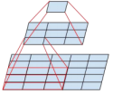

Fig1. 5×5の畳み込みを置き換えるミニネットワーク。

---

## 3.1. より小さな畳み込みへの因数分解

より大きな空間フィルター（5×5や7×7など）を用いたコンボリューションは、計算量が不均衡になる傾向があります。例えば、m個のフィルターを持つグリッド上にn個のフィルターを持つ5×5の畳み込みは、同じ数のフィルターを持つ3×3の畳み込みに比べて、25/9 = 2.78倍の計算コストがかかる。もちろん、5×5のフィルターは、前の層のより遠くにあるユニットの活性化の信号間の依存性を捉えることができるので、フィルターの幾何学的なサイズを小さくすることは、表現力を大きく犠牲にすることになります。しかし、5×5の畳み込みを、同じ入力サイズと出力の深さで、より少ないパラーメータの多層ネットワークで置き換えることができるかどうかを問うことができます。5×5畳み込みの計算グラフを拡大してみると、各出力は、5×5のタイルを入力上にスライドさせた小さな完全連結ネットワークのように見えます（図1参照）。ここでは視覚ネットワークを構築しているので、翻訳不変性を利用して、完全連結コンポーネントを2層の畳み込み構造に置き換えるのが自然だと思われます。第1層は3×3の畳み込みで、第2層は第1層の3×3の出力グリッドの上にある完全連結層です（図1参照）。この小さなネットワークを入力活性化グリッドにスライドさせると、5×5の畳み込みを2層の3×3の畳み込みに置き換えることになります（図4と5を比較）。

---

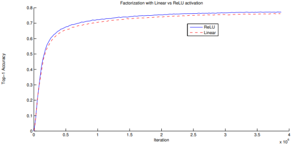

Fig2. 2つのInceptionモデルの制御実験の1つ。一方は線形＋ReLU層への因数分解を使用し、もう一方は2つのReLU層を使用する。386万回の演算の結果、前者は76.2%に落ち着き、後者は77.2%に達した。top-1 検証セットでの精度。

---

この設定では、隣接するタイル間で重みを共有することで、パラメータ数を明らかに減らしています。予想される計算コストの削減を分析するために，典型的な状況に適用されるいくつかのシミュレーションの仮定を行います．n = αmと仮定することができます。つまり、アクティベーション/ユニットの数を一定のαファクターで変化させたいということです。5×5の畳み込みは集約されているので、αは通常1よりわずかに大きくなります（GoogLeNetの場合は約1.5）。5×5層を2層に置き換えた場合、2つのステップでこの拡張に到達することは合理的だと思われます：両方のステップでフィルターの数を√αだけ増やします。α = 1 (拡張なし)を選択することで見積もりを簡単にするために、このネットワークを2つの3 × 3の畳み込み層で表現し、隣接するタイル間の活性化を再利用することにしました。このようにして、(9+9)/25の削減となり、28%の相対的な利益を得ることができました。各パラメータは、各ユニットの活性化を計算する際にちょうど1回だけ使用されるため、パラメータ数についてもまったく同じように節約できます。しかし、この設定では2つの一般的な疑問があります。この置き換えによって，表現力が失われることはないのか？我々の主な目的が計算の線形部分を因数分解することであるならば，線形活性化を第1層にとどめておくことが望ましいのではないか？私たちはいくつかの制御実験を行いましたが（例えば図2を参照）、線形活性化を使用すると、因数分解のすべての段階で、整流された線形ユニットを使用するよりも常に劣っていました。これは、出力活性化を一括正規化[7]することで、ネットワークが学習できるバリエーションの空間が広がったことによるものです。次元削減コンポーネントに線形活性化を使用しても、同様の効果が見られます。

---

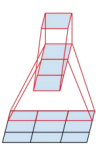

Fig3.  3×3コンボリューションに代わるミニネットワーク。このネットワークの このネットワークの下層は、3つの出力ユニットを持つ3×1の畳み込みで構成されています。

---

## 3.2. 非対称コンボリューションへの空間的因数分解

以上の結果から、3 × 3 以上のフィルタを持つ畳み込みは、常に3 × 3 畳み込み層のシーケンスに縮小できるため、一般的には有用ではないと考えられます。しかし、これをもっと小さな、たとえば2×2の畳み込みに因数分解すべきではないか、という疑問があります。例えば、3×1の畳み込みの後に1×3の畳み込みを行うと、3×3の畳み込みと同じ受容野を持つ2層のネットワークをスライドさせることになります（図3参照）。入力フィルターと出力フィルターの数が同じであれば、同じ数の出力フィルターでも2層の方が33%安くなります。それに比べて、3×3コンボリューションを2×2コンボリューションに因数分解すると、計算量が11％しか減りません。

理論的には，n × n の畳み込みを，1 × n の畳み込みと n × 1 の畳み込みに置き換えることができ，n が大きくなるにつれて計算コストが劇的に削減されます（図 6 参照）．実際には、この因数分解を採用すると、初期の層ではうまくいかないが、中程度のグリッドサイズ（m×mの特徴マップで、mは12から20の範囲）では非常に良い結果が得られることがわかった。その場合、1×7回の畳み込みと7×1回の畳み込みを行うことで、非常に良い結果が得られます。

---

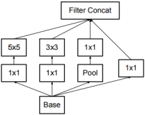

Fig4. [20]で紹介したオリジナルのInceptionモジュール。

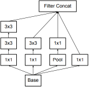

Fig5. セクション2の原則3で提案されたように、各5×5の畳み込みを2つの3×3の畳み込みに置き換えたインセプション・モジュール。

---

# 4. 補助的な分類法の有用性

[20]は，非常に深いネットワークの収束性を改善するために，補助的な分類器の概念を導入しました．当初の動機は、有用な勾配を下層に押し付けてすぐに使えるようにし、非常に深いネットワークの消失勾配問題に対処して学習中の収束性を改善することでした。また、Leeら[11]は、補助的な分類器は、より安定した学習と収束を促進すると主張しています。興味深いことに、学習の初期段階では、補助分類器は収束性の向上につながらないことがわかりました。学習の終わり近くになると、補助枝を持つネットワークは、補助枝を持たないネットワークの精度を追い越し始め、わずかに高いプラトーに達します。

また、[20]では、ネットワークの異なる段階で2つのサイドヘッドを使用しています。下側の補助枝を削除しても、ネットワークの最終的な品質には何の悪影響もありませんでした。先ほどのパラグラフの観察結果と合わせて考えると、これらのブランチが低レベルの特徴を進化させるのに役立つという[20]のオリジナルの仮説は、ほとんど見当違いであることがわかります。その代わりに、補助的なクラシファイヤーがレギュラライザーとして機能していることを主張します。このことは、側枝がバッチ正規化されていたり[7]、ドロップアウト層を持っていたりすると、ネットワークの主分類器の性能が向上するという事実によって裏付けられます。このことは、バッチ正規化が正則化として働くという推測を弱く裏付ける証拠にもなります。

# 5. 効率的なグリッドサイズの縮小

従来、畳み込みネットワークでは、特徴マップのグリッドサイズを小さくするために、何らかのプーリング操作を行っていました。表現上のボトルネックを回避するために、最大または平均プーリングを適用する前に、ネットワークフィルタの活性化次元を拡張します。例えば、k個のフィルターを持つd×dグリッドからスタートして、2k個のフィルターを持つd/2×d/2グリッドにしたい場合、まず2k個のフィルターでstride-1コンボリューションを計算し、さらにプーリングステップを適用する必要があります。つまり，全体の計算コストは，2d^2 k^2の演算を用いた大きなグリッドでの高価な畳み込みに支配されます．ひとつの可能性としては、畳み込みを行う際にプーリングに切り替えることで、2(d/2)^2 k^2となり、計算コストを1/4に減らすことができます。しかし、この方法では、表現の全体的な次元が(d/2)^2 kに下がるため、表現上のボトルネックが生じ、表現力の低いネットワークになってしまいます（図9参照）。そこで、このような方法ではなく、表現上のボトルネックを取り除きつつ、計算コストをさらに削減する別の方法を提案しています。を提案します（図10参照）。ここでは、2つの並列ストライド2ブロックを使用します。P」と「C」です。Pはプーリング層（平均プーリングまたは最大プーリング）、活性化、両方ともストライド2のフィルターバンクで、図10のように連結されています。

---

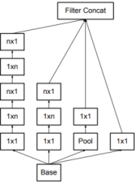

Fig6. n × n の畳み込みを因数分解した後のインセプションモジュール。今回のアーキテクチャでは、17×17グリッドの場合、n＝7としました。(フィルターの大きさは原理3で決定されます。)

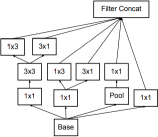

Fig7. フィルターバンクの出力を拡張したインセプションモジュール。このアーキテクチャは、最も粗いグリッド（8×8）で使用され、高次元の表現を促進するために の原理2で提案されているように、高次元の表現を促進するために、最も粗い（8×8）グリッドで使用されます。セクション2の原則2で提案されているように、このアーキテクチャは最も粗いグリッド（8×8）で使用され、高次元の表現を促進します。このソリューションは、最も粗いグリッドでのみ使用しています。高次元の疎な表現を行うことが最も重要であるからです。この解決策は、最も粗いグリッドでのみ使用しています。これは、（1×1の畳み込みによる）局所的な処理の割合が 局所的な処理（1×1の畳み込み）の割合が空間的な集約に比べて大きくなるため、高次元のスパース表現を生成することが最も重要な場所だからです。

---

# 6. インセプション-V3

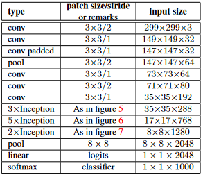

Tab1. 提案するネットワーク・アーキテクチャの概要。各モジュールの出力サイズは、次のモジュールの入力サイズになります。図10に示したリダクション技術のバリエーションを用いて、可能な限りインセプションブロック間のグリッドサイズを小さくしています。また、グリッドサイズを縮小しないInceptionモジュールの内部にも0パディングを使用しています。その他のレイヤではパディングを使用していません。フィルターバンクのサイズは、第2章の原理4を考慮して決められています。

ここでは、上記の点をつなぎ合わせて、ILSVRC 2012の分類ベンチマークで性能を向上させた新しいアーキテクチャを提案します。我々のネットワークのレイアウトを表1に示します。従来の7×7の畳み込みを、3.1節で述べたのと同じ考え方に基づいて、3×3の畳み込みに因数分解しています。ネットワークのインセプション部分では、従来のインセプションモジュールを35×35に3つ配置し、それぞれ288個のフィルターを使用しています。これを、5章で説明したグリッドリダクション技術を用いて、17×17のグリッドに768個のフィルターを配置しました。この後、図5に示すように、因数分解されたインセプション・モジュールの5つのインスタンスが続きます。これを、図10のグリッドリダクション技術を用いて、8×8×1280グリッドに縮小しました。最も粗い8×8レベルでは、図6に示すように2つのインセプション・モジュールがあり、各タイルの出力フィルタ・バンク・サイズは2048であることがわかります。インセプション・モジュール内のフィルター・バンクのサイズを含むネットワークの詳細な構造は、本稿のtarファイルに含まれるmodel.txtに記載されている補足資料に記載されています。しかし、第2章の原則を守っていれば、ネットワークの品質は比較的安定していることが確認できました。このネットワークは42層の深さがありますが、計算コストはGoogLeNetに比べて2.5倍程度であり、VGGNetよりもはるかに効率的です。

---

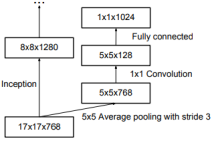

Fig8. 最後の17×17層の上にある補助的な分類器。側頭部の層を一括してバッチ正規化[7]することで，トップ1の精度を0.4%向上させた．下軸は，バッチサイズ 32 で行われた反復回数を示す．

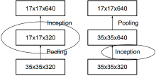

Fig9. グリッドサイズを縮小する2つの代替方法 左側の解決策は、セクション2の「表現上のボトルネックを導入しない」という原則1に違反しています。右側のバージョンは、計算コストが3倍になります。

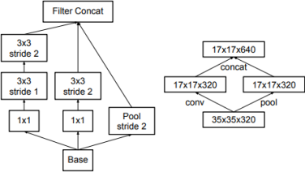

Fig10. インセプションのモジュールは、グリッドサイズを縮小し、フィルタバンクを拡大して フィルターバンクを拡張します。これは、安価であり、原則1で提案されている表現上のボトルネックを回避する 表現上のボトルネックを回避することができます。右の図は 右の図は、同じ解決策を、演算ではなくグリッドサイズの観点から見たものです。演算ではなくグリッドサイズの観点から見たものです。

---

# 7. ラベルスムージングによるモデルの正則化

ここでは、学習中のラベルドロップアウトの限界効果を推定することで、分類器層を正則化するメカニズムを提案する。

このモデルでは、各学習例$x$に対して、各ラベルの確率$k\in\left\{1, \dots, K\right\}\:p\left(k|x\right)=\frac{exp\left(z_k\right)}{sum_{i=1}^{k}exp\left(z_i\right)}$を計算します。ここで、$z_i$はlogitsまたは非正規化log-probabilitiesである。 この学習例のラベル$q(k|x)$に対するグランドトゥルース分布を、$\sum_{k} q\left(k|x\right)=1$となるように正規化して考えます。 簡略化のため、$p$と$q$の例$x$への依存性は省略します。この例の損失をクロスエントロピー:  $l=-\sum_{k=1}^{K}\log{\left(p\left(k\right)\right)q\left(k\right)}$と定義します。これを最小化することは、ラベルの期待対数尤度を最大化することと同等であり、ラベルはそのグランドトゥルース分布$q(k)$に従って選択される。クロスエントロピー損失は、対数$z_k$に関して微分可能であるため、深層モデルの勾配学習に用いることができる。勾配は、$\frac{\partial l}{\partial z_k}=p\left(k\right)-q\left(k\right)$という単純な形をしており、-1から1の間に収まります。

この場合、クロスエントロピーを最小化することは、正しいラベルの対数尤度を最大化することと等価である。ラベル y を持つ特定の例 x に対して、対数尤度が最大になるのは、$q\left(k\right)=\delta_{k, y}$ (ここで、$\delta_{k, y}$ は Dirac のデルタで、$k=y$ のとき 1、それ以外は 0 になります。この最大値は、有限の$z_k$では達成できませんが、すべての $k \neq y$ に対して $z_y\gg z_k$ の場合、つまり、グランドトゥルースのラベルに対応するロジットが他のすべてのロジットよりもはるかに大きい場合には、近づくことができます。しかし、これには2つの問題があります。1つ目は，オーバーフィッティングの可能性である．モデルが，各訓練例に対してグランドトゥルースラベルに完全な確率を割り当てるように学習した場合，一般化することは保証されない．2つ目は、最大ロジットとその他のロジットの差が大きくなり、有界勾配 $\frac{\partial l}{\partial z_k}$ と相まって、モデルの適応能力が低下することです。直感的には、モデルが自分の予測に自信を持ちすぎるために起こる現象です。

我々は、モデルの自信をなくすように促すメカニズムを提案する。訓練ラベルの対数尤度を最大化することが目的であれば，このようなことは望ましくないかもしれないが，モデルを正則化し，適応性を高めることができる．この方法はとても簡単です。訓練例 $x$ に依存しないラベルの分布 $u(k)$ と，平滑化パラメータ $\epsilon$ を考える．訓練例のラベルがyの場合、ラベル分布 $q\left(k|x\right)= \delta_{k, y}$ を次のように置き換えます。

$q^{\prime\left(k|x\right)}=\left(1-\epsilon\right)\delta_{k,\ y}+\epsilon u\left(k\right)$

これは、元々のグランドトゥルース分布 $q(k|x)$ と固定分布 $u(k)$ を、それぞれ $1- \epsilon$ と $\epsilon$ の重みで混合したものである。これは、ラベルkの分布と見なすことができる。まず、ラベルkをグランドトゥルースのラベル $k=y$ に設定し、次に、確率 $\epsilon$ で、$k$ を分布 $u(k)$ から抽出したサンプルに置き換える。ここで、$u(k)$ としてラベルの事前分布を用いることを提案する。実験では，一様分布 $u(k) = 1/K$ を用いたので，次のようになる．

$H\left(q^\prime,\ p\right)=-\sum_{k=1}^{K}\log{p\left(k\right)}q^{\prime\left(k\right)}=\left(1-\epsilon\right)H\left(q,\ p\right)+\epsilon H\left(u,\ p\right)$

したがって、LSRは、単一のクロスエントロピー損失 $H\left(q, p \right)$を、2つの損失$H\left(q, p \right)$と$H\left(u, \right)$に置き換えることと同じです。2つ目の損失は、予測されたラベル分布pと事前のuとの乖離を、相対的な重み$\frac{\epsilon}{1- \epsilon}$でペナルティとして与えます。なお、この偏差は、$H(u, p) =D_{KL}(u \parallel p)\ +H(u)$であり、$H(u)$は固定されているので、KLダイバージェンスで等価に捉えることができる。uが一様分布の場合、$H(u,\ p)$は、予測された分布pが一様分布にどれだけ似ていないかを示す指標であり、負のエントロピー$-H(p)$で測ることもできますが（等価ではありません）、我々はこの方法を試していません。

K=1000クラスのImageNet実験では，$u(k) = \frac{1}{1000}$，$\epsilon=0.1$を用いました．ILSVRC 2012では，トップ1エラーとトップ5エラーの両方で，絶対値で約0.2%の一貫した改善が見られました（表3参照）．

# 8. トレーニング方法

TensorFlow [1] 分散型機械学習システムを用いて，50 個のレプリカを NVidia Kepler GPU 上で動作させ，バッチサイズ 32 で 100 回のエポックを行い，確率的勾配を用いてネットワークを学習しました．初期の実験では，減衰が0.9のmomentum[19]を使用していましたが，最良のモデルは，減衰が0.9で$\epsilon=1.0$のRMSProp[21]を使用して達成されました．学習率は0.045で，2エポックごとに0.94の指数関数的なレートで減衰させました．また，学習を安定させるために，閾値2.0のグラジエントクリッピング[14]が有効であることがわかった．モデルの評価は，時間をかけて計算されたパラメータの走行平均を用いて行われた．

# 9. 低解像度入力時のパフォーマンス

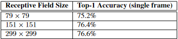

Tab2. 受容野の大きさを変え、計算量を一定にした場合の認識性能の比較。

ビジョンネットワークの典型的な使用例は、例えばMultibox [4]のように、検出の後に分類することです。これには、単一の物体を含む画像の比較的小さなパッチを、何らかのコンテキストで分析することが含まれます。課題は、パッチの中央部分が何らかのオブジェクトに対応しているかどうかを判断し、対応している場合はそのオブジェクトのクラスを決定することです。しかし、物体は比較的小さく、低解像度であることが多い。このため、低解像度の入力をどのように適切に処理するかという問題があります。

一般的には、高解像度の受容野を採用したモデルは、認識性能が大幅に向上する傾向にあります。しかし、第1層の受容野の解像度が上がったことによる効果と、モデルの容量や計算量が大きくなったことによる効果とを区別することが重要です。モデルを調整せずに入力の解像度だけを変えてしまうと、より困難な課題を解決するために、計算量がはるかに少ないモデルを使うことになってしまいます。もちろん、このような解決策は、計算量が少ないために、すでに失敗しているのは当然です。正確な評価を行うためには、モデルは曖昧なヒントを分析して、細かい部分を「幻覚」で見ることができるようにする必要があります。これには計算コストがかかります。そこで問題となるのは、計算量を一定に保った場合、入力解像度を上げることでどれだけの効果が得られるかということです。一定の労力を確保するための簡単な方法として、低解像度の入力の場合、最初の2つの層のストライドを減らすか、ネットワークの最初のプーリング層を単純に取り除くことができる。

そのために、以下の3つの実験を行いました。
1. ストライド2で299×299の受容野、1層目以降は最大のプーリング。
1. ストライド1で151×151の受容野、1層目以降は最大のプーリング。
1. ストライド1で79×79の受容野を持ち、1層目以降はプーリングなし。

この3つのネットワークの計算コストはほとんど同じです。3つ目のネットワークの方がわずかに安いですが，プーリング層のコストはわずかで，（ネットワークの総コストの1％以内）です．いずれの場合も、ネットワークは収束するまで学習され、ImageNet ILSVRC 2012分類ベンチマークの検証セットでその品質が測定されました。その結果を表2に示します。低解像度のネットワークは学習に時間がかかりますが，最終的な結果の品質は高解像度のものに非常に近いものになります．

しかし、単純に入力解像度に応じてネットワークサイズを縮小した場合、ネットワークの性能はより低下します。しかし、これは16倍も安いモデルをより難しいタスクで比較していることになるので、不公平な比較になります。

また、表2のこれらの結果から、R-CNN[5]のように、小さい物体には専用の高コスト低解像度ネットワークを使用することを検討してみてはいかがでしょうか。

# 10. 実験結果と比較

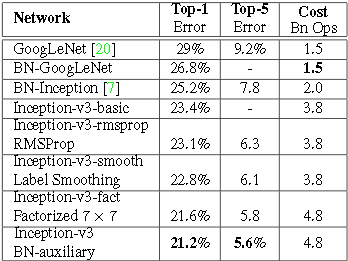

表 3. 様々な寄与因子に対する累積効果を比較したシングルクロップの実験結果。Ioffe at al [7]の発表した最良のシングルクロップ推論と比較しています。"Inception-v3-"の行では、変化は累積的なものであり、後続の各行には前のものに加えて新しい変化が含まれている。最後の行は、すべての変更を参照しているので、以下では「Inception-v3」と呼ぶことにする。残念ながら、He et al [6]は10クロップの評価結果のみを報告しており、シングルクロップの結果は報告していないので、以下の表4に報告する。

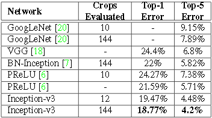

表 4. 様々な要因に対する累積効果を比較した単一モデル、マルチクロップの実験結果。我々の数値を、ILSVRC 2012年の分類ベンチマークで発表された最良の単一モデル推論結果と比較する。

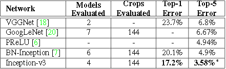

表 5. マルチモデル、マルチクロップの報告結果を比較したアンサンブル評価結果。我々の数値は、ILSVRC 2012 の分類ベンチマークで公表されている最良のアンサンブル推論結果と比較しています。∗アンサンブル結果の上位 5 位までの結果はバリデーションセットでの結果です。アンサンブルでは、バリデーションセットで3.46%のトップ5の誤差が発生しています。

表3は、第6章で述べた提案アーキテクチャ(Inception-v2)の認識性能に関する実験結果である。Inception-v2の各行は、ハイライトされた新しい変更点とそれ以前の変更点を含めた累積的な変更点の結果を示している。ラベルスムージングは、セクション7で説明した方法を参照してください。因数分解7×7は、最初の7×7畳み込み層を3×3畳み込み層のシーケンスに因数分解する変更を含む。BN-auxiliaryとは、畳み込みだけでなく、補助分類器の完全連結層も一括正規化するバージョンを指す。表3の最後の行のモデルをInception-v3とし、マルチクロップとアンサンブルの設定で性能を評価します。

評価は、[16]で提案されているように、ILSVRC-2012の検証セットの48238個のブラックリストに載っていない例を対象に行っています。また、50000個の例についても同様に評価を行った結果、トップ5エラーでは約0.1％、トップ1エラーでは約0.2％の悪化が見られた。この論文の次のバージョンでは、我々のアンサンブル結果をテストセットで検証する予定であるが、春にBN-Inceptionを最後に評価した時点では[7]、テストセットと検証セットの誤差は非常によく相関する傾向があることが示されている。

# 11. 結論

我々は、畳み込みネットワークをスケールアップするためのいくつかの設計原則を提示し、Inceptionアーキテクチャの文脈でそれらを研究しました。これにより、単純なモノリシック・アーキテクチャに比べて計算コストが比較的低い、高性能なビジョン・ネットワークを実現することができます。Inception-v2の最高品質バージョンは、ILSVR 2012の分類におけるシングルクロップ評価で、21.2%のトップ1エラーと5.6%のトップ5エラーを達成し、新たな技術水準を確立しました。これは、Ioffe et al [7]に記載されているネットワークと比較して、計算コストの増加が比較的緩やか（2.5倍）であるにもかかわらず達成されています。我々のモデルは、Heら[6]の結果を上回り、トップ5（トップ1）の誤差をそれぞれ25％（14％）削減しました。このように，パラメータ数の削減と，バッチ正規化された補助分類器とラベル平滑化による正則化を組み合わせることで，比較的小さいサイズの学習セットで高品質なネットワークを学習することができます．