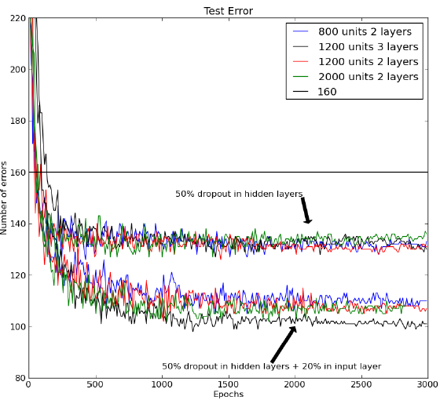
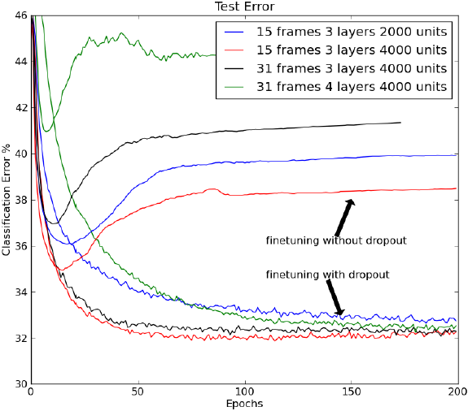
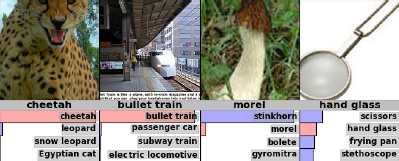

# Improving neural networks by preventing co-adaptation of feature detectors

# 備考

[元論文](https://github.com/rurusasu/paper/blob/master/AI%E6%8A%80%E8%A1%93/CNN/Dropout%EF%BC%9AImproving%20neural%20networks%20by%20preventing%20co-adaptation%20of%20feature%20detectors/%E5%85%83%E8%AB%96%E6%96%87/Improving%20neural%20networks%20by%20preventing%20co-adaptation%20of%20feature%20detectors.pdf)

## 著者

G. E. Hinton, N. Srivastava, A. Krizhevsky, I. Sutskever and R. R. Salakhutdinov

## 掲載

"Improving neural networks by preventing co-adaptation of feature detectors", arXiv:1207.0580, 2012.

# Abstract

大規模なフィードフォワード・ニューラルネットワークが小さな訓練セットで訓練されると、一般的に、ホールドアウトされたテストデータではパフォーマンスが悪くなります。この「オーバーフィット」は、各訓練ケースの特徴検出器の半分をランダムに省略することで大幅に削減されます。これにより、ある特徴検出器が他のいくつかの特定の特徴検出器の文脈でしか役に立たないような複雑な共適応を防ぐことができます。その代わりに、各ニューロンは、そのニューロンが動作しなければならない様々な内部コンテクストを組み合わせて考えると、正しい答えを出すために一般的に役立つ特徴を検出することを学習します。ランダムな「ドロップアウト」は、多くのベンチマークタスクを大幅に改善し、音声認識と物体認識の新記録を樹立します。

# Introduction

フィードフォワード型の人工ニューラルネットワークは、入力と出力の間に非線形な「隠れた」ユニットの層を使用します。これらの隠れユニットの入力接続の重みを適応させることで、入力ベクトル(1)が与えられたときに正しい出力を予測することを可能にする特徴検出器を学習します。入力と正しい出力の関係が複雑で、ネットワークがそれを正確にモデル化するのに十分な数の隠れユニットを持っている場合、特にラベル付けされた訓練データが限られた量しかない場合、訓練セットをほぼ完全にモデル化することができる重みの多くの異なる設定が一般的に存在します。これらの重みベクトルのそれぞれは、ホールドアウトされたテストデータ上で異なる予測を行い、ほとんどすべての重みベクトルは、特徴検出器がトレーニングデータ上ではうまく機能するように調整されているが、テストデータ上では機能しないため、トレーニングデータ上よりもテストデータ上の予測が悪くなります。

オーバーフィットは、訓練データ上での複雑な共適応を防ぐために「ドロップアウト」を使用することによって低減することができる。各訓練ケースの各プレゼンテーションでは、各隠れユニットは 0.5 の確率でネットワークからランダムに省略されるので、隠れユニットは他の隠れユニットが存在することに頼ることができません。ドロップアウト手順の別の見方として、ニューラルネットワークでモデル平均化を行う非常に効率的な方法があります。テストセットの誤差を減らす良い方法は、**非常に多くの異なるネットワークによって生成された予測値を平均化すること**です。これを行う標準的な方法は、多くの別々のネットワークを訓練してから、これらのネットワークのそれぞれをテストデータに適用することですが、これは訓練とテストの両方で計算コストがかかります。ランダム・ドロップアウトを用いると、膨大な数の異なるネットワークを合理的な時間で訓練することが可能になります。各トレーニングケースのプレゼンテーションごとに、ほぼ確実に異なるネットワークが存在しますが、これらのネットワークはすべて、存在する隠れユニットのための同じ重みを共有しています。

私たちは、学習ケースのミニバッチでドロップアウト・ニューラル・ネットワークを学習するために、標準的な確率的勾配降下法を使用するが、重みが大きくなりすぎないようにするために通常使用されるペナルティ項を修正している。重みベクトル全体の 2 乗長(L2 ノルム)にペナルティを与える代わりに、個々の隠れユニットごとに入力される重みベクトルの L2 ノルムに上限を設定する。重みの更新がこの制約に違反した場合、隠れユニットの重みを除算で繰り込みます。**ペナルティではなく制約を用いることで、提案された重みの更新がどれだけ大きくても、重みが非常に大きくなることを防ぎます**。これにより、学習中に減衰する非常に大きな学習率で開始することが可能となり、小さな重みから開始して小さな学習率を使用する方法と比較して、**はるかに徹底的な重み空間を探索することができる**。

テスト時には、すべての隠れユニットを含む「平均ネットワーク」を使用しますが、2 倍の数の隠れユニットがアクティブであるという事実を補うために、出力する重みを半分にしています。実際には、これは多数のドロップアウト・ネットワークの平均化と非常に似た性能を提供します。N 単位の単一の隠れ層とクラス・ラベルの確率を計算するための「softmax」出力層を持つネットワークでは、平均ネットワークを使用することは、2N 個の可能なすべてのネットワークで予測されたラベル上の確率分布の幾何学的平均を取ることと全く同じです。**ドロップアウト・ネットワークがすべて同じ予測をしないと仮定すると、平均ネットワークの予測は、個々のドロップアウト・ネットワークによって割り当てられた対数確率の平均よりも高い対数確率を正解に割り当てることが保証されます**(2)。同様に、線形出力単位の回帰では、平均ネットワークの二乗誤差は、ドロップアウト・ネットワークの二乗誤差の平均よりも常に優れている。

# 2. Experiment

## 2.1. MNIST

私たちはまず、機械学習アルゴリズムのベンチマークとして広く使用されている MNIST を用いて、ドロップアウトの有効性を探りました。MNIST には、個々の手書き数字の 28x28 のトレーニング画像 60,000 枚とテスト画像 10,000 枚が含まれています。テストセットの性能は、変換された画像でトレーニングデータを拡張する(3)か、空間変換に関する知識を畳み込みニューラルネットワークに配線する(4)か、ラベルを使用せずにトレーニング画像から有用な特徴を抽出するために生成的事前訓練を使用する(5)ことによって、大幅に向上させることができます。これらのトリックを使用せずに、標準的なフィードフォワード・ニューラルネットワークで公表されている最良の結果は、テストセットで 160 エラーです。これは、各隠れユニットの入力重みに個別の L2 制約を持つ 50%のドロップアウトを使用することで約 130 エラーに削減することができ、さらに、ピクセルの 20%をランダムにドロップアウトすることで約 110 エラーに削減することができます（図 1 参照）。

\
図 1: バックプロパゲーションを用いて学習した様々なニューラルネットワークアーキテクチャの MNIST テストセットのエラー率。下の線のセットも入力層に 20%のドロップアウトを使用しています。事前学習やウェイトシェアリング、学習セットの強化を行わずにバックプロパゲーションを用いたこのタスクの過去に発表された最良の結果を横線で示します。

ドロップアウトは、生成的事前訓練と組み合わせることもできるが、この場合は、事前訓練で発見された特徴検出器を失うことを避けるために、学習率を小さくし、重み制約を与えないようにしている。(5)で述べた公開されている事前学習されたディープビリーフネットは、標準的なバックプロパゲーションを用いて微調整した場合は 118 個の誤差、隠れユニットの 50%ドロップアウトを用いて微調整した場合は 92 個の誤差が得られた。URL で公開されているコードを用いてディープボルツマンマシンの事前学習を 5 回行ったところ、標準バックプロパゲーションを用いて微調整した場合は 103、97、94、93、88 エラー、隠れユニットの 50%ドロップアウトを用いて微調整した場合は 83、79、78、78、77 エラーとなりました。79 エラーの平均値は、事前知識や強化された訓練セットを使用しない方法の記録である（詳細は付録 A を参照）。

## 2.2. TIMIT

次に、少ない語彙できれいな音声を認識するために広く使われているベンチマークである TIMIT にドロップアウトを適用しました。音声認識システムは、時間的変動に対処するために隠れマルコフモデル（HMM）を使用しており、音響入力から抽出された係数のフレームが各隠れマルコフモデルの各可能な状態にどれだけ適合するかを決定する音響モデルを必要とします。最近では、短いフレームのシーケンスを HMM 状態を超える確率分布にマッピングする、事前に訓練された深層のフィードフォワードニューラルネットワークが、TIMIT(6)と様々なより現実的な大語彙タスク(7, 8)の両方において、伝統的なガウス混合モデルよりも優れていることが示されています。

\
図 2：TIMIT ベンチマークのコアテストセットにおけるフレーム分類エラー率。異なるネットワークアーキテクチャに対する標準とドロップアウトの微調整の比較。隠れユニットの 50%と入力ユニットの 20%のドロップアウトにより、分類が改善される。

図 2 は、ウィンドウの中央フレームがニューラルネットによって最も高い確率で与えられた HMM 状態に属するものとして分類された場合の TIMIT ベンチマークのコアテストセットにおけるフレーム分類エラー率を示しています。ニューラルネットへの入力は、フレームごとに 10 ミリ秒ずつ進む 21 個の隣接フレームです。ニューラルネットは 4 つの完全に接続された各層 4000 ユニットの隠れ層と 185 個の「softmax」出力ユニットを持ち、これらのユニットはその後ベンチマークに使用される 39 の異なるクラスにマージされます。隠れユニットの 50%のドロップアウトは、さまざまな異なるネットワーク・アーキテクチャの分類を大幅に改善します（図 2 を参照）。フレーム認識率を得るために、各フレームについてニューラルネットワークが出力するクラス確率は、HMM 状態間の遷移確率を知っているデコーダに与えられ、Viterbi アルゴリズムを実行して HMM 状態の単一の最良のシーケンスを推論します。ドロップアウトなしの場合、認識率は 22:7%、ドロップアウトありの場合は 19:7%となり、これは話者のアイデンティティに関する情報を一切使用しない記録手法となります。

## 2.3. CIFAR-10

CIFAR-10 は物体認識のベンチマークタスクです。CIFAR-10 は、クラス名（例：犬）またはそのサブクラス（例：ゴールデンレトリバー）をウェブで検索して見つかった 10 種類のオブジェクトクラスの 32x32 のダウンサンプリングされたカラー画像を使用しています。これらの画像を手でラベル付けし、クラス名を与えられる可能性のある優勢な物体が 1 つだけあるトレーニング画像 50,000 枚とテスト画像 10,000 枚を作成しました(9)（図 3 参照）。テスト画像の誤差率は 18.5%と公表されています(10)。私たちは、3 つの畳み込み隠れ層を持つニューラルネットワークを使用して、畳み込みユニットのローカルプールでの最大活性を報告する 3 つの「max-pooling」層をインターリーブして、16.6%の誤差率を達成しました。これらの 6 つの層の後に、1 つの局所的に接続された層が続いた（詳細は付録 D を参照）。最後の隠れ層でドロップアウトを使用すると，15.6%の誤差率が得られる．

\
図 3: CIFAR-10 テストセットのクラス「鳥」の 10 の例は、鳥の種類、視点、照明、背景の多様性を示しています。ニューラルネットは、最後の 2 つの例を除いてすべての例を正解しています。

ImageNet は、数千の物体クラスの数千の高解像度画像からなる非常に難易度の高い物体認識データセットである(11)。2010 年には、クラスごとに約 1000 の例を持つ 1000 のクラスのサブセットが物体認識コンテストの基礎となりましたが、このコンテストでは、実際には 6 つの別々のモデルの平均である優勝作品が、テストセットで 47.2%のエラー率を達成しました。このデータセットに関する現在の最新の結果は 45.7%です(12)。私たちは、5 つの畳み込み隠れ層を「max-pooling」層とインターリーブした単一のニューラルネットワークを使用して、2 つのグローバルに接続された層と最終的な 1000 ウェイの softmax 層を使用して、48.6%の誤差という同等の性能を達成しました。すべての層は、各隠れユニットの入力重みに L2 重み制約を持っていました。第 6 の隠れ層で 50%のドロップアウトを使用することで、これを記録的な 42.4%まで減少させることができました(詳細は付録 E を参照)。

## 2.4. Reuters-dataset

音声認識データセットと物体認識データセットの両方について、ネットのアーキテクチャを設計する際には多くの決定を行う必要がある。私たちは、多数の異なるアーキテクチャの性能を評価するために使用される別の検証セットを実施し、検証セット上でドロップアウトで最も性能が良かったアーキテクチャを使用して、実際のテストセット上でドロップアウトの性能を評価することによって、これらの決定を行いました。

ロイターのデータセットには、クラスの階層でラベル付けされた文書が含まれている。私たちは、50 の相互に排他的なクラスの 201,369 文書を含む訓練セットとテストセットを作成した。各文書は、2000 個の一般的なノンストップ単語のカウントのベクトルで表され、各カウント C は log(1+C)に変換された。バックプロパゲーションを用いて学習された 2000 個の隠れユニットからなる 2 つの完全に接続された層を持つフィードフォワード・ニューラルネットワークは、テストセットで 31.05%の誤差を得る。これは、50%のドロップアウトを使用することで 29.62%に減少します(付録 C)。

\
図 4：下にベスト 5 ラベルの確率がある Imagenet テストケース 上位 5 つのラベルの多くは非常に説得力があります。

# Results

私たちは、さまざまなドロップアウト確率を試しましたが、それらのほとんどすべてがネットワークの汎化性を向上させます。全結合層の場合、すべての隠れ層のドロップアウトは 1 つの隠れ層のみのドロップアウトよりも機能し、極端な確率でドロップアウトを行うと汎化性が悪化する傾向があるため、この論文全体で 0.5 を使用しました。入力については、50%以上の入力を保持した方が良い場合が多いですが、ドロップアウトも有効です。検証セットの平均性能をユニットが存在する場合の平均性能と比較することにより、各隠れユニットまたは入力ユニットの個々のドロップアウト確率を適応させることも可能です。これにより、この方法の動作が少し良くなります。必要な入出力マッピングにかなり異なる領域が多数あるデータセットの場合、ドロップアウト確率を入力の学習関数にして、統計的に効率的な「エキスパートの混合物」を作成することで、パフォーマンスをさらに向上させることができます（13）。組み合わせには多くのエキスパートがいますが、各パラメータはトレーニングデータの大部分に適応されます。

ドロップアウトは、訓練データを与えられた事後確率によって各モデルを重み付けするベイズ的モデル平均化よりも実装がかなり簡単です。フィードフォワード・ニューラル・ネットワークのような複雑なモデル・クラスの場合、ベイズ法は通常、マルコフ連鎖モンテカルロ法を用いて事後分布からモデルをサンプリングします(14)。対照的に、確率 0:5 のドロップアウトは、すべてのモデルが最終的に組み合わせにおいて等しい重要性を与えられると仮定するが、共有重みの学習はこれを考慮に入れる。テスト時には、ドロップアウトの決定が各ユニットに対して独立しているという事実は、平均ネットを 1 回通過させることによって、指数関数的に多数のドロップアウト・ネットの組み合わせた意見を非常に簡単に近似することを可能にします。これは、多くの別々のモデルの予測を平均化するよりもはるかに効率的です。

ベイズモデルの平均化に代わる一般的な方法として、異なるモデルを訓練セットから異なるランダムなケースを選択して訓練し、その組み合わせではすべてのモデルに等しい重みを与える「バギング」があります(15)。バギングは、決定木のようなモデルに最もよく使用されますが、これは、データへの適合が非常に速く、テスト時間が非常に短いからです(16)。ドロップアウトは、より強力なモデルであるフィードフォワード・ニューラルネットワークにも同様のアプローチを適用することができます。ドロップアウトは、各モデルが単一のケースで訓練され、モデルの各パラメータが他のすべてのモデルの対応するパラメータと共有されることで非常に強く正則化されるという、極端な形でのバギングと見ることができます。これは、パラメータをゼロに向かって縮小する標準的な方法よりもはるかに優れた正則化です。

ドロップアウトのよく知られている極端なケースは、「ナイーブ・ベイズ」で、各入力特徴量がクラス・ラベルを予測するために別々に訓練され、テスト時にすべての特徴量の予測分布が一緒に乗算されます。学習データが非常に少ない場合、この方法は、各入力特徴量が他のすべての特徴量の文脈でうまく機能するように学習するロジスティック分類よりもはるかによく機能することが多いです。

最後に、ドロップアウトと最近の進化における性の役割に関する理論(17)との間には、興味深い類似性があります。17）で説明されている混合可能性の理論の 1 つの可能な解釈は、セックスが共同適応遺伝子のセットを分割することであり、これは、共同適応遺伝子の大きなセットを使用して機能を達成することは、同じものを達成するほど強力ではないことを意味します おそらく最適ではない複数の代替方法で機能し、それぞれが少数の共同適応遺伝子のみを使用します。 これにより、フィットネスの改善に多数の共同適応遺伝子への調整された変更が必要となる行き止まりを回避するための進化が可能になります。 また、環境の小さな変化によって適合度が大幅に低下する可能性も減少します。これは、機械学習の分野で「オーバーフィッティング」として知られている現象です。
