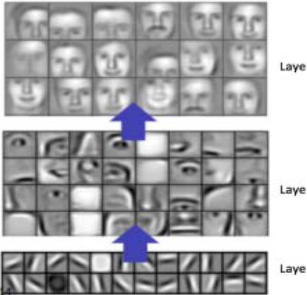
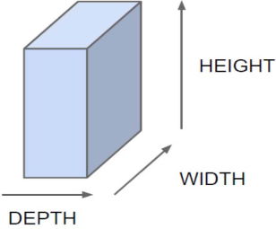
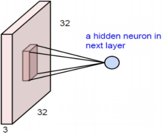
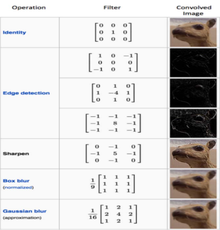
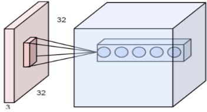

# Understanding of a Convolutional Neural Network

# 備考

## 著者
Saad ALBAWI, Tareq Abed MOHAMMED, Saad AL-ZAWI

# Abstract

ディープラーニングまたはディープニューラルネットワークという用語は、マルチレイヤーを持つ人工ニューラルネットワーク（ANN）を指します。 ここ数十年の間に，それは最も強力なツールの一つと考えられており，膨大な量のデータを扱うことができるため，文献では非常に人気があります． 深い隠れ層を持つことへの関心は最近、さまざまな分野で古典的な手法の性能を凌駕するようになってきました。 最も人気のあるディープニューラルネットワークの1つは、畳み込みニューラルネットワーク(CNN)です。 この名前は、畳み込みと呼ばれる行列間の数学的線形演算に由来しています。CNNには、畳み込み層、非線形層、プーリング層、完全接続層などの複数の層があります。 畳み込み層と完全接続層にはパラメータがあるが，プーリング層と非線形性層にはパラメータがない． ＣＮＮは機械学習問題において優れた性能を発揮する。  特に最大の画像分類データセット(Image Net)やコンピュータビジョン、自然言語処理(NLP)などの画像データを扱うアプリケーションでは非常に優れた性能を発揮し、その結果は驚くべきものであった。 本論文では、CNNに関連するすべての要素と重要な問題点、およびそれらの要素がどのように機能するのかを説明し、定義する。 また，CNNの効率に影響を与えるパラメータについても述べる． この論文は，読者が機械学習と人工ニューラルネットワークの両方について十分な知識を持っていることを前提としている．

# 1. Introduction

畳み込みニューラルネットワークは、画像処理から音声認識まで、パターン認識に関連するさまざまな分野で、過去10年間に画期的な成果を上げてきました。 CNNの最も有益な点は、ANNのパラメータ数を減らすことです。 この成果により、研究者や開発者は、従来のANNでは不可能であった複雑なタスクを解決するために、より大きなモデルにアプローチするようになりました。CNNによって解決される問題についての最も重要な前提は，空間的に依存する特徴を持つべきではないということである． 言い換えれば，例えば，顔検出アプリケーションでは，画像中のどこに顔があるかに注意を払う必要はない． 重要なのは，与えられた画像の中での位置に関係なく顔を検出することだけである． CNNのもう一つの重要な側面は，入力が深層に向かって伝播するときに抽象的な特徴を得ることである． 例えば，画像分類では，[図１]に示すように，[1,3,5,15]のように，最初の層でエッジを検出し，次に単純な形状を検出し，次の層で顔のような高次の特徴を検出することがある．

---

図1：畳み込みニューラルネットワークから学習された特徴量

---

# 2. CONVOLUTIONAL NEURAL NETWORK ELEMENTS

CNNをよく理解するために、まずはその基本的な要素から始めます。

## A. Convolution

---

図2：CNNの三次元入力表現

---

ニューラルネットワークの入力が[図2]のような形をしているとすると、画像（例えば、CIFAR-10データセットのカラー画像で、幅と高さが32×32ピクセル、奥行きが3のRGBチャンネル）や、ビデオ（グレースケールビデオで、高さと幅が解像度、奥行きがフレーム）であってもよいし、[2,10,15]のように、幅と高さが(L×L)のセンサ値を持ち、奥行きが異なる時間フレームに関連付けられている実験用ビデオであってもよい。

隠れ層にもう1つニューロンを追加すると、さらに32×32×3の重み接続が必要になり、合計で32×32×3×2パラメータになります。より明確にするために、入力をわずか2つのノードに接続するために6000以上の重みパラメータが使用されています。画像分類アプリケーションで有用な処理を行うには、2つのニューロンでは足りないのではないかと思われるかもしれません。 そこで、より効率的な処理を行うために、入力画像と次の層のニューロンを高さと幅を全く同じ値にして接続します。 このネットワークは、画像中のエッジのような処理に適用されると考えられます。 しかし、このネットワークでは、[4,5,14]のように32×32×3×32の重みの接続が必要となり、(3,145,728)となります。

---

図3：完全に接続されたネットワークのための代替手段としての畳み込み。

---

そこで、より効率的な方法を探すためには、完全な接続ではなく、画像全体ではなく、画像内の局所的な領域を探すのが良い方法であることがわかりました。 [図3]は、次の層の局所的な接続を示しています。つまり、次の層の隠れニューロンは、前の層の対応する部分からのみ入力を得る。  例えば、５×５のニューロンにしか接続できない。したがって、次の層に３２×３２個のニューロンを持たせたい場合、[1,9,13,14,17]のように、５×５×３×３2×３２個の接続があり、これは76,800個の接続 (完全接続の場合は3,145,728個と比較して) となる。

接続のサイズは劇的に減少しましたが、解くべきパラメータが非常に多く残っています。 簡略化のためのもう一つの前提として、次の層のニューロン全体の局所的な接続の重みを固定しておくことです。 これにより、次の層の隣のニューロンは、前の層のローカル領域に全く同じ重みで接続されます。 したがって、それは再び多くの余分なパラメータを落とし、次の層の32×32×3ニューロンを32×32に接続するために、重みの数を5×5×3=75だけに減らす[5,8,11]。

このような単純な仮定には多くの利点があります。 第一に、接続数が約 300 万個から、提示された例では 75 個の接続数だけに減少します。 第二に、より興味深い概念として、ローカル接続のための重みを固定することは、入力ニューロンに5×5×3のウィンドウをスライドさせ、生成された出力を対応する場所にマッピングすることに似ています。 これにより、画像内の位置に関係なく特徴を検出して認識する機会が得られる。これが、コンボリューションと呼ばれる理由である[6,7,16]。

---

図4：畳み込み行列が異なる場合の効果

---
畳み込み行列の驚異的な効果を示すために、図4は、3×3の窓の中で手動で接続重みを選ぶとどうなるかを示しています。

図４に示すように、画像中のエッジを検出するための行列を設定することができる。 これらの行列は、画像処理における古典的なフィルタのような働きをすることから、フィルタとも呼ばれている。しかし、畳み込みニューラルネットワークでは、これらのフィルタは初期化され、次いで、与えられたタスクにより適した訓練手順の形状フィルタが設定される。

---

図5：それぞれが異なるフィルタに対応しているが、与えられた画像の同じ領域を見ている複数のレイヤー

---

この方法をより有益なものにするために、入力層の後にさらに多くの層を追加することが可能である。各レイヤは、異なるフィルタと関連付けることができる。したがって、与えられた画像から異なる特徴を抽出することができる。 図５は、それらが異なるレイヤーにどのように関連付けられているかを示しています。各層は独自のフィルタを持っており、したがって、入力から異なる特徴を抽出する。 図5に示すニューロンは、異なるフィルタを使用していますが、入力画像の同じ部分を見ています。[6,8,15,17]
