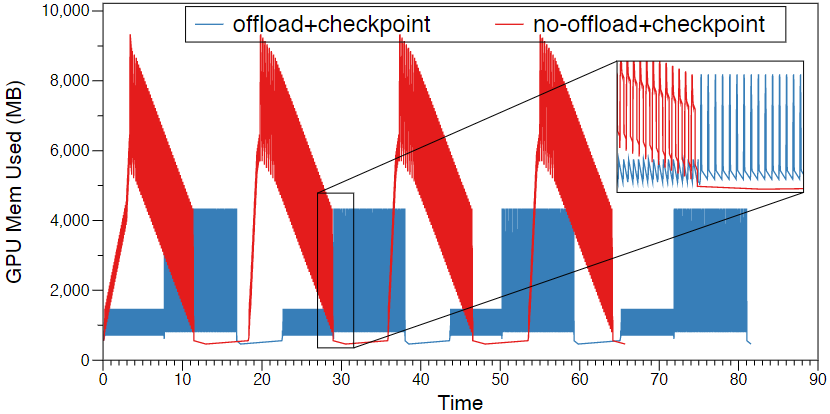
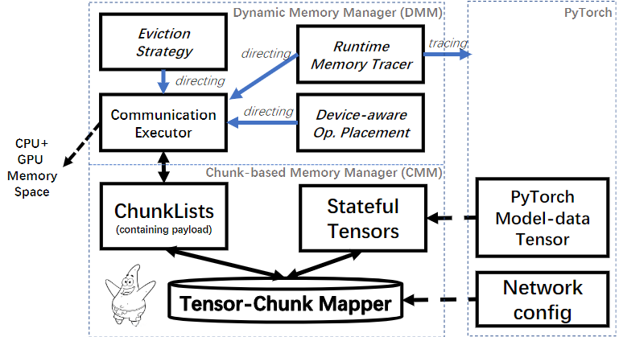
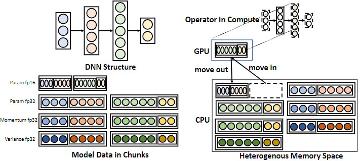

# [PatrickStar: チャンクベースのメモリ管理による事前トレーニング済みモデルの並列トレーニング](https://arxiv.org/abs/2108.05818)

# Abstract

事前学習済みモデル（PTM）は、人工知能（AI）技術に革命をもたらしている。膨大なテキストに対して一般的な言語特徴を持つモデルを学習し、その後タスクに特化したデータセットを用いてモデルの微調整を行います。残念ながら、PTMの学習には法外に高価な計算機が必要で、特に微調整はAIコミュニティのごく一部の人たちの遊びであるのが現状です。PatrickStarは、低品質のデバイスでPTMの学習を可能にすることで、PTMを誰でも利用できるようにしました。

PatrickStarは、パラメータ、勾配、オプティマイザの状態からなるモデルデータを格納するために、CPUとGPUのCPU-GPU混合メモリ空間を使用することで、コンピューティングプラットフォームのメモリ要件を削減します。モデルデータに利用可能なGPUメモリは、潮の満ち引きのようなパターンで定期的に変化し、減少・増加を繰り返していることが観察されています。しかし、既存のCPU-GPU混合（異種混合）学習は、このパターンを利用していません。そのため、CPUとGPUの間でモデルデータを静的に分割し、メモリの浪費と不正使用を引き起こしています。これに対し、PatrickStarはモデルデータをチャンクとして管理し、CPU-GPU混合なメモリ空間に動的に分散させます。チャンクは、学習時に有限状態マシンとして動作する状態テンソルから構成されています。したがって、ライフサイクルが重複しないチャンクを再利用することで、理論的に最小限のメモリ消費になります。ウォームアップ反復で収集された実行時メモリ統計に導かれ、チャンクはCPU-GPU混合メモリで効率的に編成され、CPU-GPUデータ転送量を低減する。Zero Redundancy Optimizerとの共生により、PatrickStarはデータ並列処理を用いて複数のGPUに拡張し、必要な通信帯域を最低限に抑え、帯域をより効率的に使用します。実験によると、PatrickStarは、8-V100と240GBのCPUメモリノード上で、STOA作品の2倍にあたる120億パラメータのGPTモデルをトレーニングし、同じモデルサイズでもより効率的であることを示しました。また、700ドルのパソコンでも、7億パラメータのGPTモデルを学習することができます。

# 1. INTRODUCTION

BERT (devlin2018bert), GPT2 (radford2019language), GPT3 (brown2020language) などの事前学習済みモデル（PTM）は、自然言語処理（NLP）の分野で画期的な成果を上げています。PTMは、多数の変換構造（vaswani2017attention）を積み重ねたディープニューラルネットワークを用いて、大量のテキストに対して一般言語の特徴表現を事前学習し、微調整を行った後に学習した知識を異なる下流タスクに転送します。インターネットからの潜在的に無限の量のテキストのため、PTMは言語特徴の多くの面を捕らえ、下流のタスクで最先端の結果を達成することができます。現在、AIコミュニティでは、タスクに関連したデータセットを用いて一からモデルを学習するのではなく、特定の自然言語処理タスクのバックボーンとしてPTMを採用することがコンセンサスとなっています。

PTMの前例のない性能は、多数のパラメータを伴うため、コンピューティングとメモリのリソースに大きな負担をかけることになります。モデルデータはもはや1つのGPUのメモリに収容できないため、最も一般的に使用されているデータ並列化技術はPTMに適用できません。最新の進歩により、ZeRO (rajbhandari2020zero; rajbhandari2021zero), モデル並列 (shazeer2018mesh; shoeybi2019megatron), パイプライン並列 (narayanan2019pipedream; huang2019gpipe) など、モデルデータを複数のGPUメモリに分散する並列学習の利用でPTMモデルサイズの増大が可能になっています。最先端（STOA）のソリューションは、それらを3次元並列（deepspeedblog）として組み合わせることで、数千のGPUでPTMを数兆のパラメータにスケールさせることができるようになりました。

数兆パラメータのモデルで成功した事前学習の取り組みは存在しますが、誰もがアクセス可能なPTMを実現するにはまだ長い道のりがあります。PTMの応用には、事前学習段階と微調整段階の2つの段階があります。計算操作は同じですが、この2つの段階では、アクセス可能なハードウェアの品質に大きな差があります。事前学習段階では、超大規模なデータセットに対してゼロから数え切れないほどの反復学習が行われる。これは時間とコストがかかる作業で、通常は高速なネットワークファブリックで接続された数百のGPUノードを使用するスーパーコンピューターで実施される。このような高品質のハードウェアは、AIコミュニティのごく一部の人しか手が出せない。微調整の段階では、事前に学習させたモデルを、下流のアプリケーション固有のデータセットで微調整します。このフェーズで多くの人がアクセスできるハードウェアの品質は極めて平凡で、通常は複数のGPUカードを搭載したシングルノードです。したがって、アクセス可能なハードウェア上のモデルサイズを可能な限り大きくすることが、PTMの民主化へのクリティカルパスとなるのです。残念ながら、上述の研究は、この2つの段階の間のハードウェア要件のギャップを埋めることにほとんど注意を払っていません。

CPU-GPU混合・トレーニング（pudipeddi2020training; ren2021zero; rajbhandari2021zero）は、微調整段階のハードウェア要件を下げるための最も有望なソリューションです。この手法は、GPUメモリとDRAMやNVMeメモリからなるCPUメモリの両方を利用し、CPUとGPUの両方にモデルデータを収容し、必要に応じて現在のデバイスにないデータをもう一方のデバイスから移動させるというものです。しかし，これらの研究は，いずれも 1.5TB の DRAM と 3.84TB の NVME SSD を搭載したスーパーコンピュータ DGX-2 のノードで結果を報告したものである．この構成は、データセンターやクラウドコンピューティングプラットフォームにおける平均的なCPUの標準をはるかに超えています。一般的にアクセス可能なハードウェアにこれらのシステムを採用する場合、性能は大きく損なわれます。例えば、最先端のCPU-GPU混合学習システムであるZero-Offload（rajbhandari2021zero）は、4-V100 GPUのDGX-2Hサーバーで最大モデル規模が30B（Billion）パラメータに達すると報告しています。しかし、4-V100 GPUと240 GB DRAM CPUのサーバでは、最大モデル規模は6Bパラメータにしか達しません。

誰もがアクセス可能なコンピューティングハードウェア上でのPTMモデルのスケールを向上させ、既存のソリューションの厳密なメモリ要件を下げるために、本論文ではPatrickStarと名付けられたCPU-GPU混合学習システムを提案しました。我々の設計は、モデルデータ用に利用可能なGPUメモリが、DL学習中に規則的に潮の満ち引きのようなパターンで変化するという洞察にヒントを得ています。非モデルデータは主にオペレータの出力からなり、モデルデータとGPUメモリを奪い合い、前方伝搬（FWD）中に増加し、後方伝搬（BWD）中に減少し、パラメータ更新中に削除される可能性があります。そのため、モデルデータ用に利用可能なGPUが逆に変化してしまう。しかし、既存のソリューション(ren2021zero; rajbhandari2021zero)は、潮汐法則のパターンを無視したものです。これらはCPUとGPUのメモリ間でモデルデータを静的に分割しており、そのメモリ割り当てスキーマは学習中も不変です。したがって、ハードウェアの設定は、CPUとGPUのピーク時の要求を満たす必要があります。メモリがほとんど無駄になるだけでなく、モデルサイズもCPUやGPUの最も少ないメモリリソースで制限されます。PatrickStar はCPU-GPU混合メモリをより効率的に使用するために、モデルデータをチャンク（同じサイズの連続したメモリの断片）に整理して、メモリ空間を動的に管理します。チャンクは、有限状態マシンとして動作するテンソルから構成されます。CPU-GPU混合メモリ空間におけるチャンクの分布は、そのテンソルの状態に応じて学習中に調整される。ライフサイクルの重なりのないチャンクを再利用することで、PatrickStarは理論的に最小のメモリ消費量を達成する。我々はウォームアップ反復により、実行時にモデルデータ用に利用可能なGPUメモリの統計情報を収集する。その統計情報に基づく効率的なチャンク退避戦略とデバイスを考慮した演算子配置戦略により、CPU-GPU間のデータ移動量を削減し、CPUとGPUの双方のメモリの壁を破るように設計されています。チャンクベースのメモリ管理は、チャンクのGPU内集団通信により、Zero Redundancy Optimizer (rajbhandari2020zero) を用いたデータ並列処理と効率的に共生することが可能です。我々の主な貢献は以下の通りです。

* 我々はPTMのための革新的なチャンクベースのメモリ管理システムであるPatrickStarを提案した。これは、既存のCPU-GPU混合学習アプローチのメモリ要件を減らし、計算効率を向上させることができます。
* チャンクベースの管理は、Zero Redundancy Optimizerのデータ並列処理と自然に共生しています。チャンクベースの集団通信パターンは、GPU内の帯域幅要件を最低限に抑え、高い帯域幅利用率を実現します。
* PatrickStarは、8x V100 GPUと240GB DRAMメモリCPUを搭載したクラウドコンピューティングノード上で、SOTA作品の2倍にあたる120億パラメータのGPTライクモデルを学習しています。
* PatrickStarはSOTAよりも高い計算効率を持ち、8個のGPUで超線形スケーラビリティを達成しました。

# 4. MOTIVATIONS（動機）

この研究は、産業および学術的なシナリオでPTMを適用するための道を開くことに専念しています。PTMは、事前学習と微調整の2つの段階を経ます。事前学習段階では、AIスーパーコンピュータが広く適用されている。第3章では、主にこの段階に焦点を当てます。Megatron-LMの8.3BモデルやZero-Infinity-3Dの500Bモデルのハードウェア設定は、DGX-2Hを32ノード搭載した最新のAIスパコンです[1]。装置自体が数百万円するのは言うまでもないが、モデルを一度事前学習させるだけでも数万円はかかる。事前学習モデルの規模を拡大することは、AIコミュニティのごく一部の人たちの遊びに過ぎませんが、微調整の段階では、ほとんどの人がデータセットと戯れる必要があります。産業界や学術界のAI開発者は、データセンターの設備や自分で購入した小型サーバーを使うのが最も一般的です。その計算規模、ストレージ能力、通信帯域は、AIスーパーコンピュータに比べると低い。例えば、データセンター機器のCPUメモリはTeraByteレベルをはるかに下回り、DGX-2ノードのそれよりもはるかに少ないです。また、ノード間の通信帯域は通常最小です。そのため、最も経済的なハードウェア設定は、複数の GPU を搭載した 1 つのノードです。例えば、ある産業用AIラボのGPUデータセンターでは、99%のDLオフラインタスクが8GPU未満の規模で実行されています。ハードウェアの品質向上に加え、事前学習と微調整の段階における計算能力のギャップを埋めるソフトウェアシステムの開発が、PTMを民主化する鍵です。

PTMの微調整を民主化するための最も成功した取り組みは、CPU-GPU混合・トレーニング・アプローチです。ゼロオフロード（ren2021zero）は、DGX-2Hサーバー内のシングルV100で13Bモデルをトレーニングします。特筆すべきは、CPUメモリが1.5TBで、モデルデータの保存の大部分を引き受けていることです。しかし、240GBのCPUメモリで実行した場合、Zero-Offloadの最大モデル規模は4Bに低下します。また、計算効率も4Bモデルで33Tflops、1Bモデルで47Tflopsと、モデル規模が大きくなるにつれて低下しています。CPU-GPU混合・トレーニングのメモリ効率と演算効率をまだまだ向上できることを示しています。

既存のCPU-GPU混合・トレーニング・アプローチは、CPU-GPU混合・メモリ空間内のモデルデータを静的に管理します。Zero-Offload and Zero-Inifity (rajbhandari2021zero) は、param fp16 データを GPU に、grad fp16 と OS データを CPU に格納するようにモデルデータを分割しています。param fp16 と grad fp16 のデータ、全体では 4M バイトのデータが CPU と GPU の間で反復処理される．学習プロセス全体では、GPUのメモリには、全体のparam fp16に加え、モデル以外のデータも格納する必要があります。パラメータ更新時には、CPUはすべてのモデルデータを収容しなければなりません。一方、CPUのメモリがモデルデータ全体に対して不足している場合、GPUのメモリに空きがあっても、システムは失敗します。一方、大規模バッチ学習において、非モデルデータが多すぎて、param fp16のためのGPUメモリが不足した場合、CPUメモリに空きがあっても、システムも失敗します。

現在のCPU-GPU混合・トレーニング・アプローチの非効率性は、その静的なメモリ管理が、PTMトレーニング・プロセス中に変化するメモリ要件と一致しないことに起因しています。我々の重要な知見は、GPU上の非モデルデータのメモリ消費量が時間と共に変化し、潮汐法則を示すことです。図2は、0.7B-BERTモデルのトレーニング反復中に、非モデルデータによって占有されるGPUメモリを示しています。FWD、BWD処理中は、各層の出力活性度をGPUメモリに保持する必要があるため、モデルデータ用のGPU空きメモリは、まず減少し、次に増加します。ADAMオプティマイザによるパラメータ更新時には、アクティベーションが解放されるため、GPUメモリはほぼ全てモデルデータ用に使用できる。

 図2: PyTorchで活性化チェックポイントとオフロードを使い、6B GPTライクなモデル学習を4回繰り返したときの、非モデルデータのGPUメモリフットプリント。バッチサイズは16です。

潮流の法則を利用するためには、モデルデータをきめ細かく管理する必要があります。直感的なアイデアとしては、テンソル単位でデータを転送することである。しかし、テンソルのサイズが小さい場合があり、伝送帯域の利用効率が悪くなる。L2L (pudipeddi2020training) は、1つのGPUでトランスフォーマー構造のレイヤーごとの伝送パターンをカスタマイズしたものである。しかし、通信量が14倍となるため、Zero-Offloadより性能が劣ることが実証されています。本論文では、既存論文とは異なり、モデルデータをチャンク（連続した固定サイズのメモリ空間）にて管理します。このチャンクベースのメモリ管理には、以下のような利点があります。

* PTMのトレーニングに必要なCPUとGPUのメモリ使用量を削減します。
* チャンクの再利用により、全体のメモリフットプリントを削減。
* スマートチャンクレイアウトにより、データ転送量を削減。
* チャンクでの伝送は、テンソルよりもCPU-GPU間、GPU内バンド幅を有効に活用できる。
* 並列処理に強い。チャンクの集合の集団通信を通じて、データ並列性を組み合わせやすく、最小の通信量を得ることができる。

# 5.DESIGN OVERVIEW

我々はPatrickStarと呼ばれる並列PTM学習システムを設計しており、その原理を図3に示す。PatrickStarは、モデルデータをチャンクに分割して管理し、ヘテロジニアス空間に格納することで、既存のヘテロジニアス訓練の最大モデルスケールと効率を向上させます（詳細はSec.6に記載）。さらに、Zero Redundancy Optimizer（rajbhandari2020zero）と組み合わせることで、複数のGPUへのスケーラビリティを実現しています（詳細は第7章にて）。チャンクは学習過程で必要に応じて必要なデバイスに移動される。PatrickStar は、Sec.8 の最適化により、効率的なチャンク移動戦略を得ることができる。

 図3: PatrickStarのソフトウェア開発

PatrickStarは、PyTorchランタイムとヘテロジニアスメモリの間のミドルウェアとして動作します。そのアーキテクチャ図を図4に示す。学習前に、ニューラルネットワークの構造に基づいて、テンソルとチャンクの間のマッピングスキーマを構築する。学習過程では、PyTorchが管理するチャンクベースのメモリ空間へのテンソルアクセスをハイジャックすることで、PyTorchのメモリ管理を引き継ぎます。

  図4: CMMの動作メカニズム。

# 6. SYSTEM DESIGN ON A SINGLE GPU

本システムは、前処理段階で動作する静的モジュールと、学習段階で動作する実行モジュールから構成される。このセクションでは、それらについて詳しく説明する。

## 6.1. 前処理段階

学習開始前に、前処理としてモデルデータの各テンソルにチャンク空間を割り当て、チャンク-テンソルマッピングスキーマを生成する。効率的なマッピングスキーマは、以下の3つの特徴を持つ必要がある。
1. テンソルアクセスの局所性を向上させる。
2. メモリ消費量を削減する。
3. 並列処理に優しい。

モデルの構造を解析することにより、効率的なマッピングスキーマを導出する。チャンクはモデルデータ中のテンソルの種類に応じて4種類に分けられる。すなわち、param fp16 list, param fp32 list, momentum list, variance listである。チャンクは同じサイズを持ち、異なるチャンクは同じメモリ空間を再利用することができる。特に、PatrickStarはgrad fp16リストを割り当てません。したがって、grad fp16 テンソルは param fp16 リストのチャンク空間を再利用することができる。我々はまず、モデルの初期化順序でparam fp16チャンクリストを構築する。最初のparam fp16テンソルはチャンクの始めに割り当てられる。次のテンソルは前のテンソルの後に 1 つずつ割り当てられる。新しいテンソルがチャンクの残りの領域を超えた場合、新しいチャンクがチャンクリストに追加される。このように、あるチャンク内のテンソルにアクセスする場合、すぐに使用される隣接テンソルはすでに同じチャンク内にあったものである。従って、アクセスの局所性は十分に保証されている。param fp32、運動量、分散テンソルについては、それらに対応するチャンクリストは param fp16 と同様にマップされる。その結果、同じパラメータのparam fp16、param fp32、運動量、および分散テンソルのチャンクリストのオフセットは一貫している。複数プロセスへのスケーリングでは、4つのチャンクリストが同じ位置に沿って分割される。そのため、ADAMが使用するチャンクはローカルプロセス内にあり、プロセス間通信を回避することができる。

## 6.2. Training