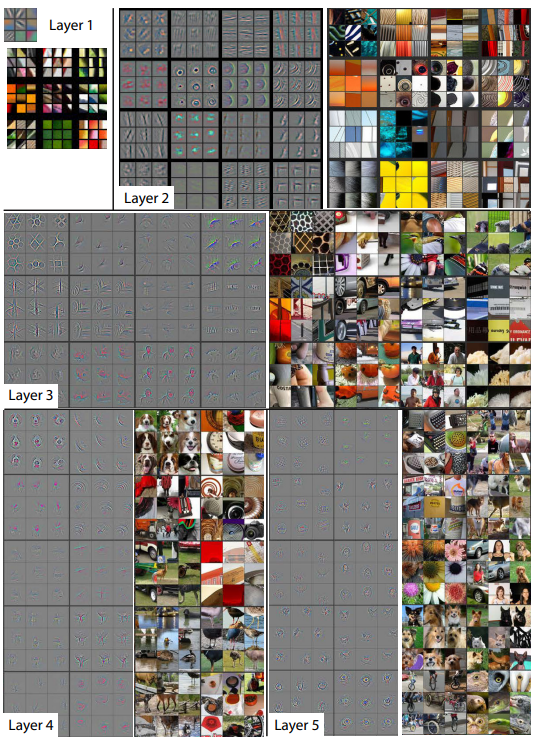

# Visualizing and Understanding Convolutional Networks

# 備考

## 著者

Matthew D. Zeiler, Rob Fergus, David Fleet, Tomas Pajdla, Bernt Schiele, Tinne Tuytelaars

## 掲載

Computer Vision – ECCV 2014, pp. 818--833, 2014.

# Abstract

大規模な畳み込みネットワークモデルは，最近，ImageNet ベンチマークである Krizhevsky ら [18]において素晴らしい分類性能を示しました．しかし，なぜこのように優れた性能を発揮するのか，また，どのようにして性能を向上させることができるのかについて，明確な理解はありません．本論文では、この2つの問題を探ります。本論文では，中間特徴層の機能と分類器の動作を知ることができる，新しい視覚化技術を紹介します．これらの可視化技術を診断に用いることで、ImageNet分類ベンチマークにおいてKrizhevskyらを凌駕するモデルアーキテクチャを見つけることができます。また、異なるモデル層からの性能貢献を発見するために、アブレーションの研究を行いました。ソフトマックス分類器を再学習すると、Caltech-101およびCaltech-256データセットにおいて、現在の最先端の結果を確信を持って上回ることができました。

# 1. Introduction

1990 年代初頭に LeCun ら [20] によって導入されて以来，畳み込みネットワーク (convnets) は，手書きの数字の分類や顔検出などのタスクで優れた性能を発揮してきました．ここ1年半の間に，いくつかの論文で，畳み込みネットワークがより困難な視覚的分類タスクにおいても優れた性能を発揮することが示されました．Ciresanら[4]は，NORBデータセットとCIFAR-10データセットで最先端の性能を示しています．特に、Krizhevskyら[18]は、ImageNet 2012の分類ベンチマークにおいて、2位の26.1％のエラーレートに対し、彼らのConvnetモデルは16.4％のエラーレートを達成し、記録的な性能を示しました。これに続き、Girshickら[10]は、PASCAL VOCデータセットにおいて、トップクラスの検出性能を示しました。この劇的な性能向上には、いくつかの要因があります。(i)数百万のラベル付き例を含む大規模なトレーニングセットが利用可能になったこと、(ii)強力なGPU実装により、非常に大規模なモデルのトレーニングが実用的になったこと、(iii)Dropout[14]のような優れたモデル正則化戦略が登場したこと、などです。

このように目覚ましい進歩を遂げているにもかかわらず、複雑なモデルの内部動作や挙動、またどのようにしてこのような優れた性能を実現しているのかについては、まだほとんど分かっていません。これは科学的に見ても非常に残念なことです。モデルがどのように、そしてなぜ動くのかを明確に理解できなければ、より良いモデルの開発は試行錯誤に陥ってしまいます。本論文では、モデルのどの層においても、個々の特徴マップを励起する入力刺激を明らかにする可視化技術を紹介する。また、学習中の特徴の変化を観察し、モデルの潜在的な問題を診断することができる。この可視化手法では，Zeilerら[29]によって提案された多層デコンボリューショナルネットワーク（deconvnet）を用いて，特徴の活性化を入力ピクセル空間に投影します．また，入力画像の一部を遮蔽して分類器の出力の感度分析を行い，シーンのどの部分が分類に重要であるかを明らかにする．

これらのツールを用いて、Krizhevskyら[18]のアーキテクチャから始めて、様々なアーキテクチャを調査し、ImageNetでの結果を上回るものを発見しました。次に、ソフトマックス分類器を再学習することで、他のデータセットに対するモデルの一般化能力を調べます。このように、これは教師付き事前学習の一種であり、Hintonら[13]や他の研究者[1,26]によって普及した教師なし事前学習法とは対照的です。

## 1.1. Related Work

**可視化**: ネットワークについての直感を得るために特徴を視覚化することは一般的な方法ですが、ほとんどの場合、ピクセル空間への投影が可能な第1層に限られます。高層では別の方法を用いなければならない。[8]は，ユニットの活性化を最大化するために画像空間で勾配降下を行うことで，各ユニットに対する最適な刺激を見つけます．これには慎重な初期化が必要で，ユニットの不変性に関する情報は得られません．後者の欠点に触発された[19]は（[2]のアイデアを拡張して）、与えられたユニットのヘシアンを最適な応答の周りで数値的に計算する方法を示し、不変性に関するいくつかの洞察を与えています。問題は、より高い層では不変性が非常に複雑であるため、単純な二次近似ではうまく捉えられないことです。一方、我々のアプローチは、不変性のノンパラメトリックな見方を提供し、トレーニングセットからのどのパターンが特徴マップを活性化するかを示す。我々のアプローチは、Simonyanら[23]による現代の研究に似ています。彼らは、我々が使用する畳み込み特徴の代わりに、ネットワークの完全連結層から投影して、畳み込みネットワークから顕在マップをどのように得ることができるかを示しています。Girshickら[10]は、モデルの上位層で強い活性化の原因となっているデータセット内のパッチを特定するビジュアライゼーションを示している。我々の可視化は、入力画像の単なる切り抜きではなく、特定の特徴マップを刺激する各パッチ内の構造を明らかにするトップダウン・プロジェクションである点が異なる。

**特徴生成**: Convnetの特徴の一般化能力については、Donahueら[7]およびGirshickら[10]の同時進行の研究でも検討されています。彼らは、前者ではCaltech-101とSun scenesデータセットで、後者ではPASCAL VOCデータセットでオブジェクト検出にconvnet特徴量を使用し、最先端の性能を得ています。

# 2. アプローチ

本論文では、LeCunら[20]およびKrizhevskyら[18]によって定義された、標準的な完全教師付きConvnetモデルを使用しています。これらのモデルは，カラーの2次元入力画像 $x_i$ を，一連の層を介して，$C$ 個の異なるクラスに対する確率ベクトル $\hat{y}_i$にマッピングする．各層は、(i)前の層の出力（または第1層の場合は入力画像）と学習したフィルターセットとの畳み込み、(ii)応答を整流された線形関数 $(relu(x)=\max(x, 0))$ に通し、(iii)（オプションで）ローカルネイバーフッドに対する最大プーリング、(iv)（オプションで）特徴マップ間の応答を正規化するローカルコントラスト演算から構成される。これらの操作の詳細については，[18]および[16]を参照してください．ネットワークの上位数層は従来の完全連結ネットワークで，最後の層はソフトマックス分類器である．図3は，我々の実験の多くで使用されたモデルを示したものである．

ラベル $y_i$ は真のクラスを示す離散的な変数であり、$N$ 個のラベル付き画像 ${x, y}$ の大規模なセットを用いてこれらのモデルを学習する。$\hat{y}_i$と$y_i$の比較には，画像分類に適したクロスエントロピー損失関数を用いる．ネットワークのパラメータ (畳み込み層のフィルタ、完全連結層の重み行列、バイアス) は、ネットワーク全体のパラメータに対する損失の微分をバックプロパゲーションし、確率的勾配降下法によりパラメータを更新することで学習する。学習方法の詳細は，セクション3で説明します．

## 2.1. Deconvnetによる可視化

我々は、これらの活動を入力ピクセル空間にマッピングし、どのような入力パターンが元々特徴マップの所定の活性化を引き起こしたかを示す新しい方法を提案する。このマッピングは、デコンボリューショナル・ネットワーク（deconvnet）Zeilerら[29]を用いて行います。デコンボリューション・ネットワークは、同じコンポーネント（フィルタリング、プーリング）を逆に使用するコンボネット・モデルと考えることができ、ピクセルを特徴にマッピングする代わりに、逆のことを行います。Zeilerら[29]では、教師なし学習を行う方法として、デコンボネットが提案されました。ここでは、既に訓練されたコンボネットのプローブとして使用されるだけで、学習能力はありません。

コンブネットを調べるには，図1（上）に示すように，各層にデコンブネットを接続し，画像のピクセルに戻るための連続した経路を確保します。まず、コンボネットに入力画像を提示し、各層で特徴量を計算します。ある層の活性化を調べるために、その層の他のすべての活性化をゼロにして、特徴マップを付属のdeconvnet層に入力として渡します。次に、(i)アンプール、(ii)レクティファイ、(iii)フィルタリングを順次行い、選択した活性化を生じさせた下の層の活動を再構築します。これを、入力ピクセル空間に到達するまで繰り返します。

図1: 上：コンボネットレイヤー（右）に取り付けられたデコンボネットレイヤー（左）。逆畳み込みは、下の層から畳み込みの特徴の近似版を再構成する。下図 deconvnetでは、convnetでのプーリング時に、各プーリング領域（色のついたゾーン）のローカルマックスの位置を記録するスイッチを用いて、unpooling操作を行っている。黒／白のバーは、特徴マップ内の負／正の活性化を示す。

**Unpooling**: しかし、各プーリング領域内の最大値の位置をスイッチ変数のセットに記録することで、近似的な逆関数を得ることができる。デコンブネットでは、これらのスイッチを使って、上の層からの再構成を適切な位置に配置することで、刺激の構造を保持したままプール解除を行います。図1（下）はその手順を示したものである。

**整形**: Convnetでは、特徴量マップを整流するrelu非線形性を使用しており、特徴量マップが常に正であることを保証している。各層で有効な特徴再構成（これも正であるべき）を得るために、再構成された信号をrelu non-linearityに通す。

**フィルタリング**: convnetは学習したフィルタを使って、前の層の特徴マップを畳み込みます。これをほぼ逆にするために、deconvnetは（RBMなどの他のオートエンコーダーモデルと同様に）同じフィルターの転置版を使用しますが、下の層の出力ではなく、整流されたマップに適用されます。実際には、各フィルターを縦と横に反転させることになります。

なお、この再構成パスでは、コントラストの正規化処理は行わない。上の層から下の層に投影する際には、上の層のコンブネットでの最大プーリングによって生成されたスイッチ設定を使用します。これらのスイッチ設定は、与えられた入力画像に特有のものであるため、単一の活性化から得られる再構成は、特徴活性化への貢献度に応じて重み付けされた構造を持つ、元の入力画像の小さな部分に似ています。モデルは識別的に学習されているので、これらの投影は、入力画像のどの部分が識別的であるかを暗黙的に示しています。なお，これらの投影は，生成過程がないため，モデルからのサンプルではありません．つまり，$\frac{\partial h}{\partial X_n}$ を計算する。ここで，$h$ は強い活性化を持つ特徴マップの要素であり，$X_n$ は入力画像である。しかし、この手法は、(i)リルーが独立して課せられること、(ii)コントラストの正規化操作が用いられないこと、という点で異なる。我々のアプローチの一般的な欠点は、単一の活性化のみを視覚化し、層に存在する共同の活性化を視覚化しないことである。しかし、図6に示すように、これらの視覚化は、モデル内の所定の特徴マップを刺激する入力パターンを正確に表現している。パターンに対応する元の入力画像の部分が隠されると、特徴マップ内の活動がはっきりと低下するのがわかる。

# 4. 畳み込みニューラルネットワークの可視化

セクション3で説明したモデルを用いて、deconvnetを使ってImageNet検証セットの特徴活性化を視覚化します。

**特徴の可視化**: 図2は，学習が完了したモデルの特徴を可視化したものである．ある特徴マップについて，上位9個の活性化を，それぞれピクセル空間に個別に投影して示しており，そのマップを励起するさまざまな構造を明らかにするとともに，入力の変形に対して不変であることを示している。また、これらの視覚化と同時に、対応する画像パッチも表示しています。これらは、各パッチ内の識別構造のみに焦点を当てた視覚化に比べて、バリエーションが豊富です。例えば、レイヤー5の1行目、2列目のパッチは、共通点が少ないように見えますが、この特徴マップは、前景の物体ではなく、背景の草に着目していることがわかります。

図2: 完全に訓練されたモデルにおける特徴の視覚化。第2層から第5層について、検証データ全体の特徴マップのランダムなサブセットにおける上位9個の活性化を、デコンボリューション・ネットワーク・アプローチを用いてピクセル空間に投影したものを示している。この再構成は、モデルからのサンプルではなく、検証セットから、ある特徴マップで高い活性化を引き起こすパターンを再構成したものです。各特徴マップには、対応する画像パッチも示している。(i)各特徴マップ内での強いグループ化、(ii)上の層でのより大きな不変性、(iii)画像の識別可能な部分の誇張（例：犬の目と鼻（第4層、第1行、第1列））に注意。電子ファイルでの表示が最適です。圧縮によるアーチファクトは、30MBの投稿制限によるもので、再構成アルゴリズムそのものではありません。

**各層からの投射は、ネットワーク内の特徴の階層性を示している。レイヤ2は、角やその他のエッジと色の組み合わせに反応します。レイヤ3は、より複雑な不変性を持ち、似たようなテクスチャーを捉えます（例：メッシュパターン（Row 1, Col 1）、テキスト（R2,C4））。レイヤ4では、犬の顔（R1,C1）、鳥の足（R4,C2）など、よりクラスに特化した大きな変化が見られます。レイヤ5では、キーボード（R1,C11）や犬（R4）など、ポーズの変化が大きいオブジェクト全体を示しています。**

図4: ランダムに選ばれたモデル特徴のサブセットの学習による進化。各層の特徴は，異なるブロックに表示されている．各ブロック内には，エポック [1,2,5,10,20,30,40,64] における特徴の無作為に選んだサブセットを表示している．視覚化されたものは，与えられた特徴マップに対して（すべての学習例にわたって）最も強い活性化を，我々のdeconvnetアプローチを用いてピクセル空間に投影したものである．カラーコントラストは人為的に高められており、図は電子的に見るのが最適である。

**トレーニング中の特徴の進化**: 図4は，ある特徴マップをピクセル空間に投影したときの，最も強い活性化の学習中の推移を示したものである（すべての学習例において）。急に見た目が変わるのは，最も強い活性化の元となった画像が変化したためである。モデルの下位層は、数エポック以内に収束することが確認できます。しかし、上層部はかなりの回数（40〜50回）のエポックを経ないと発達しないことから、モデルが完全に収束するまで学習させる必要があることがわかる。

## 4.1. アーキテクチャの選択

図5: (a): 第1層の特徴量（特徴量のスケールクリッピングなし）。1つの特徴が支配的であることに注意。(b): Krizhevskyら[18]による第1層の特徴量。(c): 我々の第1層の特徴量。ストライド（2 vs 4）とフィルタサイズ（7x7 vs 11x11）が小さいため、より特徴的な特徴が得られ、「死んだ」特徴が少ない。(d): Krizhevskyら[18]による第2層の特徴の視覚化。(e): 我々が開発した第2層の特徴の視覚化。(d)で見られたエイリアシング・アーチファクトがなく、よりきれいになっている。

学習したモデルを可視化することで、その動作を把握することができますが、そもそも良いアーキテクチャーを選択するための助けにもなります。Krizhevskyらのアーキテクチャの第1層と第2層を可視化すると (図5 (a) と (c) )、さまざまな問題が明らかになります。第1層のフィルターは、極めて高い周波数と低い周波数の情報が混在しており、中間周波数はほとんどカバーされていません。さらに、第2層の可視化では、第1層の畳み込みに使用されている大きなストライド4が原因で、エイリアシング・アーチファクトが発生しています。これらの問題を解決するために，(i)第1層のフィルタサイズを11×11から7×7に縮小し，(ii)畳み込みのストライドを4ではなく2にしました。この新しいアーキテクチャでは，図5 (b) と (d) に示すように，第1層と第2層の特徴でより多くの情報を保持することができます。さらに重要なのは、セクション5.1で示したように、分類性能も向上していることです。

## 4.2. オクルージョン感度

画像分類のアプローチでは、モデルが本当に画像内のオブジェクトの位置を特定しているのか、それとも周囲のコンテキストを利用しているだけなのか、という疑問がつきまといます。図6は、この疑問に答えるために、入力画像のさまざまな部分を灰色の四角でシステマティックに覆い隠し、分類器の出力を監視しています。この例では、オブジェクトが隠されているときに正しいクラスの確率が大幅に低下することから、モデルがシーン内のオブジェクトを特定していることが明らかになっています。また、図6は、最上位の畳み込み層の最強の特徴マップと、このマップのアクティビティ（空間的な位置の合計）をオクルーダーの位置の関数として視覚化したものです。視覚化された画像領域をオクルーダーが覆うと、特徴マップの活動が大きく低下していることがわかります。これは、可視化された画像が、その特徴マップを刺激する画像構造に純粋に対応していることを示しており、したがって、図4および図2に示した他の可視化が有効であることを示している。
